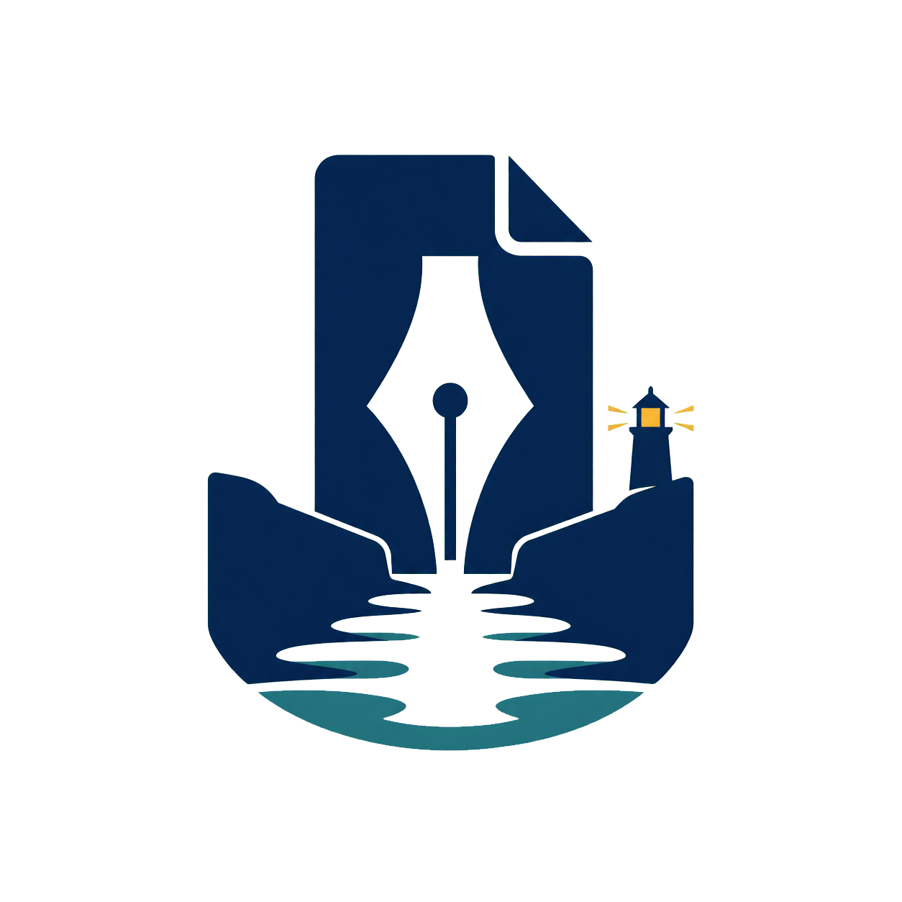

<p align="center">
  
</p>

# 稿湾 DraftHarbor

稿湾是一个独立维护、桌面优先、本地优先的 AI 长篇创作工作台。它围绕小说项目、章节与场景、人物和世界观资料、AI 生成与改写、备份恢复、阅读和创作工作流组织。

当前主要支持 Windows，提供 Electron 桌面应用、安装包和 Portable 版本。项目永久免费并以 GPL-3.0-or-later 开源。

## 项目起源

稿湾最初源于对 [Writingway 2](https://github.com/aomukai/Writingway2) 的个人适配尝试。

最开始的目标只是改善新版 DeepSeek 模型及中文创作环境下的使用体验。随着开发继续推进，项目逐步重写了桌面架构、界面、存储方式、数据模型、AI Provider 层、备份恢复和测试体系，最终演变为一个独立维护的桌面项目。

稿湾不是 Writingway 2 的官方版本、官方中文版本或官方分支，原作者不对本项目提供背书或支持。有关稿湾的问题请提交到稿湾自己的仓库。

完整来源与归属说明见 [NOTICE](NOTICE) 和 [独立化说明](docs/INDEPENDENCE.md)。

## 与 Writingway 2 的主要区别

| 方面 | Writingway 2 | 稿湾 DraftHarbor |
|---|---|---|
| 产品形态 | 浏览器本地应用 | Electron 桌面应用 |
| 运行入口 | 本地 HTTP 服务与网页入口 | `draftharbor://app` 自定义协议 |
| 端口依赖 | 使用本地服务端口 | 产品运行时不依赖固定端口 |
| 数据存储 | IndexedDB 与 JSON 快照 | 项目目录、场景 Markdown、结构化元数据与原子写入 |
| 主要环境 | 通用浏览器写作 | 中文长篇创作和桌面工作流 |
| AI 支持 | 原有 Provider 与本地模型路线 | Provider 配置档案、DeepSeek 新模型、Thinking 与正文分流 |
| 恢复能力 | 原有备份功能 | 版本化备份、恢复副本、场景恢复、替换前保护快照 |
| 发布形式 | 下载后运行网页服务 | Windows Installer、Portable 和 unpacked 应用 |
| 工程结构 | 网页应用模块 | Electron 主进程、服务层、存储层、纯核心层、桌面 UI 层 |

## 当前能力

- 项目、章节、场景和长篇正文管理
- 人物、地点、组织、物品、设定、时间线和笔记资料库
- AI 续写、节拍生成、选区改写、选区重生成和摘要
- Provider 配置组、模型选择、DeepSeek Thinking 流分离
- Prompt 模板、上下文解析和结构化人物约束
- Workshop 创作讨论与 Workflow 工作流
- Markdown、TXT、HTML、EPUB 和项目包导入导出
- Writingway 1 与旧 Writingway 2 JSON 数据导入
- 本地备份、恢复副本、场景级恢复和替换前保护
- 本地阅读器和语音朗读

旧格式兼容只保留数据解析能力，不包含旧网页应用运行时。

## 运行开发版

要求：Node.js 20 或更高版本。

```powershell
npm install
npm run desktop
```

Windows 用户也可以双击 `start-desktop-preview.cmd`。

## 测试

```powershell
npm test
npm run writer-audit
npm run backup-test
node tests/provider-stream.js
```

打包验证：

```powershell
npm run pack
npm run packaged-smoke
npm run dist
```

## 数据与隐私

- 作品默认保存在本机 DraftHarbor 用户数据目录。
- 只有在用户配置并主动使用云端 AI Provider 时，相关 Prompt 和上下文才会发送给该 Provider。
- API Key 不写入项目文件、生成历史或 Git 仓库。
- 从 Writingway 导入数据是显式操作，不会自动扫描或接管旧项目目录。

## 开源许可

稿湾自身代码以 [GNU GPL 3.0 或更高版本](LICENSE)发布。允许个人和商业使用、修改和再分发；分发包含本项目代码的修改版本时，需要遵守 GPL 的源码公开和同许可证要求。

第三方组件继续适用各自许可证，详见 [THIRD_PARTY_NOTICES.md](THIRD_PARTY_NOTICES.md)。项目来源及 Writingway 2 致谢见 [NOTICE](NOTICE)。

## 贡献

欢迎提交问题、改进文档和代码贡献。参与前请阅读 [CONTRIBUTING.md](CONTRIBUTING.md)。

感谢 Writingway 2 原作者公开项目并提供早期产品灵感，也感谢所有底层开源项目的维护者。
