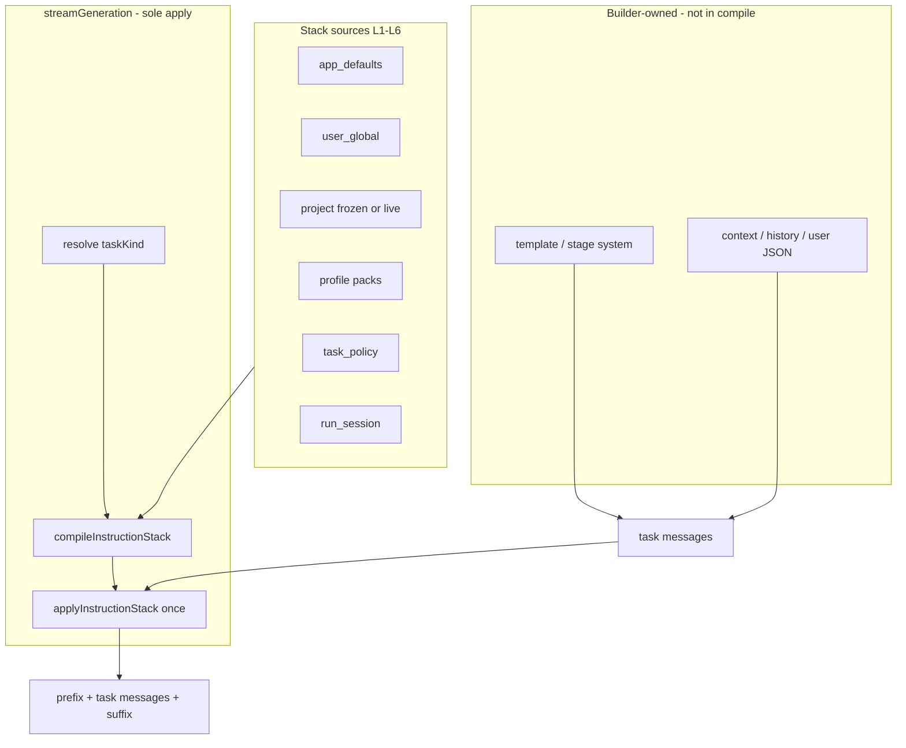
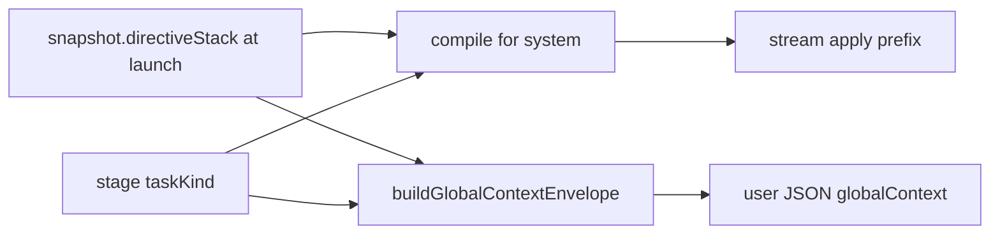

---
title: Directive Stack / 指令栈 Design
status: Draft
revision: 4-codex
date: 2026-08-03
workspace: D:\soft\DraftHarbor
supersedes: settings.globalPrompt + prependGlobalPrompt
---
# 指令栈（Directive Stack）设计方案：分层写作指令替代全局前缀

| 字段 | 值 |
|------|-----|
| **Document** | Directive Stack / 指令栈 Redesign |
| **Author** | DraftHarbor Systems Architecture |
| **Date** | 2026-08-03 |
| **Status** | Draft (rev 4 — Codex corrections over Grok rev 3) |
| **Workspace** | `D:\soft\DraftHarbor` |
| **Supersedes** | 扁平 `settings.globalPrompt` + `prependGlobalPrompt` 单串注入 |
| **Related** | F-09.6H quality locks、workflow `globalContext` freeze、workshop multi-turn |
| **Repo copy** | `docs/DIRECTIVE_STACK_DESIGN.md` |

---

## Codex 修订说明（rev 4，规范性覆盖）

> **版本边界：** 本节是 Codex 对 Grok rev 3 的修订层。为保留审计线索，后文 rev 3 的完整分析和候选设计继续保留；凡后文与本节冲突，以本节为准。简版规范及给 Grok 的交接留言见 [`DIRECTIVE_STACK_DESIGN_SUMMARY.md`](./DIRECTIVE_STACK_DESIGN_SUMMARY.md)。

**实现状态（Codex，2026-08-03）：** rev 4 V1 已在当前工作树落地；完整 `npm test` 与 `npm run writer-audit` 通过。当前采用 C6 的过渡方案：客户端用共享函数物化规范化项目层，服务端统一校验并最终定稿 snapshot；尚未改成服务端按 `projectId` 主动读取 settings/project。后续增强见本节 C7/C9，不能用后文 rev 3 的旧 PR 顺序覆盖。

### C1. 保留的 rev 3 结论

以下结论经当前代码核对成立并继续作为实现基础：

1. `globalPrompt` 无 task scope，经 `providerRuntimeConfig` 进入正文、JSON、Agent、Reader 等不同调用。
2. workflow 同时在 system prepend 与 user JSON `globalContext.globalPrompt` 中携带正文，存在双通道重复。
3. `taskKind` 是作用域编译的硬前置；多义任务不能只靠 `domain:action`。
4. `streamGeneration` 是 system 指令的唯一 apply 所有者；Builder 只拥有任务模板和业务 payload。
5. 迁移必须处理旧 UI 的 partial `{ globalPrompt }` patch，并保留 scopes。
6. 新 workflow run 必须冻结指令来源，避免运行中 settings/project 编辑改变结果。

### C2. 修正：双通道改为真正单通道

rev 3 的 `userContextEnvelope.directiveStack.layers/textDigest` 仍会把已经进入 system 的指令正文再次放入 user JSON，只是从“未过滤重复”变成了“过滤后重复”。rev 4 明确：

- 模型可见的 Directive Stack 正文只进入 system messages，恰好一次。
- workflow user JSON 不携带 `globalPrompt` 正文、applied layer content 或 text digest 正文。
- envelope 只允许审计元数据，例如：

```js
{
  directiveContext: {
    schemaVersion: 1,
    taskKind: 'workflow-json',
    appliedLayerIds: ['app_defaults', 'task_policy'],
    snapshotVersion: 1,
    digestHash: 'sha256-or-stable-short-hash'
  },
  writingInstructions: { /* 业务输入，非 stack 副本 */ }
}
```

- `buildGlobalContextEnvelope` 改名或收缩为 `buildDirectiveAuditEnvelope`；它消费已经编译出的 debug/metadata，不重新编译正文。

### C3. 修正：禁止跨请求 `instructionStackApplied` 标记

rev 3 伪代码复制 `prompt.messages` 后只在复制值上 apply，却把 `prompt.meta.instructionStackApplied = true` 写回原 Prompt。复用同一 Prompt 重试时，第二次会认为已 apply，但原 messages 没有注入内容，造成指令丢失。

rev 4 规则：

- 不修改传入的 `prompt`、`prompt.meta` 或 `prompt.messages`。
- 每次 `streamGeneration` invocation 从原始 messages 创建 request-local 副本并 apply 一次。
- debug 通过回调/返回记录或 request-local 对象暴露，不用跨调用哨兵。
- 因为 stream 是唯一 apply 所有者，不支持 Builder 预编译后再要求 stream 猜测是否已注入。

### C4. 修正：scoped 必须原子启用

rev 3 把 system isolation 放在 PR2、user envelope 清理放在 PR4。这样 PR2 默认 scoped 后，结构化任务仍会从 user JSON 看到完整用户全局文本，只是权重发生变化，产品却可能声称已经隔离。

rev 4 发布闸门：

1. compiler/migration、taskKind、workflow freeze、user JSON 清理全部可以分提交实现，但默认保持 `parity`。
2. 只有最终 Provider 请求测试同时证明 system 与 user payload 都正确后，才在一个原子变更中把默认切为 `scoped`。
3. UI 的“按任务类型注入”说明在原子切换之后发布。

### C5. 修正：旧 Run 保留 legacy 语义

rev 3 默认把只有 `snapshot.globalPrompt` 的旧 Run 重解释为 creative scopes，这会使升级后恢复的 JSON 阶段丢失原有全局文本，破坏冻结和可复现性。

rev 4 规则：

- 旧快照没有 `directivePolicyVersion` 时，按 `legacy-unscoped` 执行原有行为。
- 新快照写入 `directivePolicyVersion: 1`、`directiveStack` 和明确 mode。
- 不静默清洁历史 Run；若用户希望迁移，创建新 Run 或显式执行迁移。
- legacy 与 scoped 路径都必须有恢复测试。

### C6. 修正：冻结由服务层最终定稿

客户端仍可收集 UI 中尚未持久化的单次 override，但持久化 settings/project 层应由服务层按 `projectId` 读取、规范化并生成最终 snapshot。原因是避免每个 `start-*` 入口重复传完整项目并承担冻结规则。

若当前架构短期无法完全服务端化，则采用过渡方案：

1. 客户端只传规范化 `project.directiveStack` 和单次 override，不传完整 project。
2. 服务端校验 schema、scope 和长度后写入最终 snapshot。
3. 所有 start 入口调用同一 `finalizeDirectiveSnapshot`，不得各自组装。

### C7. 修正：V1 收缩为四层

V1 只编译：

| Order | Layer | 说明 |
|---:|---|---|
| 1 | `app_defaults` | 极短、中性、按任务族选择；不得重复 Builder 已有的 JSON/no-Markdown 文案 |
| 2 | `user_global` | 旧 globalPrompt 迁移来源，默认仅创作 scopes |
| 3 | `project` | 题材、尺度、人设、项目级风格与禁区 |
| 4 | `run_session` | Workshop 会话或本次 override |

延后到后续版本：`profile_pack`、attached pack、自由 placement/priority、sandwich/tail pin、复杂 `contract` 对象、自动预算截断。

### C8. 修正：默认契约不包含成人题材声明

成人文学是合法的项目创作需求，但不是每个项目的默认上下文。rev 4 的 `app_defaults` 仅包含中性跨项目规则，例如语言跟随、连续性、禁止泄漏创作过程 meta、服从本任务输出格式。

成人尺度、题材边界和明确允许项只在用户显式配置的 `project` 或 `run_session` 层出现；系统不内置硬越狱预设，也不基于关键词静默删除用户规则。

### C9. 修正：长度处理不静默截断

按 JavaScript 字符数截断自由文本尾部可能切断否定词、条件或结构，使约束语义反转。V1：

- 编辑和预览时显示字符/token 粗估与警告。
- 超过安全总上限时拒绝发送并提示用户缩短，或需要用户显式确认；不静默截断。
- 固定 app/task 文案由代码保证短小。
- 后续预算器若实现，必须按完整段落或 tokenizer 边界裁剪，并把结果展示给用户。

### C10. 修正：Canonical taskKind，而不是永久多重猜测

V1 可保留 rev 3 的 resolver 作为迁移适配器，但调用链最终必须收敛到一个规范化 `taskKind`：

1. Builder/业务调用点显式设置 `taskKind`。
2. `AITaskRunner` 在进入 Provider 前根据 `target.type` 规范化并写入 request-local config。
3. workflow node 在统一 provider config 中映射。
4. 开发/测试环境缺失时抛错；生产环境记录 warning 并回退 `unknown`，隔离用户/项目创作层。
5. `target.type`、`meta.task`、`domain:action` 只作为过渡输入，不允许不同层各自重新解析。

### C11. 修订后的实施顺序

```text
A compiler + migration + dual-write (parity)
  → B canonical taskKind wiring (parity)
  → C versioned workflow freeze + remove directive正文 from user JSON (parity)
  → D atomically enable scoped system compile + clean envelope
  → E project/session UX
  → Later packs / paragraph-token budget / canary-proven anti-dilution
```

阶段 D 是唯一对默认模型输入语义进行切换的闸门。A–C 可以独立合并，但不能提前向用户声称完成 scope isolation。

### C12. 修订后的最终请求验收

除 rev 3 的单元测试外，必须捕获发往 Provider 的最终 request body：

1. `writer-prose` / `workflow-draft`：用户和项目目标文本各出现恰好一次。
2. `workflow-json` / `compendium-agent` / `reader-extract`：目标创作文本在整个 request body 出现零次。
3. 同一 Prompt 对象调用两次：每个 request 各出现一次。
4. 旧 Run 恢复：保持 legacy-unscoped；新 Run 恢复：保持 scoped snapshot。
5. 缺失 `taskKind`：开发测试失败；生产 `unknown` fail-closed 并产生可观察 warning。

### 给 Grok 的交接留言

Grok：你在 rev 3 中对现有调用链、`taskKind` 多义冲突、dual-write 和 stream 单一所有者的分析是本修订版的基础。Codex 已按 C2–C12 实现 V1；接手时请先审查当前 diff、`tests/instruction-stack.js` 和 versioned/legacy workflow 测试。不要使用跨请求 `instructionStackApplied`；不要把 applied 指令正文复制进 workflow user JSON；旧 Run 必须保留 legacy 语义；成人题材只来自显式 project/session 层。后续应先做真实 Provider canary 和 UI 体验复核，V1 暂缓的 packs、tail sandwich 和自动截断不能在没有证据时直接恢复。若实现选择与本节不同，请先更新 decision log 和最终请求验收。

---

## Overview

DraftHarbor 当前用设置项 `globalPrompt: { enabled, content }` 作为跨任务「全局写作前缀」：在 `ProviderStream.streamGeneration` 中通过 `prependGlobalPrompt` 无差别插入**首条 system 消息**。真实 DeepSeek 测试（2026-08-03）表明：单串无法表达任务范围、硬越狱前缀对成人向虚构表现更差、对 JSON/分析任务形成污染、且与项目规则 / 写作指令 / 模板无分层。

本方案将扁平全局前缀替换为 **指令栈（Directive Stack）**——有序、可作用域过滤、可预算截断、可预览的指令编译管线。默认输出**短而稳定的创作契约**（语言、禁 meta、成人虚构合法允许等），题材/尺度/人设放在**项目或任务层**。保留「每次请求重新注入」；不再鼓励「每次注入完整越狱文」。

**Rev 2–3 硬化约束：**

1. **`taskKind` 是作用域注入的硬前置**——不能只靠 unscoped `config.globalPrompt` flatten。
2. **双通道同步过滤**——system 栈 **与** workflow user JSON `globalContext` 使用同一 scope 规则（envelope 在 **PR4** 落地；PR2 只保证 system 侧）。
3. **`streamGeneration` 是 messages 上指令的唯一 mutator**——builders 只附 meta / context，禁止 builder+stream 双前缀。
4. **模板 / stage system 仍归现有 builder 所有**——不进栈编译，避免双写 template。
5. **设置 partial patch 有明确 dual-write merge**——旧 UI 只写 `globalPrompt` 不会静默丢编辑。
6. **Rev 3：** stream **mode 闸门** 与「normalize 总是产出 directiveStack」解耦；**domain:action 别名不可单独区分 agent/reader**；**AITaskRunner 必须转发 taskKind**。

---

## Background & Motivation

### Current state (code anchors)

| 能力 | 现状 | 路径 |
|------|------|------|
| 设置 schema | `normalizeGlobalPrompt` → `{ enabled, content }` | `src/core/settings/settings-schema.js` L199–205, L229 |
| 运行时配置 | `providerRuntimeConfig` 把启用内容摊平成 `globalPrompt: string`；`...extras` **后写**可覆盖 | 同文件 L263–281 |
| 设置写入 | `updateSettings` shallow-merge patch；对 `providerSettings`/`generationDefaults`/`compendiumAgent`/`workflowGeneration` 有 deep-merge，**无** `globalPrompt` deep-merge | `desktop/services/settings-service.js` L23–53 |
| 注入点 | `prependGlobalPrompt(messages, value)` 始终作为首条 system | `src/core/generation/provider-stream.js` L39–43, L283–292 |
| 写作正文 Prompt | `buildFictionPrompt`：template system + user；`meta.task = 'fiction-prose'` | `src/core/generation/prompt-builder.js` L89–125 |
| 写作改写/摘要 | rewrite / regenerate / summary 经 `nativeGenerationConfig` → 同一 `globalPrompt` | `writer-prompts.js`、`writer-generation.js` |
| 避免写法 | 全局 + 项目 `styleGuardRules` 拼进 prose user 段 | `writer-core.js` `nativeAvoidanceInstruction`；`avoidance-rules.js` |
| Workshop | template system + context system + history 末 20 + user；`meta.task = 'workshop-chat'` | `workshop-prompt.js` L22–59 |
| 资料卡 JSON（写作 provider） | draw / rewrite / extract 用 `nativeGenerationConfig()`（**写作配置**，非 agent 配置） | `compendium-draw.js`、`compendium-rewrite.js`、`compendium-extraction.js` |
| 资料库管家 | 独立 profile，但 `providerRuntimeConfig` **仍带** `globalPrompt` | `compendium-agent-runner-service.js` L18–24 |
| 工作流冻结 | `generationPolicy.snapshot.globalPrompt`（**无 project 入参**） | `workflow-provider-config.js` L1–26, L97 |
| 工作流双通道 | system prepend **+** user JSON `globalContext.globalPrompt` | `workflow-creation-service.js` L33–36；guided L357–361；assembly L687 |
| UI | 设置单 textarea；写作区 partial POST `{ globalPrompt }` | `settings.html`；`writer-global-prompt.js` L50；`settings.js` L646–649 |
| 项目字段 | `styleGuardRules` 已有；**无** project directive 字段 | `project-schema.js` L102 |
| Script 加载 | `desktop.html` 已有 `provider-stream.js`、`settings-schema.js`；**无** instruction-stack | `desktop.html` |

### Pain points (validated)

1. **无作用域**：同一串作用于 prose / workshop / workflow JSON / review / summary / 资料卡 JSON。
2. **稀释误解**：每次请求都会 prepend；真正问题是影响力稀释与全局内容写错。
3. **质量反直觉**：硬越狱前缀常差于软契约；无前缀 baseline 常更好。
4. **双通道污染**：workflow 在 **system 前缀** 与 **user JSON `globalContext.globalPrompt`** 各注入一次；只修 system 不够。
5. **无分层**：与 writingInstructions、style guards、templates 平行。
6. **Workshop 抗稀释弱**：history 20，无 tail pin / session contract。
7. **不可见**：无预算、无预览。
8. **Partial settings 风险**：迁移后若「directiveStack wins」而旧 UI 只写 `globalPrompt`，会静默丢编辑。

### Why change now

- 注入点集中在 `streamGeneration`，适合统一 apply。
- 工作流已冻结 `globalPrompt`；扩展为栈快照可保持可复现性。
- F-09.6H 质量锁已存在；全局前缀仍是最粗的一层。

---

## Goals & Non-Goals

### Goals

1. **指令栈**替代单串 `globalPrompt` 作为产品与运行时模型。
2. 按 **`taskKind`** 路由层；**system 与 user envelope 同一 scope 规则**。
3. **唯一 apply 所有者** = `streamGeneration`；compile 可在 stream 或测试内调用，但 messages 只被 apply 一次。
4. **预算**硬字符上限 + 确定性截断顺序 + debug。
5. **迁移零丢字** + partial patch 正确 dual-write merge。
6. **UX**：分层编辑、预览、预设包、Workshop 会话契约。
7. **可测**：compile、scope、merge、全 call-site taskKind 清单。

### Non-Goals

- 不做完整 RAG。
- 不做成越狱产品；默认预设为专业创作契约。
- 不重做 F-11 证据化文风。
- 不打断历史 workflow run 的冻结语义。
- 不把 style-guard **检测**迁入栈（只管注入是否纳入）。
- MVP **不做** jailbreak 关键词静默降级（仅预算截断 + 可选 debug.warnings）。

---

## Proposed Design

### Product naming

| 语言 | 名称 | 说明 |
|------|------|------|
| 中文 | **指令栈** | 设置/写作区主文案 |
| English | **Directive Stack** | 代码模块、API、文档 |
| 废弃文案 | 「全局写作前缀」 | 迁移期可显示「已迁移到指令栈 · 用户全局层」 |

模块：`src/core/generation/instruction-stack.js`（`DraftHarborInstructionStack`）。

---

### A. Layer model

#### Ordered layers (compile = layers 1–6 only)

| Order | Layer ID | Source | Mutability | Default |
|------:|----------|--------|------------|---------|
| 1 | `app_defaults` | 产品常量 | 代码 | always |
| 2 | `user_global` | `settings.directiveStack.userGlobal` | 用户设置 | on if content |
| 3 | `project` | `project.directiveStack`（运行中则用 **freeze**） | 项目 JSON | on if content |
| 4 | `profile_pack` | settings packs + project/settings attachments | 可选 | off until attached |
| 5 | `task_policy` | 按 taskKind 内置策略（含统一优先级文案） | 半固定 | always |
| 6 | `run_session` | workshop `directiveContract` / 单次 override / freeze 中的 run 覆盖 | 会话/运行 | optional |

**不进栈编译（builder 自有）：**

| 概念 | 所有者 | 说明 |
|------|--------|------|
| Template / stage system | `buildFictionPrompt`、workshop template、`jsonPrompt`/`textPrompt` stage system、agent system | **禁止** compile 再输出一份 template 层 |
| Style guards | `avoidance-rules` → prose **user** 段 | 不进 system 栈 |
| Beat / user JSON / history | 各 builder | 最高局部性；冲突表中记优先级，但不由栈改写 body |

冲突优先级表（模型侧文案，见 **统一 `INSTRUCTION_PRIORITY_TEXT`**）仍把 local beat / 批次意见放在栈层之上。



#### Layer content shape

```js
{
  id: 'user_global',
  enabled: true,
  title: '用户全局创作契约',
  content: string,
  contract: {
    language: 'follow_author' | 'zh' | 'en' | string,
    allowAdultFiction: boolean | 'project',
    forbidMeta: boolean,
    outputMode: 'prose' | 'json' | 'chat' | 'auto'
  },
  scopes: string[],   // empty → layer defaultScopes
  placement: 'head' | 'tail' | 'auto',
  priority: number,
  maxChars: number,
  source: 'migrated_globalPrompt' | 'user' | 'preset' | 'system' | 'frozen'
}
```

#### App defaults

**Creative 变体**（`writer-prose`、`writer-rewrite`、`workshop-chat`、`workflow-draft` 等）：

```text
你是 DraftHarbor 的虚构创作协作者。
- 跟随作者在 beat / 上下文中的语言与叙事视角。
- 不输出创作过程元信息（场景编号、批次名、计划字段名等），除非当前任务明确要求结构化输出。
- 尊重项目已确立的事实与连续性。
- 若项目题材需要，可创作含成人向内容的虚构作品；不做说教审查，但遵守用户明确禁止项。
```

**Structured 变体**（`workflow-json`、`workflow-review`、`compendium-json`、`compendium-agent`、`reader-extract`、`unknown` 默认）：

```text
你是 DraftHarbor 的结构化任务助手。严格遵守任务 system 中的输出格式（JSON 或字段约定）。
不要输出 Markdown 代码块（除非任务要求）。不要注入与输出 schema 无关的人设或越狱指令。
```

#### User global

- 短创作契约；题材/越狱/长人设下沉 project / pack / session。
- **迁移默认 scopes**：`DEFAULT_SCOPES_CREATIVE`（见下）——**不含** json / agent / extract。
- 设置高级选项：「扩展到全部任务」（显式写入全 scopes）。

#### Project directives

```js
// project-schema / project-normalize
directiveStack: {
  schemaVersion: 1,
  layers: [/* same shape */],
  attachedPackIds: [],
  updatedAt: ''
}
```

- 与 `styleGuardRules` 并存：段落约定 vs 短语避免。
- **`CURRENT_SCHEMA_VERSION` 策略**：项目根 `schemaVersion` **不强制 bump**（可选字段 + normalize 默认空）；若团队希望严格版本门，可在实现 PR 将 `CURRENT_SCHEMA_VERSION` 升到 2 并在 normalize 注释「v1 缺省 directiveStack={}」。**推荐不 bump 根版本**，与 `readerApplications` 等历史加字段一致。

#### Profile packs

| Pack | 默认 scopes |
|------|-------------|
| `pack.minimal_contract` | `DEFAULT_SCOPES_CREATIVE` |
| `pack.soft_literary` | writer-prose, writer-rewrite, workshop-chat |
| `pack.output_json` | workflow-json, workflow-review, compendium-json |
| 硬越狱 | **非官方预设** |

#### Run / session

- Workshop：`session.directiveContract`（见 F / schema）。
- 单次：`config.directiveOverride` 或 `prompt.meta.directiveContext.override`。
- Workflow：仅使用 **launch 时冻结** 的 stack（见 E）。

#### Merge rules

1. Scope filter by `taskKind`。
2. `enabled === false` → drop。
3. 自由文本按 order 拼接；分隔标题语言默认 **中文**（`## 用户全局` / `## 本作品`）；`contract.language === 'en'` 时用英文标题。
4. `contract.*` 后者覆盖前者。
5. **不**编译 template 层。
6. 预算截断：见 §C Budgets（确定性顺序）。

#### Conflict resolution — single constant

Export from `instruction-stack.js` and use in plan/draft stage systems (replace ad-hoc string at `workflow-creation-service.js` L37):

```js
const INSTRUCTION_PRIORITY_TEXT =
  '指令优先级固定为：事实与硬约束 > 已批准蓝图和场景计划 > 当前批次用户意见 > 本请求局部指令 > 会话契约 > 项目指令 > 用户全局 > 应用默认 > 模型默认倾向。'
  + '若发生冲突，遵守高优先级内容，并在结构化结果的 notes 或 avoid 中明确记录冲突，不得静默覆盖。';
```

（英文 locale 可选常量 `INSTRUCTION_PRIORITY_TEXT_EN`，MVP 中文主路径即可。）

---

### B. Scope & task routing

#### TASK_KINDS and aliases

```js
const TASK_KINDS = Object.freeze([
  'writer-prose',
  'writer-rewrite',      // rewrite + regenerate-selection
  'writer-summary',
  'workshop-chat',
  'workflow-brief',
  'workflow-json',       // direction, blueprint, plan JSON, workflow compendium cards, analysis JSON-ish
  'workflow-draft',
  'workflow-review',
  'workflow-rewrite',    // rewrite workflow prose path
  'workflow-repair',
  'workflow-analysis',
  'compendium-json',     // shell draw/rewrite/extract on writing provider
  'compendium-agent',
  'reader-extract',
  'unknown'              // fail-closed structured default
]);

// prompt.meta.task string aliases (safe, 1:1)
const TASK_KIND_ALIASES = Object.freeze({
  'fiction-prose': 'writer-prose',
  'workshop-chat': 'workshop-chat'
});

// Safe domain:action only — NEVER use alone for multi-kind domains (compendium, workflow)
const SAFE_DOMAIN_ACTION_KIND = Object.freeze({
  'prose:generate': 'writer-prose',
  'prose:rewrite': 'writer-rewrite',
  'prose:regenerate-selection': 'writer-rewrite',
  'summary:summarize': 'writer-summary',
  'style-guard:repair': 'writer-rewrite',
  'compendium:draw': 'compendium-json',
  'compendium:rewrite': 'compendium-json'
  // INTENTIONALLY OMITTED (ambiguous — must use target.type or explicit config.taskKind):
  // 'compendium:extract'  → shell extract = compendium-json; reader = reader-extract
  // 'compendium:update'   → agent/QA = compendium-agent (NOT compendium-json)
  // 'workflow:generate'   → needs nodeId
});

// Authoritative for multi-kind domains: AITask.target.type (verified live values)
const TARGET_TYPE_TASK_KIND = Object.freeze({
  'compendium-draw': 'compendium-json',
  'compendium-entry': 'compendium-json',       // shell rewrite target
  'scene-selection': 'compendium-json',       // shell in-project extract
  'compendium-agent-analysis': 'compendium-agent',
  'reader-transfer-chunk': 'reader-extract'
});

const DEFAULT_SCOPES_CREATIVE = Object.freeze([
  'writer-prose', 'writer-rewrite', 'workshop-chat', 'workflow-draft', 'workflow-rewrite', 'workflow-repair'
]);

const DEFAULT_SCOPES_STRUCTURED_ONLY = Object.freeze([
  'workflow-json', 'workflow-review', 'workflow-brief', 'workflow-analysis',
  'compendium-json', 'compendium-agent', 'reader-extract', 'writer-summary', 'unknown'
]);
```

**Alias policy (normative):**

| Mechanism | Authority | Use for |
|-----------|-----------|---------|
| `config.taskKind` / `prompt.meta.taskKind` | **Highest — call sites should set this** | All paths |
| `TARGET_TYPE_TASK_KIND[task.target.type]` | Authoritative for multi-kind domains | agent vs shell vs reader |
| `SAFE_DOMAIN_ACTION_KIND[domain:action]` | Best-effort only | prose/summary/draw/rewrite |
| `TASK_KIND_ALIASES[prompt.meta.task]` | Best-effort | `fiction-prose` → `writer-prose` |
| `WORKFLOW_NODE_TASK_KIND[nodeId]` | Authoritative for workflow stages | brief/draft/json/… |

**Do not** map `compendium:update` → `compendium-json` or `compendium:extract` → a single kind. Live collisions:

| Site | domain | action | target.type | Correct kind |
|------|--------|--------|-------------|--------------|
| `compendium-agent-runner-service.js` | compendium | update | `compendium-agent-analysis` | `compendium-agent` |
| `compendium-agent-qa-service.js` | compendium | update | (same class) | `compendium-agent` |
| `compendium-draw.js` | compendium | draw | `compendium-draw` | `compendium-json` |
| `compendium-rewrite.js` | compendium | rewrite | `compendium-entry` | `compendium-json` |
| `compendium-extraction.js` | compendium | extract | `scene-selection` | `compendium-json` |
| `reader-compendium-extractor-service.js` | compendium | extract | `reader-transfer-chunk` | `reader-extract` |

**Migrated `user_global.scopes` default** = `DEFAULT_SCOPES_CREATIVE`（**含** `workflow-draft` / rewrite/repair；**不含** json/agent/extract/summary）。

**`writer-summary` / `workflow-brief` / `workflow-analysis`：** 默认 **不** 吃 user_global（偏结构化/分析）；project soft 可选（默认 scopes 不含 summary）。

#### Layer × taskKind matrix (stack layers only)

| Layer \ Kind | prose | rewrite | workshop | wf-draft | wf-rewrite/repair | wf-json | wf-review | wf-brief | wf-analysis | summary | comp-json | agent | reader | unknown |
|--------------|:---:|:---:|:---:|:---:|:---:|:---:|:---:|:---:|:---:|:---:|:---:|:---:|:---:|:---:|
| app creative | ✓ | ✓ | ✓ | ✓ | ✓ | — | — | — | — | — | — | — | — | — |
| app structured | — | — | — | — | — | ✓ | ✓ | ✓ | ✓ | ✓ | ✓ | ✓ | ✓ | ✓ |
| user_global | ✓ | ✓ | ✓ | ✓ | ✓ | —* | — | — | — | — | — | — | — | — |
| project | ✓ | ✓ | ✓ | ✓ | ✓ | soft† | soft† | — | soft† | soft† | — | — | — | — |
| packs | by pack scopes | | | | | | | | | | | | | |
| task_policy | ✓ | ✓ | ✓ | ✓ | ✓ | ✓ | ✓ | ✓ | ✓ | ✓ | ✓ | ✓ | ✓ | ✓ |
| run_session | ✓ | ✓ | ✓ | freeze | freeze | freeze | freeze | freeze | freeze | — | — | — | — | — |

\* user_global 仅当用户显式把该 kind 加入 scopes。  
† soft = 若 project layer scopes 包含该 kind 则注入，默认 project layer scopes = `DEFAULT_SCOPES_CREATIVE`（不含 json）。

**Builder-owned template/stage system：** 每行都有，但 **不由栈编译**。

#### Complete call-site matrix (acceptance checklist)

凡 `streamGeneration` / `AITaskRunner.run` → 必须解析出 `taskKind` 并传入 config 或 `prompt.meta`。

| # | Call site | File(s) | taskKind |
|---|-----------|---------|----------|
| 1 | Writer generate prose | `writer-generation.js` + `buildFictionPrompt` | `writer-prose` |
| 2 | Writer rewrite / regenerate | `writer-prompts.js` / generation | `writer-rewrite` |
| 3 | Writer summary | `writer-generation.js` ~summary path | `writer-summary` |
| 4 | Workshop send | `workshop.js` + `workshop-prompt.js` | `workshop-chat` |
| 5 | Compendium draw | `compendium-draw.js` | `compendium-json` |
| 6 | Compendium rewrite | `compendium-rewrite.js` | `compendium-json` |
| 7 | Compendium extract | `compendium-extraction.js` | `compendium-json` |
| 8 | Workflow brief | `workflow-generation.js` `guidedStageProviderConfig('brief')` | `workflow-brief` |
| 9 | Workflow direction/blueprint/plan/compendium JSON | creation stages | `workflow-json` |
| 10 | Workflow draft | draft stage / variant draft | `workflow-draft` |
| 11 | Workflow review | review complete | `workflow-review` |
| 12 | Workflow rewrite | rewrite services / UI | `workflow-rewrite` |
| 13 | Workflow repair | repair / variant repair config | `workflow-repair` |
| 14 | Workflow analysis | `workflow-analysis-service.js` | `workflow-analysis` |
| 15 | Workflow artifact re-gen | `workflow-artifact-interactions.js` by `nodeId` | map nodeId → kind |
| 16 | Guided step stream | `workflow.js` / `workflow-generation.js` by step.id | map step → kind |
| 17 | Compendium agent run/qa | `compendium-agent-runner-service.js`, `*-qa-service.js` | `compendium-agent` |
| 18 | Reader extract | `reader-compendium-extractor-service.js` | `reader-extract` |

**nodeId / step → kind map**（实现常量 `WORKFLOW_NODE_TASK_KIND`）：

```js
{
  brief: 'workflow-brief',
  analysis: 'workflow-analysis',
  direction: 'workflow-json',
  blueprint: 'workflow-json',
  compendium: 'workflow-json',
  plan: 'workflow-json',
  draft: 'workflow-draft',
  review: 'workflow-review',
  rewrite: 'workflow-rewrite',
  repair: 'workflow-repair'
}
```

#### Isolation is not automatic

`compendium-agent` / `reader-extract` / `compendium-json` **今天**都会经 `providerRuntimeConfig` 带上 full `globalPrompt`。隔离 = **compile 时 scopes 排除 user_global/project** + stream **禁止** legacy unscoped prepend 当 `directiveStack` 存在。Agent 配置解析处必须设 `taskKind: 'compendium-agent'`（或显式 `compiledDirectives` 空用户层），**不能**仅依赖「文档说不注入」。

---

### C. Anti-dilution, budgets, warnings

| 机制 | 默认 |
|------|------|
| 每次请求 re-compile + re-apply | 必须 |
| Head system prefix | 必须 |
| Workshop tail pin / sandwich | 默认 **on**；尾为 ≤400 字摘要 |
| Session contract sticky | workshop UI |
| History limit | 仍 20 |
| Jailbreak keyword silent drop | **MVP 不做** |

#### Budgets (string length)

| Bucket | Default max |
|--------|-------------|
| app_defaults | 600 |
| user_global | 800 |
| project | 1200 |
| packs total | 800 |
| task_policy | 400 |
| run_session | 600 |
| **Total head** | 2400 |
| **Tail pin** | 400 |
| envelope digest | 1500 |
| workflow-draft 时 user_global 额外 cap | 400（仍注入，只截断） |

#### Truncation algorithm (deterministic)

当 `total head > budget` 或单层超 `maxChars`：

1. 先按层 **单层 maxChars** 截断该层 content 尾部（保留标题行）。
2. 若总 head 仍超：按 **从低优先级到高** 继续截断自由文本尾部：  
   **`profile_pack` → `user_global` → `project` → `run_session` → `task_policy` → `app_defaults`（最后才动）**。  
3. 每层设 `debug.layers[i].truncated = true`；`debug.truncated = true`。
4. **禁止**因「像越狱」而整层 drop；仅可选：

```js
debug.warnings.push('user_global_long'); // if content.length > 800
```

#### Workshop message order (exact)

```text
[system] messagesPrefix (compiled stack head)     // stream apply
[system] template system                         // builder
[system] project context block                   // builder
... history user/assistant (≤20) ...
[system] messagesSuffix (tail pin)               // stream apply; API mode
[user] current message
```

**Local mode (`mode !== 'api'`)**：`applyInstructionStack` 将 suffix **并入最后一条 user 的前缀**（`[契约提醒]\n…\n\n` + content），不插入 mid-history system。单一分支：`if (compiled.messagesSuffix.length && mode === 'local') mergeSuffixIntoLastUser(...)`。

---

### D. Compilation pipeline & apply ownership

#### Non-negotiable invariant (PR2+)

> **`ProviderStream.streamGeneration` is the sole mutator of `messages` for Directive Stack injection.**  
> Builders **must not** prepend stack systems into `prompt.messages`.  
> Builders / runners **must** attach identity for compile (see resolution order).  
> Apply runs **at most once** per request; sets `prompt.meta.instructionStackApplied = true`.

#### Stream mode gate (PR1 vs PR2+) — normative decision table

**`normalizeDesktopSettings` always produces `directiveStack` after PR1.** That alone **must not** enable scoped compile. Scope compile is gated by **`directiveStackMode`** (or equivalent feature flag), not by presence of the object.

| Condition | Behavior |
|-----------|----------|
| `prompt.meta.instructionStackApplied === true` | **no-op** (already applied) |
| `config.directiveStackMode === 'parity'` **or** mode unset / `'legacy'` (PR1 default) | **`prependGlobalPrompt(messages, config.globalPrompt)` only**; do **not** compile; do **not** fail-closed; ignore resolved taskKind for injection |
| `config.directiveStackMode === 'scoped'` (PR2+ default once flipped) **and** taskKind resolved (including explicit `'unknown'`) | `compileInstructionStack` + `applyInstructionStack` **once**; **never** also `prependGlobalPrompt` |
| `scoped` mode **and** taskKind missing after resolution | treat as `'unknown'` fail-closed (structured; no user_global). Optional: `console.warn` / dev throw if `config.strictTaskKind` |
| Both `globalPrompt` and compile would apply | **Forbidden** — unit test must fail if double prefix detected |

Constants:

```js
// provider-stream / settings default
const DIRECTIVE_STACK_MODE_PARITY = 'parity';   // PR1
const DIRECTIVE_STACK_MODE_SCOPED = 'scoped';   // PR2+

// How mode is chosen:
// 1. config.directiveStackMode if set
// 2. else settings.directiveStack.mode if set
// 3. else 'parity' until PR2 flips default to 'scoped' in one place (provider-stream or settings default)
```

**Normative statements:**

- **Presence of normalized `directiveStack` alone does not enable scope compile.**
- Under **parity**, `config.globalPrompt` (user_global mirror string) is the inject source — same as today.
- Under **scoped**, unscoped `config.globalPrompt` is **never** the inject source; only compile output is.
- `providerRuntimeConfig` may always expose both `directiveStack` (settings user layers) and `globalPrompt` (mirror for UI/tests/parity inject).

#### taskKind resolution order (required for scoped mode)

```text
1. config.taskKind
2. prompt.meta.taskKind
3. TARGET_TYPE_TASK_KIND[config.aiTask.target.type || prompt.meta.aiTask.target.type]
4. SAFE_DOMAIN_ACTION_KIND[`${domain}:${action}`]  // only safe keys; never ambiguous extract/update alone
5. TASK_KIND_ALIASES[prompt.meta.task]
6. WORKFLOW_NODE_TASK_KIND[config.workflowNodeId || prompt.meta.workflowNodeId]
7. default: 'unknown'  → structured/isolated (no user_global, no project creative)
```

`resolveTaskKind(config, prompt)` implements the above. **Step 3–4 require AITask identity to be present on config/meta** — see AITaskRunner below.

#### AITaskRunner transport (normative PR2)

Today `ai-task-runner.js` only does:

```js
const providerConfig = { ...(runOptions.providerConfig || {}) };
await streamGeneration(prompt, onToken, providerConfig);
// does NOT attach task / taskKind
```

Therefore resolution steps that need `task` **never fire** unless every call site sets `providerConfig.taskKind` by hand.

**PR2 must change `AITaskRunner.run`:**

```js
function resolveTaskKindFromAITask(task) {
  if (!task || typeof task !== 'object') return '';
  const byTarget = TARGET_TYPE_TASK_KIND[task.target && task.target.type];
  if (byTarget) return byTarget;
  const key = `${task.domain || ''}:${task.action || ''}`;
  return SAFE_DOMAIN_ACTION_KIND[key] || '';
}

// inside run(), before streamGeneration:
const providerConfig = { ...(runOptions.providerConfig || {}) };
if (!providerConfig.taskKind) {
  providerConfig.taskKind = resolveTaskKindFromAITask(task) || undefined;
}
if (providerConfig.taskKind) {
  // ensure stream resolution sees it
  if (!prompt.meta) prompt.meta = {};
  if (!prompt.meta.taskKind) prompt.meta.taskKind = providerConfig.taskKind;
}
providerConfig.aiTask = {
  domain: task.domain,
  action: task.action,
  target: task.target && typeof task.target === 'object' ? { type: task.target.type, id: task.target.id } : {}
};
// PR2 also sets directiveStackMode: 'scoped' on configs once gate flips
await streamGeneration(prompt, onToken, providerConfig);
```

**Unit tests (PR2):**

| runner.run task shape | Expected `providerConfig.taskKind` without explicit config.taskKind |
|----------------------|---------------------------------------------------------------------|
| agent `update` + `target.type: compendium-agent-analysis` | `compendium-agent` |
| reader `extract` + `target.type: reader-transfer-chunk` | `reader-extract` |
| draw `draw` + `target.type: compendium-draw` | `compendium-json` |
| shell extract + `target.type: scene-selection` | `compendium-json` |

Direct `streamGeneration` call sites (writer, workshop, workflow shell) still set `config.taskKind` themselves (checklist).

#### compileInstructionStack(context) →

```js
{
  messagesPrefix: Message[],
  messagesSuffix: Message[],
  userContextEnvelope: {
    // ALWAYS scope-filtered for the given taskKind
    globalPrompt: string,           // legacy field: scoped digest or '' — NOT full jailbreak when out of scope
    writingInstructions: object|null,
    directiveStack: {
      schemaVersion: 1,
      taskKind: string,
      layers: [{ id, title, content, chars }],  // applied only
      textDigest: string
    }
  },
  debug: {
    taskKind, layers: [{ id, applied, chars, truncated, placement, reason }],
    totalChars, truncated, warnings: string[], version: 1
  }
}
```

`reason` examples: `applied`, `out_of_scope`, `disabled`, `budget_truncated`, `empty`.

#### applyInstructionStack(messages, compiled, { mode })

- Prefix unshift; suffix per mode rule above (api vs local).
- Idempotent if `messages.__instructionStackApplied` or meta flag.

#### streamGeneration integration (pseudocode)

```js
async function streamGeneration(prompt, onToken, config) {
  let messages = Array.isArray(prompt && prompt.messages) ? prompt.messages.slice() : /* ... */;
  const meta = (prompt && prompt.meta) || {};
  if (meta.instructionStackApplied) {
    // send messages as-is
  } else {
    const stackMode = config.directiveStackMode
      || (config.directiveStack && config.directiveStack.mode)
      || 'parity'; // PR1 default; PR2 flips global default to 'scoped'

    if (stackMode === 'parity' || stackMode === 'legacy') {
      // PARITY: identical to pre-stack product — unscoped string inject
      messages = prependGlobalPrompt(messages, config.globalPrompt);
    } else {
      // SCOPED (PR2+): compile by taskKind; never also prepend
      const taskKind = resolveTaskKind(config, prompt); // may be 'unknown'
      const compiled = config.compiledDirectives || compileInstructionStack({
        taskKind,
        mode: config.mode,
        directiveStack: config.directiveStack,
        projectDirectiveStack: config.projectDirectiveStack,
        sessionContract: config.sessionContract
          || (meta.directiveContext && meta.directiveContext.sessionContract),
        override: config.directiveOverride
          || (meta.directiveContext && meta.directiveContext.override),
        writingInstructions: config.writingInstructions,
        antiDilution: config.antiDilution
      });
      messages = applyInstructionStack(messages, compiled, { mode: config.mode });
      if (prompt) {
        prompt.meta = meta;
        prompt.meta.instructionStackApplied = true;
        prompt.meta.instructionStackDebug = compiled.debug;
      }
    }
  }
  // requestChat / requestLocal with messages
}
```

#### Preview API

`compileInstructionStack` 纯函数供 UI「本次将发送的指令预览」；预览 **不** 经 stream。预览调用应传真实 `taskKind` + 当前 freeze/project。

---

### E. Data model, migration, dual-write merge, freeze

#### Settings shape

```json
{
  "globalPrompt": { "enabled": true, "content": "..." },
  "directiveStack": {
    "schemaVersion": 1,
    "userGlobal": {
      "enabled": true,
      "content": "...",
      "scopes": ["writer-prose", "writer-rewrite", "workshop-chat", "workflow-draft", "workflow-rewrite", "workflow-repair"],
      "placement": "auto",
      "maxChars": 800
    },
    "packs": [],
    "attachedPackIds": [],
    "antiDilution": { "workshopTailPin": true, "workshopSandwich": true },
    "budgets": {}
  },
  "globalStyleGuardRules": []
}
```

#### Dual-write merge rules (normative)

Implemented in `normalizeDesktopSettings` **and** `updateSettings` deep-merge:

**On read / normalize (always produce both views):**

1. Start from stored object.
2. If `directiveStack` missing/empty and `globalPrompt` has content → migrate to `userGlobal`, scopes = `DEFAULT_SCOPES_CREATIVE`, `source: 'migrated_globalPrompt'`.
3. Derive mirror: `globalPrompt = { enabled: userGlobal.enabled, content: userGlobal.content }`.

**On write / `updateSettings(patch)`:**

| Patch contents | Behavior |
|----------------|----------|
| Only `globalPrompt` | Deep-assign `enabled`/`content` onto existing `directiveStack.userGlobal` **preserving** scopes, placement, maxChars, packs, antiDilution; then re-derive `globalPrompt` mirror. |
| Only `directiveStack` | Deep-merge `userGlobal`, `antiDilution`, `budgets`; replace `packs`/`attachedPackIds` if provided; then re-derive `globalPrompt` from `userGlobal`. |
| Both in same patch | Structure from `directiveStack` deep-merge first; then if `globalPrompt.content`/`enabled` present, **last-writer = globalPrompt fields for enabled/content only** (old UI same request rare); scopes still from directiveStack. Document: prefer sending one or the other. |
| Neither | unchanged |

**`updateSettings` must deep-merge** (extend `settings-service.js`):

```js
globalPrompt: {
  ...current.globalPrompt,
  ...(patch.globalPrompt || {})
},
directiveStack: mergeDirectiveStackSettings(current.directiveStack, patch.directiveStack)
// then single normalizeDesktopSettings that applies the dual-write rules above on the merged object
```

**Unit tests (required):**

1. After migration, POST partial `{ globalPrompt: { enabled, content: 'NEW' } }` → `userGlobal.content === 'NEW'` and scopes unchanged.
2. POST `{ directiveStack: { userGlobal: { content: 'X' } } }` → packs/antiDilution preserved.
3. Normalize only-globalPrompt legacy file → both fields.

#### Project

- `directiveStack` default empty; normalize preserves layers.
- No secrets.

#### Workflow freeze timing (normative)

**Where freeze is built today:** on the **client**, not re-resolved by the server.

- `workflowGenerationLaunchConfig()` builds `generationPolicy.snapshot` (mode/model/`globalPrompt`/…).
- `workflow-generation.js` POSTs it as `generationPolicy` to `start-creation` / `start-rewrite`.
- Server stores `options.generationPolicy` as-is (`workflow-creation-guided-service.js`).

**At run start (launch) — client must:**

1. Use `workflowGenerationLaunchConfig(projectSnapshot?)`.
2. Resolve **settings** user_global + packs + antiDilution + budgets.
3. If project snapshot present, materialize **project** `directiveStack` layers; create-project-and-start with no project → **empty project layers** (OK).
4. Freeze into `generationPolicy.snapshot`:

```js
snapshot: {
  // existing provider fields...
  globalPrompt: userGlobalFrozenContent, // legacy sentinel: raw user text
  directiveStack: {
    schemaVersion: 1,
    frozenAt: iso,
    layers: [
      // materialized: user_global, project layers, attached packs
      // each: id, title, content, scopes, placement, source: 'frozen'
    ],
    antiDilution: {...},
    budgets: {...}
  }
}
```

5. **Every** start-* payload builder passes current project into launch config (PR4 acceptance).
6. **Mid-run** project/settings edits do not affect in-flight run.
7. Stage prepare / fatContext **only read freeze** + writingInstructions artifacts.
8. Server re-resolve of project directives: **not required for MVP**.

**`snapshot.globalPrompt` meaning after rev3:**

- 兼容字段：等于 **user_global frozen content**（旧 sentinel）。
- **不等于**「每个 stage 都把这整串塞进 system/envelope」。
- System inject (scoped): `compile(taskKind, rehydrate(snapshot.directiveStack))`.
- User envelope (PR4): `buildGlobalContextEnvelope` — **forbid** unfiltered `snapshot.globalPrompt` copy.

**Old runs (only `snapshot.globalPrompt` string):**

```js
rehydrateFreeze(snapshot) {
  if (snapshot.directiveStack && snapshot.directiveStack.layers) return snapshot.directiveStack;
  return {
    schemaVersion: 1,
    layers: snapshot.globalPrompt
      ? [{ id: 'user_global', enabled: true, content: snapshot.globalPrompt,
           scopes: DEFAULT_SCOPES_CREATIVE, source: 'rehydrated_legacy_snapshot' }]
      : [],
    antiDilution: { workshopTailPin: true, workshopSandwich: true }
  };
}
```

注意：旧 run 的 rehydrate 仍用 creative scopes，因此 **旧 run 的 json stage 将不再注入** 该串（行为相对「当时 double-inject 全文」是 **有意收紧**）。若需 bit-exact replay，可检测 `!snapshot.directiveStack` 且设 `legacyUnscoped: true`——**默认不启用**；文档标明历史 run 在新版本上 json 更干净。

#### Envelope policy (dual-channel — same scope as system)

`buildGlobalContextEnvelope(taskKind, freeze, writingInstructions)`:

| taskKind | `globalPrompt` legacy field | `directiveStack` in envelope |
|----------|----------------------------|------------------------------|
| `workflow-json`, `workflow-review`, `workflow-brief`, `workflow-analysis` | `''` or short structured digest (≤200 chars from **applied** layers only; usually app structured + task_policy only) | applied layers only |
| `workflow-draft`, `workflow-rewrite`, `workflow-repair` | digest of applied creative layers under envelope budget | applied layers |
| tests that need sentinel | may assert `directiveStack` or that launch snapshot still stores raw user text in `snapshot.globalPrompt` / frozen layer content — **not** that every stage user JSON repeats full jailbreak |

`prepareCreationStage` **must** call envelope builder with stage→taskKind；**禁止** `globalContext.globalPrompt = snapshot.globalPrompt` 无过滤赋值。



---

### F. UX & workshop persistence

#### Settings / Writer / Workshop / Workflow

（与 rev1 相同产品意图：分层编辑、预览、预设、强化契约、冻结 digest 展示。）

Writer 按钮：「指令栈」；状态文案说明 **按任务类型注入**，并链到预览。

#### Workshop `directiveContract` persistence

- 存在 **project JSON** `workshopSessions[]`（现路径：`workshop.js` → `saveWorkshopSession` API → 写回项目）。
- `createWorkshopSession` / `normalizeWorkshopSessions` **必须 round-trip**：

```js
directiveContract: {
  enabled: !!raw.directiveContract && raw.directiveContract.enabled,
  content: cleanString(raw.directiveContract && raw.directiveContract.content),
  reinforcedAt: cleanString(raw.directiveContract && raw.directiveContract.reinforcedAt),
  pinMode: ['off','tail','sandwich'].includes(...) ? ... : 'sandwich'
}
```

- **新会话**：默认 `directiveContract` 空/disabled；只继承 **project/settings stack**（live compile）。UI「继承契约」可选把上一会话 content 拷入。
- **强化**：写 content + `enabled: true` + `reinforcedAt=now` + pinMode sandwich/tail。

---

### G. Testing & acceptance

| 级别 | 用例 |
|------|------|
| `tests/instruction-stack.js` | 层序、scope、截断顺序、aliases、unknown fail-closed、envelope scoped empty globalPrompt for json、rehydrate legacy snapshot |
| `tests/provider-stream.js` | **parity**：仍 prepend globalPrompt；**scoped**：唯一 apply，有 globalPrompt+stack 不双前缀；taskKind missing → unknown |
| `tests/ai-task-runner.js` | 无显式 taskKind 时 agent/reader/draw 仍解析正确 |
| `tests/settings-service.js` | partial globalPrompt patch 更新 userGlobal 且保留 scopes；directiveStack deep-merge |
| workshop-prompt / generation | message order；local suffix→user |
| workflow-creation-* | envelope 不含 full out-of-scope jailbreak；snapshot 仍冻结 user 原文于 layers；priority 常量引用 |
| desktop-library | 设置往返；可选新 data 属性 |
| Call-site checklist | PR2 关闭前表格 1–18 全部赋值 taskKind（单测或静态清单测试） |

Real provider canary optional。

---

### H. Risks

| Risk | Severity | Mitigation |
|------|----------|------------|
| PR1 误用 scoped 因 normalize 总有 directiveStack | Critical | **mode 闸门**：parity vs scoped；presence ≠ enable compile |
| PR1 无 taskKind 仍全量注入 | Expected in PR1 | parity 故意保持今日行为；PR2 翻 scoped |
| **PR2 后 system 干净、user envelope 仍可能带 raw globalPrompt 直到 PR4** | Med (interim) | **有意分期**；勿把 PR2 标成「JSON 完全去污染」；PR4 关 envelope；FEATURE_TODO 可注 |
| Envelope 在 PR4 前仍塞满 jailbreak | Med after PR2 / Critical until PR4 | `buildGlobalContextEnvelope` in PR4 |
| Partial settings 丢编辑 | Critical | dual-write merge + tests |
| Double injection | High | stream sole mutator + mode table + unit test |
| AITaskRunner 漏转发 → 误 `unknown` | High | PR2 改 runner + target.type map + unit tests |
| domain:action 别名撞车 | High | 禁止 ambiguous keys；用 target.type |
| 旧 workflow json 行为变化 | Med | 有意收紧；rehydrate 默认 scoped |
| Local mid-system | Med | local suffix→user 单分支 |
| 预算截断误伤 | Med | 固定顺序；debug.truncated 预览 |
| `providerRuntimeConfig` extras 覆盖 | Low | freeze 路径继续在 extras 后写入 |

---

## API / Interface Changes

```js
// instruction-stack.js exports
TASK_KINDS, TASK_KIND_ALIASES, SAFE_DOMAIN_ACTION_KIND, TARGET_TYPE_TASK_KIND,
WORKFLOW_NODE_TASK_KIND, DEFAULT_SCOPES_CREATIVE, DEFAULT_BUDGETS,
INSTRUCTION_PRIORITY_TEXT,
DIRECTIVE_STACK_MODE_PARITY, DIRECTIVE_STACK_MODE_SCOPED, // or string constants
normalizeDirectiveLayer, normalizeDirectiveStackSettings, normalizeProjectDirectiveStack,
mergeDirectiveStackSettings,
migrateGlobalPromptToDirectiveStack,
legacyGlobalPromptFromUserGlobal,
resolveTaskKind, resolveTaskKindFromAITask,
compileInstructionStack,
applyInstructionStack,
buildGlobalContextEnvelope,
rehydrateFreezeDirectiveStack,
summarizeStackForSnapshot,
builtinPresetPacks
```

`prependGlobalPrompt` 保留导出：parity 模式注入 + 旧单测。

---

## Alternatives Considered

### Alt 1 — Scope checkboxes on single globalPrompt only  
Rejected：无 project/session/budget/preview 体系。

### Alt 2 — Templates only  
Rejected：全局契约需复制到每个模板。

### Alt 3 — Sandwich full jailbreak every time  
Rejected：不修 scope；与质量实验相悖。

### Alt 4 — Server-only compile  
Rejected：writer/workshop 在 renderer 直调 stream；core 纯函数更贴合。

### Alt 5 — Tactical: stop stream-level prepend; inject only at prose/workshop call sites  
**Pros**：改动面小，立刻减少 JSON/agent 污染。  
**Cons**：无统一预算/预览/project/session；双通道 envelope 仍要单独改；后续仍会重做成栈。  
**Rejected as end state**；若需紧急止血可作 **临时 cherry-pick**（在 PR2 前把 agent/compendium-json/workflow-json 的 `globalPrompt` 置 `''`），但不替代指令栈。

---

## Security & Privacy

- 指令非 secret；publicSettings 不增密钥面。
- Agent/reader/compendium-json 默认隔离用户创作全局，降低交叉污染。
- 成人虚构允许写在默认契约中；无内置审查墙/越狱包。
- 日志默认不持久化完整指令正文。

---

## Observability

- `prompt.meta.instructionStackDebug` / 预览 UI。
- `debug.truncated`、`debug.warnings`。
- 可选后续 metrics：`truncated=true` 按 taskKind 计数。

---

## Rollout Plan

1. **PR1**：compiler + migration + dual-write merge；stream 默认 **`directiveStackMode: 'parity'`** → 仅 `prependGlobalPrompt(config.globalPrompt)`，与今日行为一致。**normalize 产出 directiveStack 不改变注入。**
2. **PR2**：全 call-site + **AITaskRunner 转发** + 默认翻 **`scoped`**；**system 侧**去污染。Envelope 仍可能脏到 PR4。
3. **PR3**：UX。
4. **PR4**：client launch freeze（project layers）+ envelope policy + priority 常量。
5. **PR5**：packs、docs、canary。

**PR1 明确不宣称：** JSON/agent 去污染、scoped compile、fail-closed unknown。

Rollback：`directiveStackMode: 'parity'` 全局默认；或仅 `prependGlobalPrompt`。

---

## Open Questions

1. ~~user_global 是否含 workflow-draft？~~ → **已定：含**（Key Decision）。
2. DeepSeek thinking + tail pin 质量 → canary；默认 pin **短**摘要；可设 `antiDilution.workshopTailPin` 关。
3. Project directives 进 reader 偏好？ → **否**。
4. 预设包云同步？ → MVP 仅本地。
5. ~~分隔标题语言？~~ → **默认中文**；`contract.language === 'en'` 时英文（Key Decision）。

---

## References

- `src/core/settings/settings-schema.js`, `desktop/services/settings-service.js`
- `src/core/generation/provider-stream.js`, `prompt-builder.js`
- `src/core/workshop/workshop-prompt.js`, `workshop-schema.js`
- `src/desktop/shell/writer-*.js`, `workshop.js`, `compendium-*.js`, `workflow-*.js`
- `desktop/services/workflow-creation-*.js`, `compendium-agent-*.js`, `reader-compendium-extractor-service.js`
- `docs/F096H_QUALITY_LOCKS_DESIGN.md`, `SESSION_HANDOFF.md`, `FEATURE_TODO.md`

---

## Key Decisions

1. **产品名：指令栈（Directive Stack）**。

2. **Stream 是指令 messages 的唯一 mutator**；builders 只提供 `taskKind` + `directiveContext`；禁止 builder 预 prepend 栈。

3. **taskKind 解析链（PR2 scoped）+ 默认 `unknown` fail-closed**；`TARGET_TYPE_TASK_KIND` 区分 agent/reader/shell；**禁止**用 ambiguous `compendium:extract|update` 单独映射。

4. **PR1 = 编译器 + 迁移 + dual-write merge + `directiveStackMode: 'parity'`**；**presence of directiveStack ≠ scoped compile**。治污在 **PR2 翻 `scoped` + 接线** 后生效（system）；envelope 在 **PR4**。

5. **双通道同一 scope（完整态 = PR4）**：system compile 与 `buildGlobalContextEnvelope` 共用 freeze + taskKind；json/review 的 `globalContext.globalPrompt` **不得**再塞 full user jailbreak。

6. **迁移默认 scopes = `DEFAULT_SCOPES_CREATIVE`**（含 workflow-draft / rewrite / repair；不含 json/agent/extract/summary）。

7. **模板 / stage system 归 builder**；栈仅 L1–L6。

8. **Project 指令在 run launch 时冻结**进 `snapshot.directiveStack.layers`；运行中改项目不影响；旧 snapshot 无 stack 时 rehydrate 单层 user_global + creative scopes。

9. **Partial `globalPrompt` patch 更新 `userGlobal` content/enabled 并保留 scopes**；`updateSettings` deep-merge `directiveStack`。

10. **MVP 仅硬预算截断**；无越狱关键词静默 drop；截断顺序 packs → user_global → project → session → task_policy → app_defaults。

11. **统一 `INSTRUCTION_PRIORITY_TEXT`** 导出并替换 workflow plan/draft 内联句。

12. **compendium-json（写作 provider 上的资料卡 JSON）与 agent/reader 一样默认不吃 user_global**。

13. **writingInstructions / style guards 不吞并**。

14. **分隔标题默认中文**。

15. **Alt 5 战术去 prepend 可作紧急止血，不作终态**。

16. **`directiveStackMode` 闸门**：`parity`（PR1）vs `scoped`（PR2+）；normalize 有 stack ≠ 启用 compile。

17. **AITaskRunner 必须注入 taskKind / aiTask 摘要**；多 kind 域用 `target.type`，不用 ambiguous domain:action。

18. **PR2 ≠ JSON 全去污染**；user envelope 残渣到 PR4 是有意分期。

---

## PR Plan

### PR1 — Core compiler + migration + dual-write merge（**parity**）

**Depends:** none  

**Files:**
- `src/core/generation/instruction-stack.js` **(new)** — compile/resolve helpers; mode constants
- `src/core/settings/settings-schema.js` — normalize directiveStack; `mode` default `'parity'`; globalPrompt dual-write
- `desktop/services/settings-service.js` — deep-merge globalPrompt + directiveStack
- `src/core/generation/provider-stream.js` — decision table: **default parity → prependGlobalPrompt only**; scoped path may exist behind mode but default off
- `desktop.html` — script `instruction-stack.js` before/near `provider-stream.js`
- `tests/instruction-stack.js` **(new)**
- `tests/provider-stream.js` — parity still injects globalPrompt string; scoped path unit-tested with explicit mode
- `tests/settings-service.js`

**Acceptance:**
- migration 零丢字；partial globalPrompt 保存不丢 scopes
- 旧 desktop/provider 测试绿
- **Inject behavior unchanged** vs pre-PR1 for default configs
- **Does not** require json de-pollution
- Document in PR description: presence of `directiveStack` does not change inject

---

### PR2 — taskKind wiring + scoped mode + system isolation（**system 治污闸门**）

**Depends:** PR1  

**Files:**
- `src/core/generation/ai-task-runner.js` — **forward `taskKind` + `aiTask` into providerConfig/prompt.meta** (normative)
- `src/core/generation/instruction-stack.js` — `resolveTaskKindFromAITask`, TARGET_TYPE map
- `src/core/generation/provider-stream.js` — default **`directiveStackMode: 'scoped'`** (or settings flip); no double prepend
- Call sites 1–18:
  - `writer-generation.js`, writer rewrite/summary paths
  - `workshop.js`, `workshop-prompt.js`
  - `compendium-draw.js`, `compendium-rewrite.js`, `compendium-extraction.js` (explicit taskKind still recommended)
  - `workflow-provider-config.js` — `guidedStageProviderConfig(nodeId)` → taskKind + freeze stack
  - `workflow-generation.js`, `workflow.js`, `workflow-variant-generation.js`, `workflow-artifact-interactions.js`
  - `compendium-agent-runner-service.js`, `compendium-agent-qa-service.js`, `reader-compendium-extractor-service.js`
- Tests: runner without explicit taskKind; agent/reader/draw kinds; system messages lack user_global for json/agent/comp-json

**Acceptance:**
- checklist 1–18 covered (runner auto + explicit)
- scoped + globalPrompt string present → **single** apply, no double prefix
- **system 侧** compendium-json / agent / workflow-json 无 user_global
- **Not claimed:** user JSON `globalContext.globalPrompt` clean (that is PR4)

---

### PR3 — Project schema + UX

**Depends:** PR2（避免 writer 文件冲突；预览依赖 scoped）  

**Files:**
- `project-schema.js`, `project-normalize.js`
- `workshop-schema.js` — directiveContract round-trip
- `writer-global-prompt.js` / settings fragments / `settings.js` / `workshop.js` UI
- `tests/desktop-library.js`

**Acceptance:** 分层编辑、预览 debug、会话契约保存/新会话默认。

---

### PR4 — Workflow client freeze + envelope policy + priority constant

**Depends:** PR1 + PR2  

**Live path today:** freeze is **client-assembled** then POSTed:
- `workflow-generation.js` ~L161–181: `generationPolicy: workflowGenerationLaunchConfig()` → `/api/workflows/v2/start-creation`
- ~L221: `start-rewrite`
- Server stores `options.generationPolicy` as-is (`workflow-creation-guided-service.js` ~L206) — **does not** re-resolve project directives

**Files:**
- `workflow-provider-config.js` — `workflowGenerationLaunchConfig(projectSnapshot)` materializes project layers into `snapshot.directiveStack`
- `workflow-generation.js` / `workflow.js` — **every** start-* payload passes current project snapshot into launch config
- Create-project-and-start: **empty project layers OK** by design
- `workflow-creation-guided-service.js` — fatContext uses `buildGlobalContextEnvelope(taskKind, freeze, WI)` — **no** raw `snapshot.globalPrompt` copy
- `workflow-creation-service.js` — envelope + `INSTRUCTION_PRIORITY_TEXT`
- `workflow-context-assembly.js` if needed
- tests: creation service/guided/ui sentinels

**Acceptance:**
1. `workflowGenerationLaunchConfig(projectSnapshot)` includes materialized project layers when snapshot present
2. `start-creation` / `start-rewrite` / other start-* pass current project
3. New project path: empty project layers OK
4. json stage user JSON `globalContext.globalPrompt` is `''` or short **applied** digest
5. snapshot still stores raw user text in frozen layers / legacy `snapshot.globalPrompt` for rehydrate
6. priority string single source
7. Optional MVP-out: server warn if projectId present but freeze missing expected layer ids

---

### PR5 — Presets, docs, canary

**Depends:** PR2–PR4  

**Files:** builtin packs；FEATURE_TODO/handoff 注明 PR2 system-only / PR4 envelope；repo already has `docs/DIRECTIVE_STACK_DESIGN.md`；optional canary  

**Acceptance:** 三包可附加；isolation 回归；legacy mirror 废弃时间表。

---

### Merge order (revised)

```text
PR1 → PR2 → PR3 → PR4 → PR5
```

**禁止** PR2 ∥ PR3 ∥ PR4 乐观并行。PR5 不再承担「首次 isolation」（isolation 在 PR2）。

---

## Appendix A — Old → new

| Old | New |
|-----|-----|
| Always prepend string | compile(taskKind) + sole stream apply |
| `globalContext.globalPrompt = snapshot` raw | scope-filtered envelope |
| Partial UI save globalPrompt | merges into userGlobal, keeps scopes |
| Template as stack layer 7 | builder-owned only |
| Isolation in late polish PR | PR2 hard gate |

## Appendix B — Integration checklist

1. [ ] `desktop.html` script tag for `instruction-stack.js`（先于依赖它的 shell；与 `provider-stream.js` 相邻）。
2. [ ] `settings-service.updateSettings` deep-merge `globalPrompt` + `directiveStack` + normalize dual-write。
3. [ ] `providerRuntimeConfig`：暴露 `directiveStack` + `globalPrompt` mirror；**parity** 用 mirror inject；**scoped** 不用 unscoped flatten。
4. [ ] Default `directiveStackMode`: PR1 `'parity'` → PR2 `'scoped'`（单点翻转）。
5. [ ] Freeze 路径 extras 覆盖：`guidedStageProviderConfig` 在 runtime 之后写入 `directiveStack` / `taskKind` / mode。
6. [ ] **AITaskRunner** 转发 taskKind + aiTask；unit tests for agent/reader/draw。
7. [ ] Agent/reader/compendium-json：**system** 无 user_global（PR2）；envelope（PR4）。
8. [ ] `applyInstructionStack` local suffix 单分支。
9. [ ] Tests: `tests/instruction-stack.js`, `tests/settings-service.js`, `tests/provider-stream.js`, `tests/ai-task-runner.js`。
10. [ ] Project `directiveStack` normalize；根 schemaVersion 推荐不 bump。
11. [ ] Workshop normalize 保留 `directiveContract`。
12. [ ] Call-site table 1–18 打勾。
13. [ ] `INSTRUCTION_PRIORITY_TEXT` 替换 creation-service 内联优先级句。
14. [ ] Client start-* 传 `workflowGenerationLaunchConfig(projectSnapshot)`（PR4）。
15. [ ] FEATURE_TODO：PR2 = system isolation only；PR4 = envelope。

## Appendix C — Example workshop messages after apply

```js
[
  { role: 'system', content: '/* head: app + user_global + project + task_policy */' },
  { role: 'system', content: '/* workshop template */' },
  { role: 'system', content: 'Project context:\n...' },
  { role: 'user', content: '...' },
  { role: 'assistant', content: '...' },
  // ... ≤20 history turns
  { role: 'system', content: '【契约提醒】…' },  // api mode suffix
  { role: 'user', content: 'current message' }
]
```

