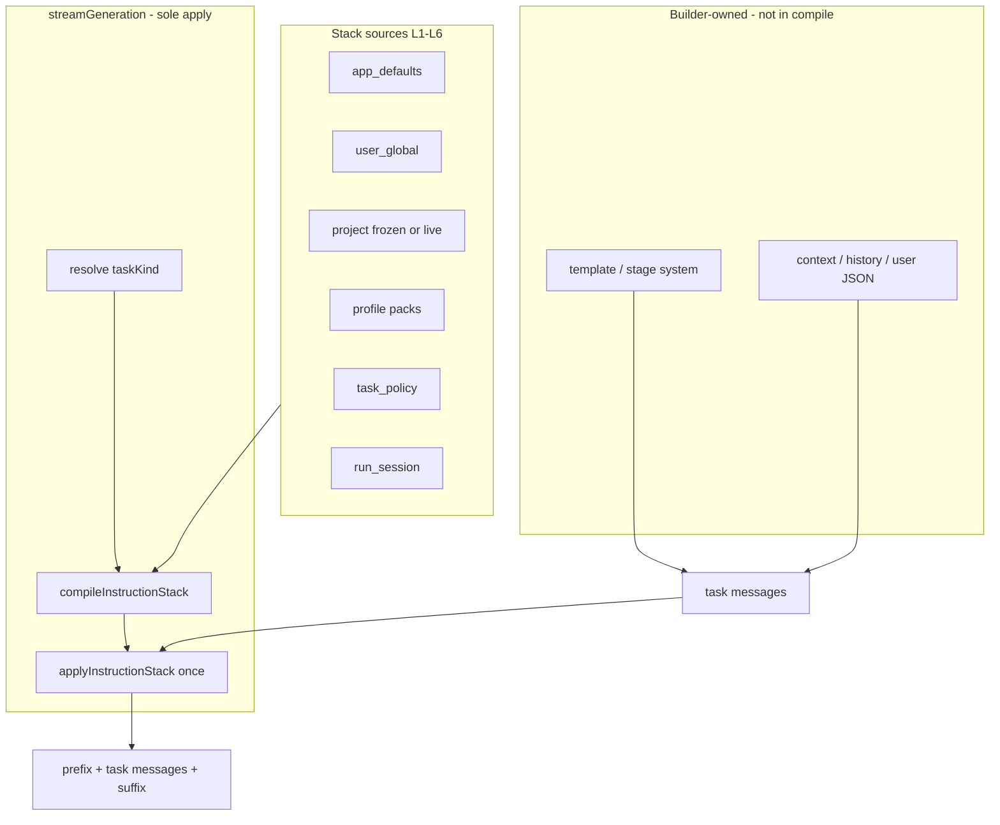
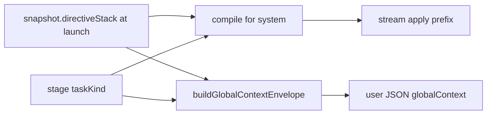

# 指令栈（Directive Stack）设计方案：分层写作指令替代全局前缀

| 字段 | 值 |
|------|-----|
| **Document** | Directive Stack / 指令栈 Redesign |
| **Author** | DraftHarbor Systems Architecture |
| **Date** | 2026-08-03 |
| **Status** | Draft (rev 2 — review fixes) |
| **Workspace** | `D:\soft\DraftHarbor` |
| **Supersedes** | 扁平 `settings.globalPrompt` + `prependGlobalPrompt` 单串注入 |
| **Related** | F-09.6H quality locks、workflow `globalContext` freeze、workshop multi-turn |

---

## Overview

DraftHarbor 当前用设置项 `globalPrompt: { enabled, content }` 作为跨任务「全局写作前缀」：在 `ProviderStream.streamGeneration` 中通过 `prependGlobalPrompt` 无差别插入**首条 system 消息**。真实 DeepSeek 测试（2026-08-03）表明：单串无法表达任务范围、硬越狱前缀对成人向虚构表现更差、对 JSON/分析任务形成污染、且与项目规则 / 写作指令 / 模板无分层。

本方案将扁平全局前缀替换为 **指令栈（Directive Stack）**——有序、可作用域过滤、可预算截断、可预览的指令编译管线。默认输出**短而稳定的创作契约**（语言、禁 meta、成人虚构合法允许等），题材/尺度/人设放在**项目或任务层**。保留「每次请求重新注入」；不再鼓励「每次注入完整越狱文」。

**Rev 2 硬化约束（审查阻塞项）：**

1. **`taskKind` 是作用域注入的硬前置**——不能只靠 unscoped `config.globalPrompt` flatten。
2. **双通道同步过滤**——system 栈 **与** workflow user JSON `globalContext` 使用同一 scope 规则。
3. **`streamGeneration` 是 messages 上指令的唯一 mutator**——builders 只附 meta / context，禁止 builder+stream 双前缀。
4. **模板 / stage system 仍归现有 builder 所有**——不进栈编译，避免双写 template。
5. **设置 partial patch 有明确 dual-write merge**——旧 UI 只写 `globalPrompt` 不会静默丢编辑。

---

## Background & Motivation

### Current state (code anchors)

| 能力 | 现状 | 路径 |
|------|------|------|
| 设置 schema | `normalizeGlobalPrompt` → `{ enabled, content }` | `src/core/settings/settings-schema.js` L199–205, L229 |
| 运行时配置 | `providerRuntimeConfig` 把启用内容摊平成 `globalPrompt: string`；`...extras` **后写**可覆盖 | 同文件 L263–281 |
| 设置写入 | `updateSettings` shallow-merge patch；对 `providerSettings`/`generationDefaults`/`compendiumAgent`/`workflowGeneration` 有 deep-merge，**无** `globalPrompt` deep-merge | `desktop/services/settings-service.js` L23–53 |
| 注入点 | `prependGlobalPrompt(messages, value)` 始终作为首条 system | `src/core/generation/provider-stream.js` L39–43, L283–292 |
| 写作正文 Prompt | `buildFictionPrompt`：template system + user；`meta.task = 'fiction-prose'` | `src/core/generation/prompt-builder.js` L89–125 |
| 写作改写/摘要 | rewrite / regenerate / summary 经 `nativeGenerationConfig` → 同一 `globalPrompt` | `writer-prompts.js`、`writer-generation.js` |
| 避免写法 | 全局 + 项目 `styleGuardRules` 拼进 prose user 段 | `writer-core.js` `nativeAvoidanceInstruction`；`avoidance-rules.js` |
| Workshop | template system + context system + history 末 20 + user；`meta.task = 'workshop-chat'` | `workshop-prompt.js` L22–59 |
| 资料卡 JSON（写作 provider） | draw / rewrite / extract 用 `nativeGenerationConfig()`（**写作配置**，非 agent 配置） | `compendium-draw.js`、`compendium-rewrite.js`、`compendium-extraction.js` |
| 资料库管家 | 独立 profile，但 `providerRuntimeConfig` **仍带** `globalPrompt` | `compendium-agent-runner-service.js` L18–24 |
| 工作流冻结 | `generationPolicy.snapshot.globalPrompt`（**无 project 入参**） | `workflow-provider-config.js` L1–26, L97 |
| 工作流双通道 | system prepend **+** user JSON `globalContext.globalPrompt` | `workflow-creation-service.js` L33–36；guided L357–361；assembly L687 |
| UI | 设置单 textarea；写作区 partial POST `{ globalPrompt }` | `settings.html`；`writer-global-prompt.js` L50；`settings.js` L646–649 |
| 项目字段 | `styleGuardRules` 已有；**无** project directive 字段 | `project-schema.js` L102 |
| Script 加载 | `desktop.html` 已有 `provider-stream.js`、`settings-schema.js`；**无** instruction-stack | `desktop.html` |

### Pain points (validated)

1. **无作用域**：同一串作用于 prose / workshop / workflow JSON / review / summary / 资料卡 JSON。
2. **稀释误解**：每次请求都会 prepend；真正问题是影响力稀释与全局内容写错。
3. **质量反直觉**：硬越狱前缀常差于软契约；无前缀 baseline 常更好。
4. **双通道污染**：workflow 在 **system 前缀** 与 **user JSON `globalContext.globalPrompt`** 各注入一次；只修 system 不够。
5. **无分层**：与 writingInstructions、style guards、templates 平行。
6. **Workshop 抗稀释弱**：history 20，无 tail pin / session contract。
7. **不可见**：无预算、无预览。
8. **Partial settings 风险**：迁移后若「directiveStack wins」而旧 UI 只写 `globalPrompt`，会静默丢编辑。

### Why change now

- 注入点集中在 `streamGeneration`，适合统一 apply。
- 工作流已冻结 `globalPrompt`；扩展为栈快照可保持可复现性。
- F-09.6H 质量锁已存在；全局前缀仍是最粗的一层。

---

## Goals & Non-Goals

### Goals

1. **指令栈**替代单串 `globalPrompt` 作为产品与运行时模型。
2. 按 **`taskKind`** 路由层；**system 与 user envelope 同一 scope 规则**。
3. **唯一 apply 所有者** = `streamGeneration`；compile 可在 stream 或测试内调用，但 messages 只被 apply 一次。
4. **预算**硬字符上限 + 确定性截断顺序 + debug。
5. **迁移零丢字** + partial patch 正确 dual-write merge。
6. **UX**：分层编辑、预览、预设包、Workshop 会话契约。
7. **可测**：compile、scope、merge、全 call-site taskKind 清单。

### Non-Goals

- 不做完整 RAG。
- 不做成越狱产品；默认预设为专业创作契约。
- 不重做 F-11 证据化文风。
- 不打断历史 workflow run 的冻结语义。
- 不把 style-guard **检测**迁入栈（只管注入是否纳入）。
- MVP **不做** jailbreak 关键词静默降级（仅预算截断 + 可选 debug.warnings）。

---

## Proposed Design

### Product naming

| 语言 | 名称 | 说明 |
|------|------|------|
| 中文 | **指令栈** | 设置/写作区主文案 |
| English | **Directive Stack** | 代码模块、API、文档 |
| 废弃文案 | 「全局写作前缀」 | 迁移期可显示「已迁移到指令栈 · 用户全局层」 |

模块：`src/core/generation/instruction-stack.js`（`DraftHarborInstructionStack`）。

---

### A. Layer model

#### Ordered layers (compile = layers 1–6 only)

| Order | Layer ID | Source | Mutability | Default |
|------:|----------|--------|------------|---------|
| 1 | `app_defaults` | 产品常量 | 代码 | always |
| 2 | `user_global` | `settings.directiveStack.userGlobal` | 用户设置 | on if content |
| 3 | `project` | `project.directiveStack`（运行中则用 **freeze**） | 项目 JSON | on if content |
| 4 | `profile_pack` | settings packs + project/settings attachments | 可选 | off until attached |
| 5 | `task_policy` | 按 taskKind 内置策略（含统一优先级文案） | 半固定 | always |
| 6 | `run_session` | workshop `directiveContract` / 单次 override / freeze 中的 run 覆盖 | 会话/运行 | optional |

**不进栈编译（builder 自有）：**

| 概念 | 所有者 | 说明 |
|------|--------|------|
| Template / stage system | `buildFictionPrompt`、workshop template、`jsonPrompt`/`textPrompt` stage system、agent system | **禁止** compile 再输出一份 template 层 |
| Style guards | `avoidance-rules` → prose **user** 段 | 不进 system 栈 |
| Beat / user JSON / history | 各 builder | 最高局部性；冲突表中记优先级，但不由栈改写 body |

冲突优先级表（模型侧文案，见 **统一 `INSTRUCTION_PRIORITY_TEXT`**）仍把 local beat / 批次意见放在栈层之上。



#### Layer content shape

```js
{
  id: 'user_global',
  enabled: true,
  title: '用户全局创作契约',
  content: string,
  contract: {
    language: 'follow_author' | 'zh' | 'en' | string,
    allowAdultFiction: boolean | 'project',
    forbidMeta: boolean,
    outputMode: 'prose' | 'json' | 'chat' | 'auto'
  },
  scopes: string[],   // empty → layer defaultScopes
  placement: 'head' | 'tail' | 'auto',
  priority: number,
  maxChars: number,
  source: 'migrated_globalPrompt' | 'user' | 'preset' | 'system' | 'frozen'
}
```

#### App defaults

**Creative 变体**（`writer-prose`、`writer-rewrite`、`workshop-chat`、`workflow-draft` 等）：

```text
你是 DraftHarbor 的虚构创作协作者。
- 跟随作者在 beat / 上下文中的语言与叙事视角。
- 不输出创作过程元信息（场景编号、批次名、计划字段名等），除非当前任务明确要求结构化输出。
- 尊重项目已确立的事实与连续性。
- 若项目题材需要，可创作含成人向内容的虚构作品；不做说教审查，但遵守用户明确禁止项。
```

**Structured 变体**（`workflow-json`、`workflow-review`、`compendium-json`、`compendium-agent`、`reader-extract`、`unknown` 默认）：

```text
你是 DraftHarbor 的结构化任务助手。严格遵守任务 system 中的输出格式（JSON 或字段约定）。
不要输出 Markdown 代码块（除非任务要求）。不要注入与输出 schema 无关的人设或越狱指令。
```

#### User global

- 短创作契约；题材/越狱/长人设下沉 project / pack / session。
- **迁移默认 scopes**：`DEFAULT_SCOPES_CREATIVE`（见下）——**不含** json / agent / extract。
- 设置高级选项：「扩展到全部任务」（显式写入全 scopes）。

#### Project directives

```js
// project-schema / project-normalize
directiveStack: {
  schemaVersion: 1,
  layers: [/* same shape */],
  attachedPackIds: [],
  updatedAt: ''
}
```

- 与 `styleGuardRules` 并存：段落约定 vs 短语避免。
- **`CURRENT_SCHEMA_VERSION` 策略**：项目根 `schemaVersion` **不强制 bump**（可选字段 + normalize 默认空）；若团队希望严格版本门，可在实现 PR 将 `CURRENT_SCHEMA_VERSION` 升到 2 并在 normalize 注释「v1 缺省 directiveStack={}」。**推荐不 bump 根版本**，与 `readerApplications` 等历史加字段一致。

#### Profile packs

| Pack | 默认 scopes |
|------|-------------|
| `pack.minimal_contract` | `DEFAULT_SCOPES_CREATIVE` |
| `pack.soft_literary` | writer-prose, writer-rewrite, workshop-chat |
| `pack.output_json` | workflow-json, workflow-review, compendium-json |
| 硬越狱 | **非官方预设** |

#### Run / session

- Workshop：`session.directiveContract`（见 F / schema）。
- 单次：`config.directiveOverride` 或 `prompt.meta.directiveContext.override`。
- Workflow：仅使用 **launch 时冻结** 的 stack（见 E）。

#### Merge rules

1. Scope filter by `taskKind`。
2. `enabled === false` → drop。
3. 自由文本按 order 拼接；分隔标题语言默认 **中文**（`## 用户全局` / `## 本作品`）；`contract.language === 'en'` 时用英文标题。
4. `contract.*` 后者覆盖前者。
5. **不**编译 template 层。
6. 预算截断：见 §C Budgets（确定性顺序）。

#### Conflict resolution — single constant

Export from `instruction-stack.js` and use in plan/draft stage systems (replace ad-hoc string at `workflow-creation-service.js` L37):

```js
const INSTRUCTION_PRIORITY_TEXT =
  '指令优先级固定为：事实与硬约束 > 已批准蓝图和场景计划 > 当前批次用户意见 > 本请求局部指令 > 会话契约 > 项目指令 > 用户全局 > 应用默认 > 模型默认倾向。'
  + '若发生冲突，遵守高优先级内容，并在结构化结果的 notes 或 avoid 中明确记录冲突，不得静默覆盖。';
```

（英文 locale 可选常量 `INSTRUCTION_PRIORITY_TEXT_EN`，MVP 中文主路径即可。）

---

### B. Scope & task routing

#### TASK_KINDS and aliases

```js
const TASK_KINDS = Object.freeze([
  'writer-prose',
  'writer-rewrite',      // rewrite + regenerate-selection
  'writer-summary',
  'workshop-chat',
  'workflow-brief',
  'workflow-json',       // direction, blueprint, plan JSON, workflow compendium cards, analysis JSON-ish
  'workflow-draft',
  'workflow-review',
  'workflow-rewrite',    // rewrite workflow prose path
  'workflow-repair',
  'workflow-analysis',
  'compendium-json',     // shell draw/rewrite/extract on writing provider
  'compendium-agent',
  'reader-extract',
  'unknown'              // fail-closed structured default
]);

const TASK_KIND_ALIASES = Object.freeze({
  'fiction-prose': 'writer-prose',
  'workshop-chat': 'workshop-chat',
  // AITask domain/action → kind (resolver helper)
  'prose:generate': 'writer-prose',
  'prose:rewrite': 'writer-rewrite',
  'prose:regenerate-selection': 'writer-rewrite',
  'summary:summarize': 'writer-summary',
  'compendium:draw': 'compendium-json',
  'compendium:rewrite': 'compendium-json',
  'compendium:extract': 'compendium-json',
  'compendium:update': 'compendium-json',
  'workflow:generate': null, // need stage/nodeId
  'style-guard:repair': 'writer-rewrite'
});

const DEFAULT_SCOPES_CREATIVE = Object.freeze([
  'writer-prose', 'writer-rewrite', 'workshop-chat', 'workflow-draft', 'workflow-rewrite', 'workflow-repair'
]);

const DEFAULT_SCOPES_STRUCTURED_ONLY = Object.freeze([
  'workflow-json', 'workflow-review', 'workflow-brief', 'workflow-analysis',
  'compendium-json', 'compendium-agent', 'reader-extract', 'writer-summary', 'unknown'
]);
```

**Migrated `user_global.scopes` default** = `DEFAULT_SCOPES_CREATIVE`（**含** `workflow-draft` / rewrite/repair；**不含** json/agent/extract/summary）。

**`writer-summary` / `workflow-brief` / `workflow-analysis`：** 默认 **不** 吃 user_global（偏结构化/分析）；project soft 可选（默认 scopes 不含 summary）。

#### Layer × taskKind matrix (stack layers only)

| Layer \ Kind | prose | rewrite | workshop | wf-draft | wf-rewrite/repair | wf-json | wf-review | wf-brief | wf-analysis | summary | comp-json | agent | reader | unknown |
|--------------|:---:|:---:|:---:|:---:|:---:|:---:|:---:|:---:|:---:|:---:|:---:|:---:|:---:|:---:|
| app creative | ✓ | ✓ | ✓ | ✓ | ✓ | — | — | — | — | — | — | — | — | — |
| app structured | — | — | — | — | — | ✓ | ✓ | ✓ | ✓ | ✓ | ✓ | ✓ | ✓ | ✓ |
| user_global | ✓ | ✓ | ✓ | ✓ | ✓ | —* | — | — | — | — | — | — | — | — |
| project | ✓ | ✓ | ✓ | ✓ | ✓ | soft† | soft† | — | soft† | soft† | — | — | — | — |
| packs | by pack scopes | | | | | | | | | | | | | |
| task_policy | ✓ | ✓ | ✓ | ✓ | ✓ | ✓ | ✓ | ✓ | ✓ | ✓ | ✓ | ✓ | ✓ | ✓ |
| run_session | ✓ | ✓ | ✓ | freeze | freeze | freeze | freeze | freeze | freeze | — | — | — | — | — |

\* user_global 仅当用户显式把该 kind 加入 scopes。  
† soft = 若 project layer scopes 包含该 kind 则注入，默认 project layer scopes = `DEFAULT_SCOPES_CREATIVE`（不含 json）。

**Builder-owned template/stage system：** 每行都有，但 **不由栈编译**。

#### Complete call-site matrix (acceptance checklist)

凡 `streamGeneration` / `AITaskRunner.run` → 必须解析出 `taskKind` 并传入 config 或 `prompt.meta`。

| # | Call site | File(s) | taskKind |
|---|-----------|---------|----------|
| 1 | Writer generate prose | `writer-generation.js` + `buildFictionPrompt` | `writer-prose` |
| 2 | Writer rewrite / regenerate | `writer-prompts.js` / generation | `writer-rewrite` |
| 3 | Writer summary | `writer-generation.js` ~summary path | `writer-summary` |
| 4 | Workshop send | `workshop.js` + `workshop-prompt.js` | `workshop-chat` |
| 5 | Compendium draw | `compendium-draw.js` | `compendium-json` |
| 6 | Compendium rewrite | `compendium-rewrite.js` | `compendium-json` |
| 7 | Compendium extract | `compendium-extraction.js` | `compendium-json` |
| 8 | Workflow brief | `workflow-generation.js` `guidedStageProviderConfig('brief')` | `workflow-brief` |
| 9 | Workflow direction/blueprint/plan/compendium JSON | creation stages | `workflow-json` |
| 10 | Workflow draft | draft stage / variant draft | `workflow-draft` |
| 11 | Workflow review | review complete | `workflow-review` |
| 12 | Workflow rewrite | rewrite services / UI | `workflow-rewrite` |
| 13 | Workflow repair | repair / variant repair config | `workflow-repair` |
| 14 | Workflow analysis | `workflow-analysis-service.js` | `workflow-analysis` |
| 15 | Workflow artifact re-gen | `workflow-artifact-interactions.js` by `nodeId` | map nodeId → kind |
| 16 | Guided step stream | `workflow.js` / `workflow-generation.js` by step.id | map step → kind |
| 17 | Compendium agent run/qa | `compendium-agent-runner-service.js`, `*-qa-service.js` | `compendium-agent` |
| 18 | Reader extract | `reader-compendium-extractor-service.js` | `reader-extract` |

**nodeId / step → kind map**（实现常量 `WORKFLOW_NODE_TASK_KIND`）：

```js
{
  brief: 'workflow-brief',
  analysis: 'workflow-analysis',
  direction: 'workflow-json',
  blueprint: 'workflow-json',
  compendium: 'workflow-json',
  plan: 'workflow-json',
  draft: 'workflow-draft',
  review: 'workflow-review',
  rewrite: 'workflow-rewrite',
  repair: 'workflow-repair'
}
```

#### Isolation is not automatic

`compendium-agent` / `reader-extract` / `compendium-json` **今天**都会经 `providerRuntimeConfig` 带上 full `globalPrompt`。隔离 = **compile 时 scopes 排除 user_global/project** + stream **禁止** legacy unscoped prepend 当 `directiveStack` 存在。Agent 配置解析处必须设 `taskKind: 'compendium-agent'`（或显式 `compiledDirectives` 空用户层），**不能**仅依赖「文档说不注入」。

---

### C. Anti-dilution, budgets, warnings

| 机制 | 默认 |
|------|------|
| 每次请求 re-compile + re-apply | 必须 |
| Head system prefix | 必须 |
| Workshop tail pin / sandwich | 默认 **on**；尾为 ≤400 字摘要 |
| Session contract sticky | workshop UI |
| History limit | 仍 20 |
| Jailbreak keyword silent drop | **MVP 不做** |

#### Budgets (string length)

| Bucket | Default max |
|--------|-------------|
| app_defaults | 600 |
| user_global | 800 |
| project | 1200 |
| packs total | 800 |
| task_policy | 400 |
| run_session | 600 |
| **Total head** | 2400 |
| **Tail pin** | 400 |
| envelope digest | 1500 |
| workflow-draft 时 user_global 额外 cap | 400（仍注入，只截断） |

#### Truncation algorithm (deterministic)

当 `total head > budget` 或单层超 `maxChars`：

1. 先按层 **单层 maxChars** 截断该层 content 尾部（保留标题行）。
2. 若总 head 仍超：按 **从低优先级到高** 继续截断自由文本尾部：  
   **`profile_pack` → `user_global` → `project` → `run_session` → `task_policy` → `app_defaults`（最后才动）**。  
3. 每层设 `debug.layers[i].truncated = true`；`debug.truncated = true`。
4. **禁止**因「像越狱」而整层 drop；仅可选：

```js
debug.warnings.push('user_global_long'); // if content.length > 800
```

#### Workshop message order (exact)

```text
[system] messagesPrefix (compiled stack head)     // stream apply
[system] template system                         // builder
[system] project context block                   // builder
... history user/assistant (≤20) ...
[system] messagesSuffix (tail pin)               // stream apply; API mode
[user] current message
```

**Local mode (`mode !== 'api'`)**：`applyInstructionStack` 将 suffix **并入最后一条 user 的前缀**（`[契约提醒]\n…\n\n` + content），不插入 mid-history system。单一分支：`if (compiled.messagesSuffix.length && mode === 'local') mergeSuffixIntoLastUser(...)`。

---

### D. Compilation pipeline & apply ownership

#### Non-negotiable invariant

> **`ProviderStream.streamGeneration` is the sole mutator of `messages` for Directive Stack injection.**  
> Builders **must not** prepend stack systems into `prompt.messages`.  
> Builders **must** attach identity for compile: at minimum `prompt.meta.taskKind` (or mappable `prompt.meta.task` / AITask domain:action) and optional `prompt.meta.directiveContext`.  
> Apply runs **at most once** per request; sets `prompt.meta.instructionStackApplied = true` (and/or internal flag on the messages array reference used for the HTTP body).

#### taskKind resolution order (required)

```text
1. config.taskKind
2. prompt.meta.taskKind
3. TASK_KIND_ALIASES[prompt.meta.task]
4. TASK_KIND_ALIASES[`${task.domain}:${task.action}`] when AITask present on meta
5. WORKFLOW_NODE_TASK_KIND[config.workflowNodeId || prompt.meta.workflowNodeId]
6. default: 'unknown'  → structured/isolated (no user_global, no project creative)
```

#### `config.globalPrompt` when directiveStack exists

- **禁止**把 unscoped `legacyFlatten(full user_global)` 当作 stream 的注入源。
- `providerRuntimeConfig` 可继续暴露：
  - `directiveStack`: normalized settings stack snapshot (user layers only; **not** project),
  - `globalPrompt`: **mirror of user_global content for legacy UI/tests only**,
  - 但 `streamGeneration` 在存在 `config.directiveStack` **或** settings 已 normalize 出 directiveStack 时：  
    **走 compile(taskKind)**，**不**调用 `prependGlobalPrompt(messages, config.globalPrompt)`。
- 仅当 **纯旧数据路径**（无 directiveStack 字段的极端回退）才 `prependGlobalPrompt`。
- Workflow freeze：`guidedStageProviderConfig` 传 `directiveStack: snapshot.directiveStack`、`taskKind` from node、以及 **scoped** `globalPrompt` 仅作兼容字段（可等于 envelope digest，见 E）。

#### compileInstructionStack(context) →

```js
{
  messagesPrefix: Message[],
  messagesSuffix: Message[],
  userContextEnvelope: {
    // ALWAYS scope-filtered for the given taskKind
    globalPrompt: string,           // legacy field: scoped digest or '' — NOT full jailbreak when out of scope
    writingInstructions: object|null,
    directiveStack: {
      schemaVersion: 1,
      taskKind: string,
      layers: [{ id, title, content, chars }],  // applied only
      textDigest: string
    }
  },
  debug: {
    taskKind, layers: [{ id, applied, chars, truncated, placement, reason }],
    totalChars, truncated, warnings: string[], version: 1
  }
}
```

`reason` examples: `applied`, `out_of_scope`, `disabled`, `budget_truncated`, `empty`.

#### applyInstructionStack(messages, compiled, { mode })

- Prefix unshift; suffix per mode rule above.
- Idempotent if `messages.__instructionStackApplied` or meta flag.

#### streamGeneration integration (pseudocode)

```js
async function streamGeneration(prompt, onToken, config) {
  const messages = /* from prompt */;
  const meta = prompt && prompt.meta || {};
  if (!meta.instructionStackApplied) {
    const taskKind = resolveTaskKind(config, prompt);
    const compiled = config.compiledDirectives
      || compileInstructionStack({
          taskKind,
          mode: config.mode,
          directiveStack: config.directiveStack,      // freeze or settings
          projectDirectiveStack: config.projectDirectiveStack, // usually from freeze
          sessionContract: config.sessionContract || meta.directiveContext && meta.directiveContext.sessionContract,
          override: config.directiveOverride || meta.directiveContext && meta.directiveContext.override,
          writingInstructions: config.writingInstructions,
          antiDilution: config.antiDilution
        });
    messages = applyInstructionStack(messages, compiled, { mode: config.mode });
    if (prompt && prompt.meta) {
      prompt.meta.instructionStackApplied = true;
      prompt.meta.instructionStackDebug = compiled.debug;
    }
  }
  // NEVER also prependGlobalPrompt when compile path ran
}
```

#### Preview API

`compileInstructionStack` 纯函数供 UI「本次将发送的指令预览」；预览 **不** 经 stream。

---

### E. Data model, migration, dual-write merge, freeze

#### Settings shape

```json
{
  "globalPrompt": { "enabled": true, "content": "..." },
  "directiveStack": {
    "schemaVersion": 1,
    "userGlobal": {
      "enabled": true,
      "content": "...",
      "scopes": ["writer-prose", "writer-rewrite", "workshop-chat", "workflow-draft", "workflow-rewrite", "workflow-repair"],
      "placement": "auto",
      "maxChars": 800
    },
    "packs": [],
    "attachedPackIds": [],
    "antiDilution": { "workshopTailPin": true, "workshopSandwich": true },
    "budgets": {}
  },
  "globalStyleGuardRules": []
}
```

#### Dual-write merge rules (normative)

Implemented in `normalizeDesktopSettings` **and** `updateSettings` deep-merge:

**On read / normalize (always produce both views):**

1. Start from stored object.
2. If `directiveStack` missing/empty and `globalPrompt` has content → migrate to `userGlobal`, scopes = `DEFAULT_SCOPES_CREATIVE`, `source: 'migrated_globalPrompt'`.
3. Derive mirror: `globalPrompt = { enabled: userGlobal.enabled, content: userGlobal.content }`.

**On write / `updateSettings(patch)`:**

| Patch contents | Behavior |
|----------------|----------|
| Only `globalPrompt` | Deep-assign `enabled`/`content` onto existing `directiveStack.userGlobal` **preserving** scopes, placement, maxChars, packs, antiDilution; then re-derive `globalPrompt` mirror. |
| Only `directiveStack` | Deep-merge `userGlobal`, `antiDilution`, `budgets`; replace `packs`/`attachedPackIds` if provided; then re-derive `globalPrompt` from `userGlobal`. |
| Both in same patch | Structure from `directiveStack` deep-merge first; then if `globalPrompt.content`/`enabled` present, **last-writer = globalPrompt fields for enabled/content only** (old UI same request rare); scopes still from directiveStack. Document: prefer sending one or the other. |
| Neither | unchanged |

**`updateSettings` must deep-merge** (extend `settings-service.js`):

```js
globalPrompt: {
  ...current.globalPrompt,
  ...(patch.globalPrompt || {})
},
directiveStack: mergeDirectiveStackSettings(current.directiveStack, patch.directiveStack)
// then single normalizeDesktopSettings that applies the dual-write rules above on the merged object
```

**Unit tests (required):**

1. After migration, POST partial `{ globalPrompt: { enabled, content: 'NEW' } }` → `userGlobal.content === 'NEW'` and scopes unchanged.
2. POST `{ directiveStack: { userGlobal: { content: 'X' } } }` → packs/antiDilution preserved.
3. Normalize only-globalPrompt legacy file → both fields.

#### Project

- `directiveStack` default empty; normalize preserves layers.
- No secrets.

#### Workflow freeze timing (normative)

**At run start (launch)** — extend `workflowGenerationLaunchConfig(project?)` / start payload builder:

1. Resolve **settings** user_global + packs + antiDilution + budgets.
2. Resolve **current project** `directiveStack` layers (requires `projectId` / snapshot in launch path — guided start already has project context).
3. Freeze into `generationPolicy.snapshot`:

```js
snapshot: {
  // existing provider fields...
  globalPrompt: scopedLegacyMirrorForLaunch, // see below
  directiveStack: {
    schemaVersion: 1,
    frozenAt: iso,
    layers: [
      // materialized texts: user_global, project layers, attached packs as frozen content
      // each with id, title, content, scopes, placement, source: 'frozen'
    ],
    antiDilution: {...},
    budgets: {...}
  }
}
```

4. **Mid-run project/settings edits do not affect** in-flight run（与 model/endpoint 冻结同级）。
5. Stage `prepareCreationStage` / guided fatContext **只读 freeze** + writingInstructions artifacts；**不再**现场读 live settings/project for directives.

**`snapshot.globalPrompt` meaning after rev2：**

- 兼容字段：等于 **user_global frozen content**（便于旧 sentinel 测「启动时冻结了设置里的串」）。
- **不等于**「每个 stage 都会把这整串塞进 system/envelope」。
- Stage inject 一律：`compile(taskKind, snapshot.directiveStack)`。

**Old runs (only `snapshot.globalPrompt` string):**

```js
rehydrateFreeze(snapshot) {
  if (snapshot.directiveStack && snapshot.directiveStack.layers) return snapshot.directiveStack;
  return {
    schemaVersion: 1,
    layers: snapshot.globalPrompt
      ? [{ id: 'user_global', enabled: true, content: snapshot.globalPrompt,
           scopes: DEFAULT_SCOPES_CREATIVE, source: 'rehydrated_legacy_snapshot' }]
      : [],
    antiDilution: { workshopTailPin: true, workshopSandwich: true }
  };
}
```

注意：旧 run 的 rehydrate 仍用 creative scopes，因此 **旧 run 的 json stage 将不再注入** 该串（行为相对「当时 double-inject 全文」是 **有意收紧**）。若需 bit-exact replay，可检测 `!snapshot.directiveStack` 且设 `legacyUnscoped: true`——**默认不启用**；文档标明历史 run 在新版本上 json 更干净。

#### Envelope policy (dual-channel — same scope as system)

`buildGlobalContextEnvelope(taskKind, freeze, writingInstructions)`:

| taskKind | `globalPrompt` legacy field | `directiveStack` in envelope |
|----------|----------------------------|------------------------------|
| `workflow-json`, `workflow-review`, `workflow-brief`, `workflow-analysis` | `''` or short structured digest (≤200 chars from **applied** layers only; usually app structured + task_policy only) | applied layers only |
| `workflow-draft`, `workflow-rewrite`, `workflow-repair` | digest of applied creative layers under envelope budget | applied layers |
| tests that need sentinel | may assert `directiveStack` or that launch snapshot still stores raw user text in `snapshot.globalPrompt` / frozen layer content — **not** that every stage user JSON repeats full jailbreak |

`prepareCreationStage` **must** call envelope builder with stage→taskKind；**禁止** `globalContext.globalPrompt = snapshot.globalPrompt` 无过滤赋值。



---

### F. UX & workshop persistence

#### Settings / Writer / Workshop / Workflow

（与 rev1 相同产品意图：分层编辑、预览、预设、强化契约、冻结 digest 展示。）

Writer 按钮：「指令栈」；状态文案说明 **按任务类型注入**，并链到预览。

#### Workshop `directiveContract` persistence

- 存在 **project JSON** `workshopSessions[]`（现路径：`workshop.js` → `saveWorkshopSession` API → 写回项目）。
- `createWorkshopSession` / `normalizeWorkshopSessions` **必须 round-trip**：

```js
directiveContract: {
  enabled: !!raw.directiveContract && raw.directiveContract.enabled,
  content: cleanString(raw.directiveContract && raw.directiveContract.content),
  reinforcedAt: cleanString(raw.directiveContract && raw.directiveContract.reinforcedAt),
  pinMode: ['off','tail','sandwich'].includes(...) ? ... : 'sandwich'
}
```

- **新会话**：默认 `directiveContract` 空/disabled；只继承 **project/settings stack**（live compile）。UI「继承契约」可选把上一会话 content 拷入。
- **强化**：写 content + `enabled: true` + `reinforcedAt=now` + pinMode sandwich/tail。

---

### G. Testing & acceptance

| 级别 | 用例 |
|------|------|
| `tests/instruction-stack.js` | 层序、scope、截断顺序、aliases、unknown fail-closed、envelope scoped empty globalPrompt for json、rehydrate legacy snapshot |
| `tests/provider-stream.js` | 唯一 apply；同时存在 `globalPrompt` 与 `directiveStack` 时 **不**双前缀；taskKind missing → unknown |
| `tests/settings-service.js` | partial globalPrompt patch 更新 userGlobal 且保留 scopes；directiveStack deep-merge |
| workshop-prompt / generation | message order；local suffix→user |
| workflow-creation-* | envelope 不含 full out-of-scope jailbreak；snapshot 仍冻结 user 原文于 layers；priority 常量引用 |
| desktop-library | 设置往返；可选新 data 属性 |
| Call-site checklist | PR2 关闭前表格 1–18 全部赋值 taskKind（单测或静态清单测试） |

Real provider canary optional。

---

### H. Risks

| Risk | Severity | Mitigation |
|------|----------|------------|
| PR1 无 taskKind 仍全量注入 | Critical | PR1 = parity only；scope 在 PR2 接线后生效（见 PR Plan） |
| Envelope 仍塞满 jailbreak | Critical | `buildGlobalContextEnvelope` 强制 scope；改测试期望 |
| Partial settings 丢编辑 | Critical | dual-write merge + tests |
| Double injection | High | stream sole mutator invariant + unit test |
| 旧 workflow json 行为变化 | Med | 有意收紧；rehydrate 默认 scoped；文档说明 |
| Local mid-system | Med | local suffix→user 单分支 |
| 预算截断误伤 | Med | 固定顺序；debug.truncated 预览 |
| `providerRuntimeConfig` extras 覆盖 | Low | freeze 路径继续在 extras 后写入 scoped 字段 |

---

## API / Interface Changes

```js
// instruction-stack.js exports
TASK_KINDS, TASK_KIND_ALIASES, WORKFLOW_NODE_TASK_KIND,
DEFAULT_SCOPES_CREATIVE, DEFAULT_BUDGETS,
INSTRUCTION_PRIORITY_TEXT,
normalizeDirectiveLayer, normalizeDirectiveStackSettings, normalizeProjectDirectiveStack,
mergeDirectiveStackSettings,
migrateGlobalPromptToDirectiveStack,
legacyGlobalPromptFromUserGlobal,
resolveTaskKind,
compileInstructionStack,
applyInstructionStack,
buildGlobalContextEnvelope,
rehydrateFreezeDirectiveStack,
summarizeStackForSnapshot,
builtinPresetPacks
```

`prependGlobalPrompt` 保留导出，**仅** legacy 回退与旧单测。

---

## Alternatives Considered

### Alt 1 — Scope checkboxes on single globalPrompt only  
Rejected：无 project/session/budget/preview 体系。

### Alt 2 — Templates only  
Rejected：全局契约需复制到每个模板。

### Alt 3 — Sandwich full jailbreak every time  
Rejected：不修 scope；与质量实验相悖。

### Alt 4 — Server-only compile  
Rejected：writer/workshop 在 renderer 直调 stream；core 纯函数更贴合。

### Alt 5 — Tactical: stop stream-level prepend; inject only at prose/workshop call sites  
**Pros**：改动面小，立刻减少 JSON/agent 污染。  
**Cons**：无统一预算/预览/project/session；双通道 envelope 仍要单独改；后续仍会重做成栈。  
**Rejected as end state**；若需紧急止血可作 **临时 cherry-pick**（在 PR2 前把 agent/compendium-json/workflow-json 的 `globalPrompt` 置 `''`），但不替代指令栈。

---

## Security & Privacy

- 指令非 secret；publicSettings 不增密钥面。
- Agent/reader/compendium-json 默认隔离用户创作全局，降低交叉污染。
- 成人虚构允许写在默认契约中；无内置审查墙/越狱包。
- 日志默认不持久化完整指令正文。

---

## Observability

- `prompt.meta.instructionStackDebug` / 预览 UI。
- `debug.truncated`、`debug.warnings`。
- 可选后续 metrics：`truncated=true` 按 taskKind 计数。

---

## Rollout Plan

1. **PR1**：compiler + migration + dual-write merge；**行为与今日 parity**（stream 仍可对所有 kind 注入 user_global **仅当** 临时 `legacyParity: true` **或** 尚未传 taskKind 时——见下）。
2. **PR2**：全 call-site `taskKind` + stream 强制 compile + isolation；**关闭污染**。
3. **PR3**：UX。
4. **PR4**：freeze + envelope policy + priority 常量接入 workflow。
5. **PR5**：packs、docs、canary。

**PR1 parity 细节：** 若 `resolveTaskKind` → `unknown` 且 `config.legacyParity !== false` 在过渡旗标下——**Rev2 决定：PR1 默认仍 prepend 旧 globalPrompt 以保绿；PR2 起 `unknown` fail-closed 且禁止 unscoped prepend。** 文档与 PR1 acceptance 写明：**PR1 不宣称已修复 JSON 污染。**

Rollback：关 feature 用仅 `prependGlobalPrompt`；或 settings 兼容模式。

---

## Open Questions

1. ~~user_global 是否含 workflow-draft？~~ → **已定：含**（Key Decision）。
2. DeepSeek thinking + tail pin 质量 → canary；默认 pin **短**摘要；可设 `antiDilution.workshopTailPin` 关。
3. Project directives 进 reader 偏好？ → **否**。
4. 预设包云同步？ → MVP 仅本地。
5. ~~分隔标题语言？~~ → **默认中文**；`contract.language === 'en'` 时英文（Key Decision）。

---

## References

- `src/core/settings/settings-schema.js`, `desktop/services/settings-service.js`
- `src/core/generation/provider-stream.js`, `prompt-builder.js`
- `src/core/workshop/workshop-prompt.js`, `workshop-schema.js`
- `src/desktop/shell/writer-*.js`, `workshop.js`, `compendium-*.js`, `workflow-*.js`
- `desktop/services/workflow-creation-*.js`, `compendium-agent-*.js`, `reader-compendium-extractor-service.js`
- `docs/F096H_QUALITY_LOCKS_DESIGN.md`, `SESSION_HANDOFF.md`, `FEATURE_TODO.md`

---

## Key Decisions

1. **产品名：指令栈（Directive Stack）**。

2. **Stream 是指令 messages 的唯一 mutator**；builders 只提供 `taskKind` + `directiveContext`；禁止 builder 预 prepend 栈。

3. **taskKind 解析链 + 默认 `unknown` = structured fail-closed**（PR2 起）；`TASK_KIND_ALIASES` 统一映射 `fiction-prose` → `writer-prose` 等。

4. **PR1 = 编译器 + 迁移 + dual-write merge + 行为 parity**；**不**在 PR1 宣称 scope 治污。治污在 **PR2 全量接线 taskKind** 后生效。

5. **双通道同一 scope**：system compile 与 `buildGlobalContextEnvelope` 共用 freeze + taskKind；json/review 的 `globalContext.globalPrompt` **不得**再塞 full user jailbreak。

6. **迁移默认 scopes = `DEFAULT_SCOPES_CREATIVE`**（含 workflow-draft / rewrite / repair；不含 json/agent/extract/summary）。

7. **模板 / stage system 归 builder**；栈仅 L1–L6。

8. **Project 指令在 run launch 时冻结**进 `snapshot.directiveStack.layers`；运行中改项目不影响；旧 snapshot 无 stack 时 rehydrate 单层 user_global + creative scopes。

9. **Partial `globalPrompt` patch 更新 `userGlobal` content/enabled 并保留 scopes**；`updateSettings` deep-merge `directiveStack`。

10. **MVP 仅硬预算截断**；无越狱关键词静默 drop；截断顺序 packs → user_global → project → session → task_policy → app_defaults。

11. **统一 `INSTRUCTION_PRIORITY_TEXT`** 导出并替换 workflow plan/draft 内联句。

12. **compendium-json（写作 provider 上的资料卡 JSON）与 agent/reader 一样默认不吃 user_global**。

13. **writingInstructions / style guards 不吞并**。

14. **分隔标题默认中文**。

15. **Alt 5 战术去 prepend 可作紧急止血，不作终态**。

---

## PR Plan

### PR1 — Core compiler + migration + dual-write merge（**parity**）

**Depends:** none  

**Files:**
- `src/core/generation/instruction-stack.js` **(new)**
- `src/core/settings/settings-schema.js`
- `desktop/services/settings-service.js` — deep-merge globalPrompt + directiveStack；normalize 规则
- `src/core/generation/provider-stream.js` — 接入 resolve/apply **但** 无 taskKind 时保持 legacy prepend（parity）
- `desktop.html` — script：`instruction-stack.js` **before** `provider-stream.js`（或紧邻其后且在 shell 前）
- `tests/instruction-stack.js` **(new)**
- `tests/provider-stream.js`
- `tests/settings-service.js`（**非** `tests/settings`）

**Acceptance:** migration 零丢字；partial globalPrompt 保存不丢 scopes；旧测试绿；**不**要求 json 去污染。

---

### PR2 — taskKind 全量接线 + scope 强制 + isolation（**治污闸门**）

**Depends:** PR1  

**Files:** 上表 call sites 1–18 全部：
- `writer-generation.js`, `writer-prompts.js`（若独立）
- `workshop.js`, `workshop-prompt.js`（meta.taskKind）
- `compendium-draw.js`, `compendium-rewrite.js`, `compendium-extraction.js`
- `workflow-provider-config.js` — `guidedStageProviderConfig(nodeId)` 设 `taskKind` + 传 `directiveStack` freeze
- `workflow-generation.js`, `workflow.js`, `workflow-variant-generation.js`, `workflow-artifact-interactions.js`
- `desktop/services/compendium-agent-runner-service.js`, `compendium-agent-qa-service.js`, `reader-compendium-extractor-service.js` — `taskKind` + 确保 compile 路径
- `provider-stream.js` — **移除**「无 taskKind 则 unscoped prepend」；unknown fail-closed
- `tests/*` 覆盖 scope：json/agent/comp-json 不出现 user_global 全文

**Acceptance:** checklist 1–18 完成；同时给 `globalPrompt`+`directiveStack` 无双前缀；compendium-json / agent / workflow-json **system 侧**无 user_global。

---

### PR3 — Project schema + UX

**Depends:** PR1；**建议 rebase on PR2**（预览才真实）  

**Files:**
- `project-schema.js`, `project-normalize.js`
- `workshop-schema.js` — directiveContract round-trip
- `writer-global-prompt.js` / settings fragments / `settings.js` / `workshop.js` UI
- `tests/desktop-library.js`

**Acceptance:** 分层编辑、预览 debug、会话契约保存/新会话默认。

**Note:** 不与 PR2 并行改同一 writer 文件；**顺序 PR2 → PR3**。

---

### PR4 — Workflow freeze + envelope policy + priority constant

**Depends:** PR1 + PR2  

**Files:**
- `workflow-provider-config.js` — launch 接收 project，冻结 layers
- `workflow-generation.js` / start guided paths — 传 project directives
- `workflow-creation-guided-service.js` — fatContext 用 `buildGlobalContextEnvelope`
- `workflow-creation-service.js` — 使用 envelope；`INSTRUCTION_PRIORITY_TEXT`
- `workflow-context-assembly.js` if needed
- tests: creation service/guided/ui sentinels 更新期望

**Acceptance:** json stage user JSON 的 `globalContext.globalPrompt` 为空或短 digest；snapshot 仍含冻结 user 原文于 layers；priority 字符串单一来源。

---

### PR5 — Presets, docs, canary

**Depends:** PR2–PR4  

**Files:** builtin packs；FEATURE_TODO/handoff；optional `docs/DIRECTIVE_STACK_DESIGN.md`；optional canary test  

**Acceptance:** 三包可附加；isolation 回归；legacy mirror 废弃时间表。

---

### Merge order (revised)

```text
PR1 → PR2 → PR3 → PR4 → PR5
```

**禁止** PR2 ∥ PR3 ∥ PR4 乐观并行。PR5 不再承担「首次 isolation」（isolation 在 PR2）。

---

## Appendix A — Old → new

| Old | New |
|-----|-----|
| Always prepend string | compile(taskKind) + sole stream apply |
| `globalContext.globalPrompt = snapshot` raw | scope-filtered envelope |
| Partial UI save globalPrompt | merges into userGlobal, keeps scopes |
| Template as stack layer 7 | builder-owned only |
| Isolation in late polish PR | PR2 hard gate |

## Appendix B — Integration checklist

1. [ ] `desktop.html` script tag for `instruction-stack.js`（先于依赖它的 shell；与 `provider-stream.js` 相邻）。
2. [ ] `settings-service.updateSettings` deep-merge `globalPrompt` + `directiveStack` + normalize dual-write。
3. [ ] `providerRuntimeConfig`：暴露 `directiveStack`；stream **不**用 unscoped flatten 注入。
4. [ ] Freeze 路径 extras 覆盖：`guidedStageProviderConfig` 在 runtime 之后写入 `directiveStack` / `taskKind` / scoped fields。
5. [ ] Agent/reader：`taskKind` 必填；验证 messages 无 user_global。
6. [ ] Compendium shell JSON：`taskKind: 'compendium-json'`。
7. [ ] `applyInstructionStack` local suffix 单分支。
8. [ ] Tests: `tests/instruction-stack.js`, `tests/settings-service.js`, `tests/provider-stream.js`（非虚构 `tests/settings`）。
9. [ ] Project `directiveStack` normalize；根 schemaVersion 策略按本文（推荐不 bump）。
10. [ ] Workshop normalize 保留 `directiveContract`。
11. [ ] Call-site table 1–18 打勾。
12. [ ] `INSTRUCTION_PRIORITY_TEXT` 替换 creation-service 内联优先级句。

## Appendix C — Example workshop messages after apply

```js
[
  { role: 'system', content: '/* head: app + user_global + project + task_policy */' },
  { role: 'system', content: '/* workshop template */' },
  { role: 'system', content: 'Project context:\n...' },
  { role: 'user', content: '...' },
  { role: 'assistant', content: '...' },
  // ... ≤20 history turns
  { role: 'system', content: '【契约提醒】…' },  // api mode suffix
  { role: 'user', content: 'current message' }
]
```
