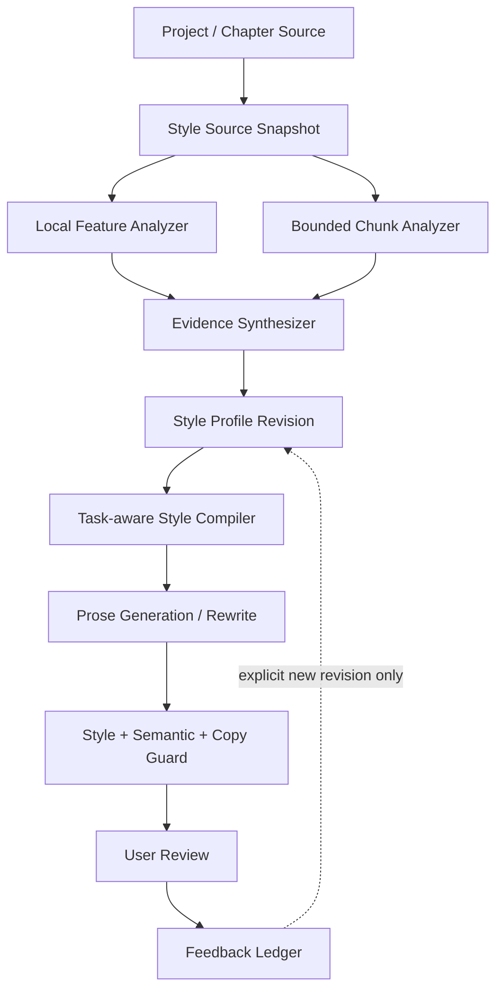

# F-11 证据化文风工程设计 0.1

- 日期：2026-07-16
- 状态：长期研究提案；推迟到下一个大版本的独立实验分支，当前主线不实现
- 用户入口名：文风实验室
- 核心资产名：文风档案（内部类型 `style-profile@1`）
- 适用范围：从当前项目的一章、若干章节或整个项目提取作者自己的文风，用于续写和重写

## 1. 要解决的不是“生成一份 style JSON”

常见方案把来源文本交给模型，得到一组诸如“句式简洁、氛围克制、意象细腻”的字段，再把整份 JSON 塞回 Prompt。这个方案的问题不在 JSON 文件格式，而在它缺少工程闭环：

- 标签听起来正确，却没有对应原文证据，用户无法判断模型是否真的理解了文本。
- 整章或整个项目被压成一个平均值，动作、对白、内心和说明段落之间的不同模式被抹平。
- 分析结果直接等同于执行指令，没有经过任务适配；同一套描述被机械用于续写和重写。
- 没有校准环节，用户只能在正式正文里反复试错。
- 没有语义保真、连续性和复刻原句检查；“像”经常以改坏剧情或照抄措辞为代价。
- 模型或 Prompt 改动后没有回归基线，体验漂移只能靠作者偶然发现。
- 用户接受、修改或放弃结果后，系统没有形成可审计的反馈。

本功能仍可在磁盘内部使用结构化 JSON，但 JSON 只是版本化存储格式，不是用户界面，也不是直接发送给模型的最终 Prompt。

## 2. 产品原则

1. **先证据，后结论。** 每条文风原则都必须能回到具体章节、场景和原文片段。
2. **描述和执行分离。** 文风档案记录“观察到什么”，任务编译器决定“这次该怎样写”。
3. **项目不是一种平均文风。** 系统保留稳定基底，并识别动作、对白、内心、氛围等可切换模式。
4. **内容约束高于文风。** 人物、事实、因果、视角和时间线永远是硬约束，文风是软约束。
5. **先试听再发布。** 未经校准和明确确认的分析只能是草稿，不能成为项目默认文风。
6. **像表达习惯，不复制表达。** 使用短样本帮助模型理解，但必须检测与来源文本的异常重复。
7. **反馈不自动污染档案。** 接受、编辑、放弃会生成改进建议，只有用户确认后才能创建新版本。
8. **模型可替换。** 文风档案不绑定某一家模型；模型切换只会使校准状态过期，不会使来源证据失效。

## 3. 用户看到的完整闭环


### 3.1 创建文风档案

用户在“文风实验室”选择来源：

- 当前章节
- 多个明确章节
- 整个项目

系统先展示取样计划，而不是立即调用 AI。作者可以排除：代写/引用片段、实验章节、尚未定稿的场景、明显不代表目标文风的内容。

建议默认值：

- 少于 1,500 字：允许分析，但标记“证据不足”，不能设为项目默认。
- 单章 3,000—15,000 字：可直接分析。
- 整个项目：按章节和场景类型分层取样，首轮最多约 30,000 字；另留一部分未参与分析的文本用于校验。

这些数值是首版产品默认值，后续应以真实 Provider 验收调整，不作为语言学结论。

### 3.2 阅读文风档案

档案首页不展示原始 JSON，而展示五组可操作信息：

1. **一句话印象**：帮助快速识别档案，不作为 Prompt 主体。
2. **稳定基底**：叙事距离、句段节奏、信息密度、描写选择、对白方式、情绪表达、意象习惯等。
3. **场景模式**：例如“动作时短句增多”“内心段落保持克制”“对白依靠停顿和动作承载潜台词”。
4. **证据与置信度**：每条原则可展开查看 2—5 个来源片段和定位；证据相互冲突时明确显示。
5. **不要做什么**：过拟合风险、来源中偶发但不应推广的写法、与项目避免写法规则的合并结果。

档案的维度显示为“目标区间”，不是伪精确的单分数。例如“句长大多位于短至中等区间，动作段明显更短”，而不是“句长风格 83 分”。

### 3.3 试听与校准

发布前系统使用两类短探针：

- 系统自带的中性微场景：对白、动作、内心、氛围各一段，便于不同档案横向比较。
- 用户选择的一段真实正文：只在预览中重写，不写回项目。

每个探针生成低、标准、强三档。作者只需回答：

- 哪一版最接近？
- 哪些地方“太用力”？
- 哪些特征仍然不像？

系统把反馈转换成有边界的校准补丁，例如降低意象密度、保持短段落、仅在对白模式启用省略，而不是要求用户编辑 Prompt 或 JSON。

### 3.4 用于续写

写作区新增一个轻量选择：

- 不使用文风档案
- 项目默认文风
- 选择其他已发布档案

默认只显示“自然 / 明显 / 强烈”三档；高级设置才允许单独调整节奏、描写、对白、叙事距离等维度。场景意图和文风档案是两个独立输入：选择“动作场面”不会永久改写项目文风，只会激活档案中的动作模式。

生成时系统发送：

- 当前任务与剧情约束
- 适用于当前场景的少量文风原则
- 2—4 个短证据样本
- 避免写法与防复刻要求
- 当前场景上下文

不会把完整档案、整个来源章节或所有样本无差别塞进 Prompt。

### 3.5 用于重写

文风重写不采用一次性“照这个风格改写”的调用，而是三段式：

1. **内容锁定**：提取必须保留的事实、人物立场、时序、专有名词、视角和段落功能。
2. **风格转换**：根据当前场景模式和强度生成候选文本。
3. **双重审查**：检查内容保真与文风目标，并运行来源复刻检测。

预览同时呈现正文差异和简短验收摘要，例如“事实全部保留；节奏进入目标区间；出现一处与来源过长重合，已自动重试”。风格评分不能掩盖内容丢失。

## 4. 文风档案不是一个平面对象

### 4.1 四层模型

| 层 | 内容 | 主要来源 | 用途 |
| --- | --- | --- | --- |
| 来源层 | 不可变文本快照、章节/场景 locator、摘要与 digest | Project Service | 可追溯、可判断 stale |
| 观察层 | 句段分布、对白比例、标点习惯、局部重复、段落形态等 | 本地确定性分析器 | 建立稳定基线，减少模型幻觉 |
| 解释层 | 有证据的文风原则、场景模式、反例与置信度 | 分块 AI 分析 + 聚合 | 形成用户可读档案 |
| 执行层 | 针对续写/重写/场景意图编译的短指令与样本包 | Style Compiler | 给具体模型执行 |

解释层不能覆盖观察层；执行层可以随模型和任务重新编译，但不得修改来源与解释层。

### 4.2 维度建议

首版维度保持有限且可验证：

- 叙述视角与距离
- 句子和段落节奏
- 信息显隐与解释密度
- 动作、感官、心理、环境的注意力分配
- 对白比例、长度、潜台词和动作伴随方式
- 情绪表达的直接/克制程度
- 意象、比喻和修辞密度
- 场景转场、段尾与章节钩子的习惯
- 高频套式与需要避免的表达

角色对白声音应作为可选子档案，不与叙述者文风混成同一个平均值。首版可以识别其存在，但角色级完整能力应单独排期。

### 4.3 场景模式而非平均值

项目分析先用本地特征找到候选差异，再由模型解释差异并引用证据。首版允许形成 2—6 个模式，例如：

- 基础叙述
- 动作/冲突
- 对白/交锋
- 内心/情绪
- 氛围/悬疑
- 说明/设定

用户可以合并、停用或重命名模式。没有足够证据时宁可只保留基础模式，也不能强行聚类。

## 5. 工程架构



### 5.1 所有权

- 文风档案是**项目级一等资产**，不塞进资料卡，也不作为普通 Prompt 模板保存。
- `Style Profile Service` 拥有档案、版本、来源快照和校准记录。
- Project Service 提供只读来源快照和版本信息；普通项目保存不能覆盖档案目录。
- Writer 和 Workflow 只引用一个已发布的档案 Revision，不拥有或隐式修改档案。
- AI Task History 记录使用的 profile/revision、编译器版本、模式、强度和 Provider 快照，但不重复保存 API Key。

建议目录：

```text
DraftHarbor Library/projects/<project>/styles/
  index.json
  <profile-safe-id>/
    manifest.json
    revisions/<revision-safe-id>/
      profile.json
      evidence.json
      source.snapshot
      calibration.json
    feedback/events.jsonl
```

所有文件使用原子写入和摘要验证；Revision 发布后不可变。内部可以使用 JSON，但不提供“直接编辑整份 JSON”作为主体验。

### 5.2 核心资产

`style-profile@1` 概念字段：

| 分组 | 字段 |
| --- | --- |
| 身份 | profileId、revisionId、projectId、title、status、createdAt |
| 来源 | sourceScope、sourceReferences、sourceDigest、analyzerVersion、freshness |
| 观察 | featureRanges、sampleCoverage、holdoutCoverage |
| 解释 | principles、modes、counterExamples、confidence、evidenceReferences |
| 安全 | copyGuard、avoidanceRuleRefs、excludedSources |
| 校准 | probeSetVersion、providerSnapshot、strengthMapping、userDecisions |
| 生命周期 | draft、calibrating、published、stale、archived |

每条 `principle` 至少包含：可读标题、可执行方向、适用条件、不适用条件、证据引用、置信度和是否启用。没有证据的模型形容词不能进入发布版本。

### 5.3 本地分析器

首版不依赖中文分词或向量数据库，先使用可解释、确定性的指标：

- UTF-16/字符和段落计数
- 句长、段长的分位区间与离散程度
- 对话段、叙述段和混合段比例
- 标点、引号、破折号、省略号和段尾形态
- 第一/第三人称信号及视角跳变候选
- 高频字符 n-gram、重复开头和模板化句式候选
- 动作/心理/感官等只做保守词表信号，不宣称精确语义分类

指标带 `analyzerVersion`。修改算法必须重跑固定夹具，不能静默改变旧档案含义。

### 5.4 分块证据分析

- 每块只接收有 locator 的有限正文和本地指标摘要。
- 模型只能返回受 schema 限制的观察、证据范围、适用场景和置信度。
- 聚合器按证据覆盖率与跨块复现合并；互相矛盾的观察优先成为不同模式，不强行平均。
- 项目取样按章节和本地特征分层，避免只取开头或最长章节。
- 留出的 holdout 文本只用于验证，不参与原则生成。

### 5.5 任务级编译器

Style Compiler 的输入是：

- profile revision
- 当前任务：续写或重写
- 场景意图和视角人物
- 用户强度与高级维度覆盖
- Provider/模型上下文预算
- 项目避免写法

输出是短小、可记录摘要的 `style-instruction-pack@1`：硬约束、激活原则、目标区间、短样本、反例提示和复制防护。编译器按固定顺序组装，不能让模型自行读取并解释整份档案。

建议默认预算：2—4 个样本，每个约 80—220 字；整个文风包尽量控制在 1,800 个中文字符以内。样本由任务模式、视角和来源覆盖确定性检索，不做全项目相似度搜索。

## 6. 结果验收而不是“相信 Prompt”

### 6.1 三类审查

| 审查 | 方法 | 阻断条件 |
| --- | --- | --- |
| 内容保真 | 专有名词/实体、事实清单、因果和视角检查；必要时模型复核 | 重写丢失高优先级事实或改变人物立场 |
| 文风贴合 | 本地指标是否落入目标区间 + 证据化模型判断 | 关键维度明显偏离；普通偏差只提示 |
| 来源复刻 | 最长公共片段、多个 n-gram 重合、排除专名后的异常短语检查 | 超过阈值时自动重试或要求人工确认 |

不要对外展示一个看似精确的“文风相似度 91%”。更可信的输出是：哪些维度进入范围、哪些仍偏离、证据是否充分。

### 6.2 校准和模型切换

校准绑定 Provider、模型和编译器版本。切换模型后档案仍然有效，但状态显示“当前模型未校准”，可运行一个低成本的快速探针。只有来源项目内容变化才会使来源 Revision 变为 stale。

### 6.3 反馈账本

记录：接受、编辑后接受、放弃、恢复原文，以及用户最终编辑量。系统可以形成“建议创建新版本”：

- 某原则连续被降低强度
- 某模式下结果经常被放弃
- 用户反复删除同类修辞
- 用户编辑后的句段区间稳定偏离档案

系统不得从一次接受中自动强化档案，也不得把 AI 自己生成的文本自动加入来源，避免自我模仿循环。

## 7. 与现有稿湾能力的连接

### 7.1 Writer

- 复用现有 AI Task、Provider Profile、Prompt Preview、流式生成、改写预览与应用确认。
- `AITask.contextReferences` 增加 profile/revision 引用；任务记录保存编译摘要。
- 现有 Prompt 模板继续描述“这次写什么”，文风档案描述“长期怎样表达”；二者可以组合，不互相替代。
- “避免写法”合并到文风编译器的负向规则，但仍由原有 Style Guard 所有。

### 7.2 Workflow

- 新增 `style-profile@1` 输入 Artifact 与 `style-instruction-pack@1` 派生 Artifact。
- 续写和重写节点读取同一已批准 Revision，步骤视图和图视图保持一致。
- Workflow Review 同时读取语义保真与文风审查结果；文风评分不能自动批准正文。

### 7.3 Reader

首版只允许从当前项目及其章节创建文风档案。Reader 可提供快捷入口和精确 locator，但不拥有档案，也不允许从任意外部书籍一键建立模仿档案。未来若开放外部来源，必须加入“本人创作或已获授权”的明确确认和更严格的复刻门禁。

### 7.4 Prompt Library

文风档案不能保存成普通 Prompt，也不能被用户误删 Prompt 时一并删除。高级用户可查看“本次编译后的 Prompt 片段”用于诊断，但编辑它只影响本次任务，不回写档案。

## 8. UI 信息架构

### 8.1 文风实验室

入口建议放在项目级导航或写作区的项目工具中，主列表展示：

- 档案名称与一句话印象
- 来源范围和覆盖章节数
- 状态：草稿 / 待校准 / 已发布 / 来源已变化 / 已归档
- 默认适用模式
- 最近一次校准的模型

创建流程使用五步向导：来源 → 取样 → 分析 → 试听校准 → 发布。长时间分析可以恢复，失败不能留下半发布版本。

### 8.2 档案详情

详情页优先显示人话而不是字段：

- “这个档案如何写”
- “不同场景下如何变化”
- “依据来自哪里”
- “哪些地方容易用过头”
- “用一个短场景试听”
- “版本与校准记录”

证据片段点击后跳转到原章节/场景；来源 stale 时仍可查看冻结证据，但必须明确提示它不再代表当前项目内容。

### 8.3 写作区

常用状态只增加一行：档案选择、强度和“试听”入口。高级维度、证据、版本切换放入展开面板，避免把日常写作变成参数调试。

## 9. 失败与恢复边界

- 未确认取样：不创建正式来源快照。
- 分块失败：保存可恢复的草稿和已完成块，不发布半成品。
- 分析 schema 无效：丢弃该块输出并允许重试，不能以自由文本降级写入档案。
- 来源更新：旧档案保留，标记 stale；用户可以继续使用、重新基于新来源分析或创建分支版本。
- 校准失败：档案保持 `calibrating`，不成为项目默认。
- 生成/重写失败：项目正文不变；AI Task History 保留失败和 profile revision。
- 审查失败：候选仍可查看，但不能自动应用；用户可明确越过非关键文风提示，不能越过高优先级内容丢失而不确认。
- 重复发布/应用：使用确定性 operation ID 和 application ledger，保持幂等。

## 10. 如何证明它比 style JSON 更好

最终真实 Provider 验收必须做随机盲测，不能只展示一两个“看起来不错”的例子。对同一组 8—12 个探针比较：

- A：现有通用 Prompt
- B：一次性模型生成的传统 style JSON 直接注入
- C：证据化档案 + 任务编译器 + 校准

评价项：

- 作者盲选哪一版更接近来源文风
- 重写事实保留率和高严重度遗漏
- 作者接受率、编辑后接受率和最终编辑距离
- 来源异常复刻次数
- 不同场景模式是否仍保持差异
- 更换模型后的快速校准成本和结果漂移
- Token、费用、延迟与失败恢复

只有 C 在文风偏好上稳定优于 B，且不牺牲内容保真、复刻安全和成本边界，才能证明工程投入有效。

## 11. 分阶段开发建议

### F-11.0 基线与数据契约（2 点）

- 建立通用 Prompt、朴素 style JSON、证据档案三路固定探针。
- 冻结 source/profile/evidence/calibration/feedback schema 和状态机。
- 退出条件：设计夹具可重复、朴素基线可量化，不开始产品写回。

### F-11.1 来源快照、Store 与本地分析器（4 点）

- 章节/多章/项目分层取样、排除项、holdout 和 digest。
- 原子 Store、不可变 Revision、stale、备份与迁移。
- 确定性特征和性能预算。
- 退出条件：无需 Provider 即可创建可验证的观察层草稿。

### F-11.2 证据分析与档案合成（5 点）

- 有界分块、schema 输出、证据定位、跨块合并和模式识别。
- 档案人话展示、冲突/弱证据提示、失败续跑。
- 退出条件：章级和项目级档案均能回到证据，不出现无证据原则。

### F-11.3 试听校准与编译器（5 点）

- 中性探针、真实片段试听、三档强度和维度补丁。
- 任务级指令包、样本选择、上下文预算和模型校准状态。
- 退出条件：发布前完成确认，编译结果可解释且不等于原始 JSON 直塞。

### F-11.4 Writer 续写与重写闭环（5 点）

- 续写接入、三阶段重写、Prompt 预览、差异和应用确认。
- 内容保真、文风范围、复刻门禁和反馈账本。
- 退出条件：失败不改正文、重复应用幂等、项目备份可恢复。

### F-11.5 Workflow、真实 Provider 与发布验收（5 点）

- Workflow Artifact/Revision 接入和审查节点。
- A/B/C 盲测、长项目压力、模型切换、成本与安装版冒烟。
- 退出条件：工程方案相对朴素 style JSON 有真实证据优势。

## 12. 首版明确不做

- 不做模型微调、LoRA 或训练服务。
- 不做向量数据库或全库实时语义检索。
- 不从互联网抓取作者作品或建立“某知名作者风格”公共市场。
- 不把项目自动生成内容循环加入来源。
- 不让文风档案覆盖人物事实、剧情约束或项目避免写法。
- 不提供任意脚本式风格规则。
- 不在没有用户确认的情况下自动更新项目默认文风。

## 13. 当前建议结论

首版应选择“**证据化文风档案 + 场景模式 + 任务级编译 + 试听校准 + 双重审查**”路线。它比 style JSON 多出来的价值不在字段数量，而在来源可追溯、任务适配、反馈可利用、模型可替换和结果可验收。

实现前最重要的不是继续扩充维度，而是先完成 F-11.0 的三路基线。若证据档案无法在盲测中稳定胜过朴素 style JSON，就应回到取样、编译或校准设计，而不是继续堆 UI 和 schema。

## 14. 产品决策记录（2026-07-17）

本功能涉及现有正文 Prompt、改写预设、自定义 Prompt、避免写法、上下文选择、角色声音，以及 Workflow Brief、锁、节点要求和审查 Prompt。若把文风档案作为新的并列提示词模块接入，会造成重复控制、优先级冲突和上下文膨胀。

因此作出以下决定：

- F-11 不进入当前版本主线开发，作为下一个大版本的候选目标保留。
- 未来只在独立实验分支启动，不直接修改当前稳定分支。
- F-11.0 的真正前置任务调整为：盘点全部提示词来源，设计统一指令契约、优先级、冲突解析器和最终 Prompt 编译器。
- 文风档案只能作为统一编译器的一种输入，不能成为 Writer 或 Workflow 中又一个独立 Prompt 控件。
- 个人文风库、项目绑定与跨项目样本属于实验设计的一部分，必须在统一提示词工程之后验证。
- 当前版本继续使用全局/项目 Prompt、改写预设、手动要求和避免写法控制表达风格。
- 当前开发优先级转为 F-09、F-10 及其他已完成功能的作者人工测试、缺陷修复、默认值调整和交互打磨。

重新启动条件：当前稳定版完成人工使用周期并积累足够的真实 Prompt 冲突案例；用户明确决定开启下一个大版本的实验分支；统一指令编译器可以在不破坏现有任务历史、Workflow Revision 和写回安全边界的前提下逐步迁移。
