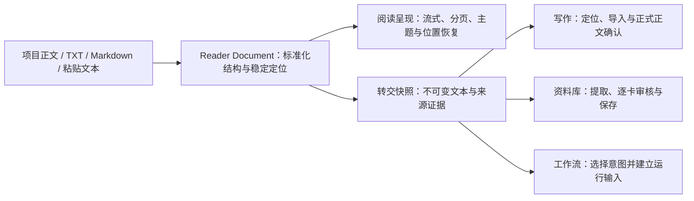

# F-10 阅读体验改造正式设计

- 文档版本：0.1
- 日期：2026-07-15
- 状态：正式设计已定稿；F-10.1A—F-10.1C 已完成
- 关联进度：[功能开发待办与进度](FEATURE_TODO.md) 中的 F-10
- 前置分析：[F-10 阅读功能改造设计分析 0.2](READING_MODULE_REDESIGN_DISCOVERY.md)
- 开发计划：[F-10 阅读体验改造开发计划 0.1](READING_MODULE_REDESIGN_DEVELOPMENT_PLAN.md)

> 历史说明：本文件记录已经完成的 F-10 数据、安全与首版阅读体验设计。2026-08-03 起，Reader 作为稿湾第三核心模块进入 F-12 Reader 2.0 产品级重设计；新的产品和视觉范围见 [Reader 2.0 专业小说阅读器产品设计](READING_MODULE_2_0_DESIGN.md)。F-10 的 Reader Document、Locator、Store 和 Transfer 边界继续有效。

## 1. 背景

稿湾当前阅读器已经支持当前项目、TXT/Markdown 导入、章节识别、目录、章节切换、滚动位置和基础排版，但它仍以单个浏览器状态中的本地文本预览为中心。长篇正文被放入 `localStorage`，项目正文转换时丢失场景与段落来源，阅读位置依赖章节内滚动比例，外部文档也没有稳定身份和可追溯版本，因此不能可靠承担长期阅读或跨模块转交。

F-10 将阅读器升级为独立的阅读体验层。它统一呈现项目正文和外部文本，保存可跨排版变化恢复的位置，并把用户明确选择的内容冻结为不可变快照，交给写作、资料库或半自动工作流处理。

本设计冻结影响实现方向的数据、存储、定位、迁移和转交契约。视觉参数可以在开发和人工验收中继续调整，但不得绕过本设计中的权威数据、版本、确认与安全边界。

## 2. 产品定位

### 2.1 一句话定义

阅读模块让作者在稿湾中沉浸阅读项目正文或本地文本，并把可追溯的选区、场景、章节或全文安全转交到真正负责编辑、分析和生成的目标模块。

### 2.2 三层职责



- 阅读呈现层只负责阅读、导航、范围选择和外观设置。
- Reader Document 层统一结构、来源映射、内容修订和稳定 locator。
- 内容转交层冻结用户选择；目标模块继续拥有分析、预览、确认、备份与正式写入。

### 2.3 模式边界

阅读模式与选择模式共享同一 Reader Document、排版设置和当前位置。

- 阅读模式：沉浸阅读、翻页、目录、书库、搜索、书签和排版。
- 选择模式：选择选区、场景、章节、多章或全文，并发起三个目标动作。
- 选择模式不是正文编辑器，不展示 Prompt、模型参数、AI 结果、资料卡审核队列或写回按钮。
- 项目正文修改仍在写作模块完成；外部源文件不在阅读器中修改。

## 3. 目标与非目标

### 3.1 目标

- 项目正文、TXT、Markdown 和粘贴文本使用同一阅读模型。
- 外部文档复制进入应用管理的本地书库，原文件移动后仍可阅读。
- 当前项目保留章节、场景、块和字符范围映射，不建立第二份权威正文。
- 支持流式滚动、单页、双页和自动布局，并在重新分页后恢复同一文本位置。
- 支持稳定的字体预设、主题、背景和减少动态效果。
- 选区、场景、章节、多章和全文可形成不可变来源快照。
- 写作、资料库和工作流通过统一转交契约接收来源，并检测项目来源是否已经变化。
- 旧阅读器 `localStorage` 内容可预览、迁移或放弃；迁移失败不破坏旧数据。
- 长篇导入、打开、滚动、分页和恢复具备明确性能与回归验收。

### 3.2 非目标

- 第一版不支持 EPUB、DOCX、PDF、扫描/OCR、书内图片或复杂 Markdown 媒体。
- 不导入或管理本地字体文件；只提供稳定字体预设和系统回退栈。
- 不建设阅读器内 AI 分析侧栏、Prompt 工作台或第二套正文编辑器。
- 不直接写资料卡、项目场景或工作流运行。
- 不修改外部原文件，不以原路径作为唯一内容来源。
- 不建立四个模块间的实时双向同步。
- 不把页码、滚动比例或 DOM 节点当成永久来源定位。
- 第一版不建设云同步、跨设备进度、社交阅读或复杂批注系统。

## 4. 权威数据与所有权

| 数据 | 权威所有者 | Reader 的处理方式 |
| --- | --- | --- |
| 项目章节与场景正文 | 项目 Store/Service | 每次按需派生 Reader Document 投影；不复制为可编辑正文 |
| 外部 TXT/Markdown 原件 | Reader Library Store | 导入时复制到 `source/`，标准化修订由 Reader Store 唯一写入 |
| 粘贴文本 | 临时 Reader Document；保留后归 Reader Store | 未保留前只存在于受控临时存储，转交时仍可冻结快照 |
| 阅读位置、书签与单书设置 | Reader State Store | 按 `documentId` 保存，不进入项目正文文件 |
| 转交快照 | Reader Transfer Store | 不可变；目标模块只读解析，不原地覆盖 |
| 正式正文写入 | 写作模块 | 预览、版本保护、备份、确认和应用均由写作模块负责 |
| 正式资料卡写入 | 资料库模块 | 逐卡审核、并发校验、备份和保存均由资料库负责 |
| 工作流输入与运行 | 工作流模块 | 读取快照后创建自身不可变输入产物和运行 |

项目 Reader Document 是可重建投影，不是项目正文的第二份副本。外部 Reader Document 则是本地阅读书库中的正式内容，因为应用不能依赖用户继续保留原文件。

## 5. Reader Document v2

### 5.1 文档身份

每个 Reader Document 使用稳定 `documentId`：

- 项目文档：`project:<projectId>`；同一项目始终使用同一文档身份。
- 外部文档：导入时生成随机 ID；重复文件默认形成新文档，用户确认后才可替换既有文档或追加修订。
- 粘贴文档：先生成会话级临时 ID；选择“保存到书库”后生成正式随机 ID。

文件名、标题和路径均不能充当文档身份。磁盘路径只由 Store 从 `documentId` 解析，前端和模型不可提交任意目标路径。

### 5.2 文档结构

```text
ReaderDocumentV2
  schemaVersion: 2
  documentId / sourceKind / format
  title / originalFileName? / importedAt / updatedAt
  projectId? / activeRevisionId
  revisions[]

ReaderDocumentRevision
  revisionId / parentRevisionId?
  contentDigest / structureDigest / createdAt
  encoding? / lineEnding / parserVersion
  chapters[]

ReaderChapter
  chapterId / title / order
  sourceChapterId?
  blocks[]

ReaderBlock
  blockId / type / text / order
  sourceSceneId?
  sourceStart? / sourceEnd?
  textDigest
```

第一版块类型为 `heading`、`scene-title`、`paragraph`、`blank-break` 和 `code`。Markdown 仅保留安全的结构语义，不渲染原始 HTML、脚本、远程媒体或任意内嵌资源。未知块类型必须可读降级为纯文本。

### 5.3 修订规则

- 外部文档正式入库后，每次重新导入或确认章节校正均创建新修订，不覆盖旧修订内容。
- 文档只保存一个 `activeRevisionId`；旧修订用于位置解析、来源追溯和转交快照校验。
- 项目投影的修订 ID 由规范化章节/场景结构与内容摘要生成，不在 Reader Library 中复制正文。
- `contentDigest` 覆盖规范化文本；`structureDigest` 同时覆盖章节、场景和块顺序。
- 只修改标题或书库展示元数据不产生内容修订。
- 正式修订不可原地编辑。章节识别预览中的人工校正只修改导入草稿；确认入库时一次性生成正式修订。

### 5.4 项目来源映射

项目转换必须保留：

- `projectId`、`chapterId`、`sceneId`。
- 每个块在场景正文中的 UTF-16 字符 `sourceStart/sourceEnd`，与现有浏览器选择 API 和写作区字符范围保持一致。
- 块文本摘要及前后文本锚点，用于场景正文发生轻微变化后的重新定位。
- 场景 `updatedAt` 与内容摘要，用于判断来源新鲜度。

场景标题可以作为独立 `scene-title` 块显示，但不能与场景正文字符范围混为一体。没有章节的历史场景使用稳定的合成章节 ID，不修改项目数据。

### 5.5 外部格式标准化

- TXT：保留纯文本段落和空行语义；导入预览显示检测编码、置信度和替代字符数量。
- Markdown：识别一级至三级标题、段落、列表、引用和代码块并安全降级为第一版块类型；忽略原始 HTML 的执行语义。
- 粘贴文本：用户选择“纯文本”或“Markdown”，默认依据明显标题标记给出建议，但确认前可切换。
- 所有来源统一换行为 `\n`；内容摘要基于标准化结果计算，原文件仍按字节复制保存。

第一版至少自动识别 UTF-8、UTF-8 BOM、UTF-16 LE/BE；对中文高概率非 UTF 文本提供 GB18030/GBK 手动重试。无法可靠识别时必须停在预览，不以乱码内容直接入库。

## 6. 稳定 Locator

### 6.1 契约

```text
ReaderLocatorV1
  documentId / revisionId
  chapterId
  blockId?
  offset: UTF-16 character offset within block
  affinity: before | after
  projectRef?: projectId / chapterId / sceneId / sceneOffset
  quote?: exact / prefix / suffix
  blockDigest?
  contextBlockDigests?: previous / next
```

范围由 `start` 和 `end` 两个 locator 表达。所有 offset 都明确使用 UTF-16 code unit，避免前端、Node 和持久化之间对 emoji 或扩展字符产生不同计数。

### 6.2 解析顺序

恢复位置时按以下顺序解析：

1. 同一修订中的 `chapterId + blockId + offset` 精确定位。
2. 项目来源使用 `sceneId + sceneOffset`，并校验文本锚点。
3. 在同一章节或场景中使用 `exact + prefix + suffix` 唯一匹配。
4. 使用相邻块和 `blockDigest` 找到最近可解释位置。
5. 降级到同章首个可读块；章节不存在时降级到最近章节并提示位置已近似恢复。

解析不得跨整本文档静默匹配常见短句。不能唯一定位时返回 `approximate` 或 `unresolved`，由界面提示，而不是假装精确恢复。

### 6.3 排版与分页关系

页码是当前排版结果，不进入永久 locator。字体、字号、字距、行距、段距、页边距、窗口宽度、缩放、单页/双页或系统字体回退发生变化时：

1. 先记录当前可视区域起点的 locator。
2. 使当前分页缓存失效。
3. 重新测量并生成当前章节附近的分页结果。
4. 将记录的 locator 放回首屏或当前展开页。

分页缓存键至少包含文档修订、章节、视口尺寸、布局模式、字体实际解析结果和全部排版参数；缓存随时可删除重建，不能成为阅读位置来源。

## 7. 本地阅读书库

### 7.1 磁盘布局

```text
DraftHarbor Library/
  reader-documents/
    index.json
    <documentId>/
      document.json
      source/<sanitized-original-file-name>
      revisions/<revisionId>/revision.json
      revisions/<revisionId>/chapters/<chapterId>.json
      state.json
  reader-transfers/
    <envelopeId>/
      envelope.json
      snapshot.json
      snapshot.txt
```

- `index.json` 只保存书库列表摘要，不包含长篇正文。
- `document.json` 保存文档元数据和修订列表，不重复嵌入章节全文。
- 章节文件包含结构化块；长篇打开时按章读取。
- `state.json` 保存阅读位置、书签和单书设置覆盖。
- 所有正式 JSON 和文本写入复用原子写入；索引在内容提交成功后更新。
- Reader Store 是以上目录的唯一写入者，项目整体保存和普通项目备份不得覆盖阅读书库。

项目文档不在 `reader-documents/` 保存正文修订。其书库条目是派生的项目入口；阅读状态可以单独以安全文档键保存。

### 7.2 删除与重导入

- 删除外部文档先检查未归档转交引用；存在引用时默认只从书库列表隐藏，保留修订和快照。
- 强制永久删除必须二次确认，并明确列出将失效的书签和来源定位。
- 替换文件先形成新导入草稿，确认后追加修订；失败时旧活动修订保持不变。
- 原始文件名必须清理路径字符；任何 API 都不能接受调用方提供的绝对落盘路径。

### 7.3 阅读状态

全局设置与单书覆盖分离：

```text
ReaderGlobalPreferences
  layoutMode / pageTransition / themeId / fontFamilyId
  fontSize / lineHeight / letterSpacing / paragraphSpacing
  pageMargin / textAlign / indent / reducedMotionOverride?

ReaderDocumentState
  positionLocator / updatedAt
  preferenceOverrides
  bookmarks[]
```

`localStorage` 只允许保留抽屉开合、控制条显隐等轻量瞬时偏好；长文内容、权威阅读位置和转交正文不得继续保存在其中。

## 8. 阅读体验

### 8.1 信息架构

- 中央阅读舞台默认只显示书页。
- 顶部控制条显示返回、书名、当前章、搜索、选择模式和外观入口；无操作时自动隐藏。
- 底部控制条显示章节位置、当前布局中的临时页数和可拖动的内容进度。
- 左抽屉包含书库、目录、搜索结果、书签和历史。
- 右抽屉包含主题、字体、字号、字距、行距、段距、页边距、对齐、缩进、布局和翻页方式。
- 点击正文中央或按 `Esc` 切换控制条；分页模式的左右边缘用于前后翻页。

### 8.2 布局模式

- `flow`：连续滚动。
- `single-page`：单页分页。
- `double-page`：双页展开；宽度不足时不得压缩到不可读。
- `auto`：依据可用宽度、最小页宽和用户缩放在单页与双页间切换。

自动布局只改变当前呈现，不覆盖用户保存的 `auto` 选择。双页模式的阅读顺序固定为先左后右，最后一页允许单页收尾。

### 8.3 翻页与动态效果

- `fade`：默认，快速淡入淡出。
- `slide`：水平滑动。
- `curl`：可选增强；实现成本或性能不达标时允许在 F-10.2 验收前延后，不阻塞分页闭环。
- `none`：无动画。

系统 `prefers-reduced-motion` 为减少动态效果时，`fade`、`slide` 和 `curl` 自动降级为 `none`，除非用户明确覆盖。动画期间输入需合并或排队，不能丢失最终目标页，也不能产生重复位置写入。

### 8.4 字体与主题

- 字体保存稳定 `fontFamilyId`，第一版提供系统默认、中文衬线、中文无衬线和楷体预设。
- 每个预设由受控回退栈解析；实际字体不可用时自动回退并使分页缓存失效。
- 主题使用稳定 `themeId`，至少覆盖深色、纸张和棕褐/护眼；正文与控件需满足可读对比度。
- 背景只允许受控颜色或应用资源，不接受任意远程 URL。
- 单书覆盖可以一键重置为跟随全局。

### 8.5 输入与可访问性

- 键盘：方向键/PageUp/PageDown 翻页或滚动，`[`/`]` 切章，`Esc` 控制条，`Ctrl+F` 搜索。
- 所有动作必须有按钮路径，不能只依赖手势或左右热区。
- 触控热区与选区手势冲突时，文本选择优先。
- 焦点顺序、可见焦点、抽屉焦点圈定、按钮名称和状态需可由辅助技术读取。
- 高缩放、窄窗口和超长章节下不得遮挡正文或让主要动作离屏不可达。

## 9. 进度、搜索与书签

### 9.1 进度

全书进度按标准化可读字符权重计算，不再把每章视为等长：

```text
(当前 locator 前的可读字符数) / (全文可读字符数)
```

空白与结构控制字符不计入权重。起点允许显示 0%，终点显示 100%。分页模式可以同时显示临时页码，但设置变化后允许页数改变。

### 9.2 搜索

- 搜索在标准化块文本中进行，结果携带 locator 和短上下文。
- 项目文档搜索使用当前派生修订；来源变化后结果失效并重新查询。
- 长文搜索在后台分章执行并可取消，不能阻塞翻页。
- 第一版是字面搜索，不引入向量数据库或模型调用。

### 9.3 书签

书签保存 locator、用户标题、创建时间和一小段显示摘录。书签不复制整章正文；来源变化时使用 locator 解析规则标记为精确、近似或失效。

## 10. 选择模式

### 10.1 支持范围

- `selection`：任意非空文本选区，可跨块但第一版不得跨文档。
- `scene`：仅项目来源且能映射到场景。
- `chapter`：当前章节。
- `chapters`：目录中连续或离散选择的多个章节。
- `document`：全文。

范围确认区必须显示来源、字符数、章节/场景数量和截断风险。超出目标模块单次处理预算不会阻止创建快照，但目标模块必须采用分块或明确提示处理范围。

### 10.2 轻量动作

选区上下文工具条和范围确认区只提供：

- `去写作`
- `生成资料卡`
- `去半自动工作流`

动作创建 envelope 后立即切换目标模块。阅读器不询问 Provider、模型、Prompt 或写入方式；目标项目只有在来源已经属于项目且目标可确定时作为建议传递，不能替用户静默决定跨项目写入。

## 11. Reader Transfer Envelope

### 11.1 Envelope

```text
ReaderTransferEnvelopeV1
  schemaVersion: 1
  envelopeId / createdAt / destination
  sourceKind: project | local-text | pasted-text
  documentId / revisionId / sourceRevisionDigest
  format: project | txt | md | plain
  scope: selection | scene | chapter | chapters | document
  sourceLocators[]
  snapshotRef / snapshotDigest / characterCount
  suggestedProjectId?
  lifecycle: active | consumed | archived
```

`destination` 只能是 `writer`、`compendium` 或 `workflow`。导航状态只携带 `envelopeId`；正文和绝对路径不得进入 URL、DOM dataset、任务历史或 `localStorage`。

### 11.2 快照内容

快照必须包含：

- 规范化文本和必要的章节/场景分隔。
- 创建时的 locator、来源标题和结构摘要。
- 项目来源的章节/场景 ID、各段摘要与 `updatedAt`。
- 文档修订、内容摘要和创建时间。

快照创建成功后不可原地修改。用户重新选择内容会创建新 envelope。目标模块需要自身不可变产物时，可复制或引用该快照，但不能把 envelope 当成可写草稿。

### 11.3 新鲜度

- 项目来源：根据所选场景当前内容摘要、结构和字符范围重新计算，返回 `fresh`、`stale` 或 `missing`。
- 外部文档：正式修订不可变；只要修订和快照存在即为 `fresh`，即使文档已有更新修订，也提示“存在较新版本”而不把旧快照标为损坏。
- 粘贴来源：快照本身是权威来源，不做外部新鲜度比较。

目标模块遇到 `stale` 时提供“继续使用已冻结快照”或“返回阅读器刷新来源”；不得静默替换。遇到 `missing` 时仍可在摘要校验通过后使用快照，但不能承诺回到原位置。

### 11.4 生命周期与清理

- `active`：已创建，尚未被目标模块确认接收。
- `consumed`：目标模块已经创建对应草稿、候选队列或工作流输入，并记录其引用。
- `archived`：用户放弃或目标流程结束；默认仍保留追溯信息。

清理只能删除无活跃消费者的归档 envelope。任何自动清理策略必须先证明目标模块已物化所需文本，不能只因时间经过就删除仍被引用的来源。

## 12. 三个目标模块的接入

### 12.1 写作

- 项目场景来源：打开原场景并按 locator 定位；内容已变化时提示近似位置。
- 项目章节/多章：打开章节及首个场景，并让用户选择定位或导入动作。
- 外部或粘贴来源：进入导入预览，选择新建项目或导入现有项目、章节拆分和冲突处理。
- 任何创建或更新场景的动作继续使用项目版本保护、备份、预览和明确确认。

### 12.2 资料库

- 目标模块选择项目、单卡/多卡模式、类型限制和数量上限。
- 长文本分块抽取，候选跨块合并时保留每条来源证据和冲突字段。
- 与已有资料卡比较并标记新建、更新或疑似重复。
- 每张候选卡必须得到 `通过`、`修改后通过` 或 `放弃` 决定。
- 可以一次保存所有已经逐卡审核通过的项目，但未审核项不能被隐式视为通过。
- 正式保存仍由资料库 Service 做整批校验、并发保护和备份。

资料卡 `sourceReferences` 需要向后兼容扩展为可表达 `sourceKind`、`documentId`、`revisionId`、`chapterId`、`blockId`、range、摘录和内容摘要。旧的 `sceneId + excerpt` 输入保持合法，无需破坏性迁移。

### 12.3 半自动工作流

- 工作流读取 envelope 后，由用户选择目标项目、处理意图和模板。
- 项目来源可以复用现有 `writer-source@1` 快照能力，但必须通过显式适配器保留 Reader locator。
- 外部与粘贴来源创建新的版本化工作流输入产物，不伪装成项目场景。
- 工作流自己的 Artifact Revision、确认点、过期检测和写回账本保持权威；Reader Store 不写运行目录。

## 13. API 与代码边界

建议核心模块：

- `src/core/document/reader-document-schema.js`
- `src/core/document/reader-locator.js`
- `src/core/document/reader-import.js`
- `src/core/document/reader-transfer-schema.js`

建议后台边界：

- `desktop/storage/reader-document-store.js`
- `desktop/storage/reader-state-store.js`
- `desktop/storage/reader-transfer-store.js`
- `desktop/services/reader-library-service.js`
- `desktop/services/reader-transfer-service.js`
- `desktop/controllers/reader-controller.js`

建议桌面边界：

- `desktop/fragments/reader.html`
- `src/desktop/shell/reader-library.js`
- `src/desktop/shell/reader-reading.js`
- `src/desktop/shell/reader-selection.js`
- `src/desktop/shell/reader-transfer.js`
- `src/styles/desktop/reader.css`

`desktop/local-server.js` 只组合 Reader Controller，不放产品路由实现。现有 `src/desktop/shell/reader.js` 在迁移期可作为兼容入口，但不得继续扩张为书库、分页、选择和转交的单体模块。

API 只接受 ID、受控枚举、结构化导入草稿和 envelope 请求。文件选择由桌面受控导入入口读取；服务端路径必须从书库根和安全 ID 推导。读取响应按章或范围返回，列表接口不得携带全文。

## 14. 迁移与兼容

### 14.1 旧状态来源

旧键：`draftharbor:desktop:reader`，可能包含：

- 整份外部文档正文。
- 当前项目的派生正文。
- 章节索引和滚动比例。
- 字体、字号、行距、版心、段距、缩进和主题。

### 14.2 迁移策略

1. 新 Reader Store 首次启动时只读解析旧状态，不立即删除。
2. 排版设置映射到稳定预设和全局偏好；无法识别的值使用默认值并记录迁移警告。
3. 项目来源只迁移外观设置和近似章节位置，正文重新从项目派生。
4. 外部正文显示迁移预览，用户可“加入阅读书库”或“放弃旧文档”。确认后创建正式 Reader Document。
5. 旧滚动比例只用于一次性估算目标块与 offset，成功后保存 locator。
6. 新状态和文档原子写入成功后记录迁移完成标志；旧键至少保留到一次成功重新打开验证后再清理。

迁移必须幂等。进程中断、磁盘不足或解析失败不得留下被索引为正式文档的半成品，也不得破坏旧 `localStorage` 数据。

## 15. 性能与可靠性

- 文档索引与章节正文分离，打开书库不读取全部长文。
- 流式模式只渲染当前章节附近的块；分页模式按当前章节和相邻页增量测量。
- 搜索、导入解析、摘要计算和长文分页必须可取消或分批让出主线程。
- 任何分页缓存、搜索索引和项目 Reader 投影缓存均可删除重建。
- Store 写入使用原子替换，索引最后提交；启动时清理遗留临时文件并忽略未提交目录。
- 单个坏章节不得阻止书库列表和其他文档打开；界面显示可定位错误并允许重新导入或恢复旧修订。
- 真实长篇验收至少覆盖百万字符、超长单章、大量短章、重复段落、中英文混排、emoji 和窗口快速缩放。

具体时间和内存预算在开发计划中按测试设备冻结；设计底线是长篇操作不能用“把全文持续放在 DOM 或 `localStorage`”实现。

## 16. 安全与隐私

- 阅读、搜索、分页、书签和转交快照默认完全本地执行。
- 只有目标模块在用户明确启动 AI 操作后，才按其既有 Provider 规则发送所选快照内容。
- API Key 不进入 Reader Document、envelope、快照、日志、错误对象或迁移记录。
- Markdown 原始 HTML、脚本、事件属性和远程资源不得执行。
- 导入文件名、文档标题和章节标题都按不可信输入显示；不拼接为可执行 HTML。
- 文件读写限制在用户选择的源文件和应用管理的阅读书库；服务 API 不暴露通用文件读取能力。
- 跨模块转交必须由用户点击发起，目标模块不得枚举或读取与当前 envelope 无关的文档全文。

## 17. 错误与恢复

| 场景 | 行为 |
| --- | --- |
| 编码不确定或乱码 | 停在导入预览，允许切换编码，不创建正式文档 |
| 章节识别错误 | 在导入草稿中校正；确认前不写正式修订 |
| 写入中断 | 索引不指向半成品；下次启动清理临时文件 |
| 项目正文已变化 | 阅读投影刷新；按 locator 尝试恢复并标记精确度 |
| 转交来源已变化 | 目标模块要求继续旧快照或返回刷新 |
| 外部活动修订损坏 | 尝试打开上一修订；保留错误和修复入口 |
| 字体不可用 | 使用预设回退栈，重新分页并恢复 locator |
| 动画或分页性能不足 | 降级无动画或单页，不改变保存位置 |
| 目标模块接收失败 | envelope 保持 active，可重试；不丢失当前阅读位置 |

## 18. 分阶段实现边界

### F-10.1 Reader Document 与书库基础

- 冻结核心 schema、修订、locator、导入草稿和迁移契约。
- 实现 Reader Document/State Store、项目投影与场景字符映射。
- 实现 TXT/Markdown 复制入库、编码与章节预览、粘贴临时文档。
- 完成旧 `localStorage` 兼容迁移。
- 此阶段可用最小现有阅读界面验证数据，不开发完整分页动画。

### F-10.2 沉浸式阅读

- 拆分 Reader 桌面模块和独立样式文件。
- 实现控制条、抽屉、流式/单页/双页/自动布局。
- 实现主题、字体、排版、翻页、键鼠/触控和位置恢复。
- 完成长篇、缩放、减少动态效果和桌面视觉验收。

### F-10.3 选择与转交

- 实现范围选择、Reader Transfer Store、快照和新鲜度检测。
- 实现三个轻量动作和目标模块来源条。
- 目标模块尚未完整接入时，只允许安全读取和明确的未支持提示，不临时把业务塞回阅读器。

### F-10.4 目标模块接入

- 写作定位和外部导入预览。
- 资料库单卡/多卡提取、去重和逐卡审核。
- 工作流冻结输入适配器和项目/意图选择。
- 完成三条路径的版本、备份、幂等和恢复验收。

## 19. 验收标准

### 数据与迁移

- 项目转换保留每个正文块的章节、场景和字符范围，并可回到原场景。
- 外部文件移动或删除后，已入库文档仍可完整阅读。
- 文档修订不可原地覆盖，失败导入不改变活动修订。
- 旧阅读器内容迁移可预览、可放弃、可重试且幂等。
- 列表、状态和转交索引均不嵌入整本正文。

### 阅读与定位

- 流式、单页、双页和自动布局使用同一文档结构。
- 改变字体、字号、窗口宽度和布局后恢复到同一 locator，不依赖旧页码。
- 项目轻微编辑后能精确或近似恢复，并明确显示解析结果。
- 全书进度按内容权重计算，起点为 0%，终点为 100%。
- 百万字符、超长单章和大量短章不会把全文长期渲染到 DOM。

### 转交与写入

- 路由和 `localStorage` 中没有大段快照正文。
- envelope 与快照不可变，重复读取不改变内容摘要。
- 项目来源变化可检测；用户可以明确继续旧快照或刷新。
- 阅读器自身无法直接写场景、资料卡或工作流运行。
- 每张资料候选均经过明确决定，未审核项不能批量写入。
- 三个目标模块继续执行自身的预览、确认、版本、备份和幂等规则。

### 安全与发布

- Markdown 不执行脚本、原始 HTML 事件或远程资源。
- 路径穿越、未知文档 ID、未知修订和跨项目目标均被拒绝。
- API Key 不出现在 Reader 数据、日志、错误或测试快照。
- Reader 核心、Store、迁移、长篇性能、位置恢复、三模块转交、桌面视觉、完整回归、打包和安装包冒烟通过。

## 20. 冻结决定与开放参数

### 冻结决定

1. Reader Document v2 是统一阅读结构；项目正文仍由项目 Store 权威持有。
2. 外部 TXT/Markdown 默认复制进本地阅读书库，正式修订不可原地覆盖。
3. Locator 使用章节/场景/块/UTF-16 字符与文本锚点组合，不保存永久页码。
4. 阅读器只选择和转交；分析、审核和写入由目标模块负责。
5. 转交以不可变 envelope 和快照实现，来源变化不得静默替换。
6. 资料卡候选必须逐卡得到明确决定。
7. 字体从第一版进入分页缓存和位置恢复契约。
8. 第一版格式仅为项目、TXT、Markdown 和粘贴文本。

### 开放参数

- 控制条自动隐藏时长、抽屉宽度和页边热区。
- 自动单双页切换阈值和最小页宽。
- 第一版字体预设的具体数量与名称。
- 淡入和滑动动画时长；仿真翻页是否在 F-10.2 首次发布中启用。
- 长篇性能的具体毫秒、内存和磁盘预算。

这些参数在开发计划和真实桌面视觉验收中冻结，不得改变本设计的数据所有权、locator、转交和确认边界。
