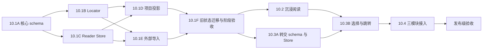

# F-10 阅读体验改造开发计划

- 计划版本：0.1
- 日期：2026-07-15
- 状态：F-10.1—F-10.4D 已完成；F-10 于 2026-07-16 通过最终发布验收
- 产品设计：[F-10 阅读体验改造正式设计 0.1](READING_MODULE_REDESIGN_DESIGN.md)
- 权威进度：[功能开发待办与进度](FEATURE_TODO.md) 中的 F-10

## 1. 计划目的

本计划把 F-10 拆成可独立验证、独立回退的工作包。核心顺序是先冻结 Reader Document、locator 和不可变修订，再建设本地书库与迁移；数据基础通过长篇验收后实现沉浸阅读；最后建设不可变转交和三个目标模块接入。

`docs/FEATURE_TODO.md` 仍是唯一进度记录。本文件负责工作包、依赖、风险、测试、性能预算和退出条件。功能开始、暂停、完成或取消时，必须同步更新 F-10 状态和完成证据。

## 2. 开发原则

1. 项目正文始终由项目 Store/Service 权威持有，Reader Document 只是可重建投影。
2. 外部文档由 Reader Store 唯一写入；项目保存、资料库和工作流不得覆盖阅读书库。
3. 先完成纯函数 schema、locator 和导入契约，再接入文件系统、API 和界面。
4. 不把整本正文放入 `localStorage`、路由、列表索引、普通任务历史或长期 DOM。
5. 不把页码、滚动比例、文件名或 DOM 节点当成永久定位。
6. 不进行破坏性原地迁移；旧阅读器状态在新数据成功重开前保持可恢复。
7. 选择模式只创建来源快照和跳转，不复制写作、资料库或工作流业务。
8. 三个目标模块分别拥有自己的预览、确认、版本、备份和正式写入。
9. 每个阶段先通过纯函数/存储测试，再接 API，最后接桌面界面和视觉验收。
10. 不提交真实书稿、外部版权文本、API Key、用户书库、性能临时文件或发布产物。

## 3. 范围与总工作量

| 阶段 | 范围 | 估算点数 | 主要退出证据 |
| --- | --- | ---: | --- |
| F-10.1 | Reader Document v2、本地书库、项目投影、导入和迁移 | 34 | schema、Store、迁移、百万字符基础验收 |
| F-10.2 | 沉浸阅读、分页、排版、搜索、书签和无障碍 | 27 | 位置恢复、长篇性能、桌面视觉验收 |
| F-10.3 | 范围选择、不可变 envelope、新鲜度和来源条 | 16 | 快照不可变、过期检测、三个安全跳转 |
| F-10.4 | 写作、资料库和工作流正式接入与发布收尾 | 24 | 三模块闭环、备份恢复、发布级回归 |
| 合计 |  | 101 |  |

点数用于比较复杂度，不承诺具体工时。1 点约等于一个边界清楚、可独立验证的小改动。任何工作包若需要额外数据库、通用文件访问、第二份项目正文或跨模块实时同步，应停止并重新评估设计。

## 4. 依赖与并行边界



- F-10.1A 与测试夹具准备可以同时进行，但 Store 不得先于 schema 定稿。
- 项目投影与外部导入可在 Reader Store 接口稳定后并行开发，必须使用同一 Reader Document/locator 契约。
- F-10.2 的视觉壳和 F-10.3A 的纯转交契约可在 F-10.1 完成后并行，但范围选择必须等待分页/流式渲染的选择映射稳定。
- F-10.4 的三个目标适配器可以分别实现，但共享 envelope 读取、新鲜度和消费记账服务；不得各自解析快照文件。
- 同一阶段内可以并行准备测试，不允许绕过阶段退出条件提前合入下游持久化或正式写入。

## 5. F-10.1 Reader Document 与书库基础

目标：完成不会因分页、格式扩展或目标模块接入而推翻的数据骨架。阶段结束时允许继续使用最小阅读界面验证数据，但不交付完整沉浸阅读。

### F-10.1A Reader Document v2 与导入草稿契约（5 点）

交付内容：

- 定义 `ReaderDocumentV2`、不可变 Revision、Chapter、Block 和受控块类型。
- 定义项目、TXT、Markdown、粘贴文本四种来源与稳定 `documentId` 规则。
- 定义内容/结构摘要、解析器版本、编码、换行和父修订。
- 定义导入草稿、章节识别预览、人工校正和确认入库协议。
- 定义全局偏好、单书覆盖、书签和状态 schema。
- 所有 normalize/validate 行为保持纯函数，不依赖 DOM、Node 文件系统或 Provider。

建议代码边界：

- `src/core/document/reader-document-schema.js`
- `src/core/document/reader-import.js`
- `tests/reader-document-schema.js`
- `tests/reader-import.js`

测试：

- 未知 schema 版本、来源、格式、块类型和非法修订引用被拒绝。
- 正式修订不能原地覆盖，元数据更新不产生内容修订。
- 项目 ID 与外部随机 ID 不冲突，文件名不能成为身份。
- Markdown 原始 HTML 和远程资源降级为安全文本，不产生可执行内容。
- 换行和摘要在 Windows/Unix 输入上稳定。

退出条件：核心 schema 不依赖 UI 和文件系统，纯函数测试通过；后续 Store 不需要自行修正文档结构。

完成证据（2026-07-15）：

- 新增 Reader Document v2、不可变 Revision、Chapter、Block、全局偏好、单书状态和书签纯核心契约。
- 新增 TXT/Markdown/粘贴导入草稿、编码预览、章节校正和确认协议；不可靠编码与空正文不能确认。
- 正式 Revision 的块、内容和结构摘要由调用方注入纯摘要函数生成；Revision 深度冻结，追加与元数据更新均返回新值。
- `npm run reader-core-test`、定向 ESLint、`npm run core-test` 和 `git diff --check` 通过；未接入 Store、API 或桌面界面。

### F-10.1B 稳定 Locator 与范围解析（6 点）

交付内容：

- 定义 `ReaderLocatorV1` 和 start/end 范围，统一 UTF-16 offset。
- 实现同修订精确定位、项目场景定位、文本锚点匹配、相邻块降级和失效状态。
- 实现 DOM 选择与 Reader locator 的纯数据转换边界，DOM 细节留在桌面适配器。
- 实现按 locator 计算内容权重进度，不使用章节等权或最低 1%。
- 实现书签重定位和定位结果 `exact/approximate/unresolved`。

建议代码边界：

- `src/core/document/reader-locator.js`
- `tests/reader-locator.js`

测试：

- emoji、组合字符、中英文混排和 CRLF 下 offset 不漂移。
- 章节前插入、同场景段落轻微修改、块顺序变化后能按规则恢复。
- 重复短句不能跨整本静默误配；不唯一时返回近似或失效。
- 起点进度为 0%，终点为 100%，长短章按内容权重计算。
- 跨文档、反向、空范围和超界 offset 被拒绝或规范化为明确结果。

退出条件：locator 在无 DOM 环境中完成精确、近似和失效测试；分页层只消费 locator，不另存页码。

完成证据（2026-07-15）：

- 新增 `ReaderLocatorV1`、Reader Range、UTF-16 offset、affinity、文本锚点、块摘要和相邻块摘要契约。
- 重定位严格按同 Revision、项目场景字符位置、唯一文本锚点、块/相邻块摘要和章节降级执行，返回 `exact/approximate/unresolved`。
- emoji、组合字符、重复短句、章节 ID 变化、正文前插、跨块范围、非法反向范围和长短章内容权重进度均有断言。
- 定向 ESLint、`npm run reader-core-test`、`npm run core-test` 和 `git diff --check` 通过；未接入 Store、API、DOM 或分页。

### F-10.1C Reader 路径、Store 与唯一写入所有权（8 点）

交付内容：

- 在 `library-paths.js` 增加 Reader Document、Revision、Chapter、State、Transfer 安全路径函数。
- 实现文档索引、元数据、不可变修订、按章内容和阅读状态 Store。
- 复用原子写入，内容提交成功后最后更新索引。
- 实现乐观版本或摘要保护，拒绝过期状态覆盖和重复 Revision 覆盖。
- 实现失败临时目录清理、损坏活动修订回退和索引重建。
- 项目文档只保存状态和派生入口，不在书库复制正文。
- 删除、隐藏、重导入和引用保护遵守正式设计。

建议代码边界：

- `desktop/storage/library-paths.js`
- `desktop/storage/reader-document-store.js`
- `desktop/storage/reader-state-store.js`
- `desktop/services/reader-library-service.js`
- `tests/reader-document-store.js`
- `tests/reader-state-store.js`

测试：

- 多文档、多修订和大章节不进入 `index.json` 或 `document.json`。
- 同一 Revision 二次写入被拒绝，旧活动修订保持可读。
- 写入中断不留下可被正式索引读取的半成品。
- 项目整体保存和备份不改变阅读书库文件摘要。
- 路径穿越、绝对路径、未知文档 ID、未知修订和非法章节 ID 被拒绝。
- 书库索引损坏可从文档元数据重建，单本文档损坏不阻塞其他文档。

退出条件：隔离临时数据根中完成多文档、多修订、并发拒绝、中断恢复、重开和索引重建测试。

完成证据（2026-07-15）：

- 新增 Reader Document/Revision/Chapter/State/Transfer 安全路径；路径段使用可读清理前缀与原始 ID 摘要，拒绝遍历并避免清理后碰撞。
- 新增 Reader Document Store 与 State Store；不可变 Revision 按章保存，索引、文档元数据和 Revision 元数据不嵌入正文。
- 写入按章节、Revision 元数据、文档元数据和索引顺序提交，并使用进程内串行化、索引版本、文档时间戳和状态时间戳拒绝并发过期写入。
- 活动 Revision 摘要损坏时显式回退到较早可读 Revision；索引可重建，原子临时文件、未提交文档和未引用 Revision 可清理，损坏正式文档保留并报告。
- 项目 Reader Document 被 Store 拒绝，项目整体保存不会改变 Reader 文件摘要；定向 ESLint、`npm run reader-storage-test`、`npm run core-test` 和 `git diff --check` 通过。

### F-10.1D 项目 Reader 投影与场景映射（5 点）

交付内容：

- 升级 `projectToReaderDocument`，保留 chapter/scene/block/character range。
- 从项目章节、场景顺序和内容摘要生成可重建 Revision。
- 为无章节历史场景生成稳定合成章节，不修改项目 schema。
- 场景标题与正文范围分离；每个正文块保存场景 offset 和文本锚点。
- 项目变化时重新投影并用 locator 恢复位置，返回精确度。
- 保持现有项目打开、写作刷新和工作流写回后 Reader 刷新路径兼容。

建议代码边界：

- `src/core/document/reader-document.js`
- `desktop/services/project-snapshot-adapter.js` 或独立 Reader 投影适配器
- `tests/core-project.js`
- `tests/reader-project-projection.js`

测试：

- 多章多场景、空场景、无章节场景和重复段落均保留正确来源。
- 写作区修改其他场景不让当前 locator 无故失效。
- 当前段前插入文本后可以按 scene offset/quote 规则精确或近似恢复。
- 项目投影缓存删除后可完全重建且摘要一致。
- Reader 投影不写回项目文件，也不改变项目更新时间。

退出条件：项目正文任意 Reader 块可追溯到场景及字符范围；项目数据无新增权威副本。

完成记录（2026-07-15）：项目投影已生成正式 Reader Document v2 与内容/结构摘要 Revision；正文块保留稳定 ID、场景 ID 和 UTF-16 范围，场景标题与正文范围分离，无章节/孤立历史场景进入稳定合成章节。项目变化后的场景偏移与文本锚点恢复、纯函数不变性、删除缓存后确定性重建以及旧桌面 Reader 兼容均通过自动化；未写入 Reader Store 或项目文件。

### F-10.1E TXT/Markdown/粘贴导入（6 点）

交付内容：

- 建立受控文件导入入口，复制源文件并生成标准化导入草稿。
- 支持 UTF-8、UTF-8 BOM、UTF-16 LE/BE 自动识别及 GB18030/GBK 手动重试。
- 显示编码、置信度、替代字符、章节识别和块结构预览。
- 支持章节标题校正、拆分、合并和格式切换，确认前不写正式 Revision。
- 粘贴文本支持纯文本/Markdown 预览、临时文档和选择性入库。
- 重导入生成子 Revision；原文件移动或删除不影响已入库文档。

建议代码边界：

- `src/core/document/reader-import.js`
- `desktop/services/reader-library-service.js`
- `desktop/controllers/reader-controller.js`
- `tests/reader-import.js`
- `tests/reader-library-service.js`

测试：

- UTF-8/BOM、UTF-16、GB18030、乱码、空文件、超长行和混合换行。
- 中文章回、英文 Chapter、Markdown 标题、无标题正文和误识别校正。
- Markdown script、事件属性、原始 HTML 和远程图片不执行、不自动请求网络。
- 原文件删除后重开成功；重导入失败不改变活动 Revision。
- 粘贴临时文档未保存时不进入正式索引，转交快照仍可创建。

退出条件：四种第一版来源都能生成同一 v2 结构；不可靠编码不会绕过预览入库。

完成记录（2026-07-15）：新增会话级 Reader 导入服务，TXT/Markdown 文件与纯文本/Markdown 粘贴均进入同一 v2 草稿和确认链。支持编码重试、格式切换、标题校正、章节拆分/合并、原始字节按 Revision 复制、选择性粘贴入库及重导入子 Revision；确认失败保持草稿和旧活动 Revision。原文件删除重开、惰性 Markdown、超长行、空/超限输入和崩溃遗留源副本清理均有自动化覆盖；未接产品 API。

### F-10.1F 旧状态迁移、API 与阶段验收（4 点）

交付内容：

- 只读解析 `draftharbor:desktop:reader`，迁移排版设置和近似位置。
- 项目来源重新派生正文；外部正文要求用户确认加入书库或放弃。
- 实现迁移标志、失败重试、一次成功重开验证和延迟清理。
- Reader Controller 暴露列表、按章读取、导入草稿、确认、状态和迁移 API。
- `local-server.js` 只组合 Controller；列表与导航 API 不返回全文。
- 使用最小兼容 UI 完成迁移和书库数据人工冒烟。

建议代码边界：

- `desktop/services/reader-migration-service.js`
- `desktop/controllers/reader-controller.js`
- `tests/reader-migration-service.js`
- `tests/reader-protocol.js`

测试：

- 无旧状态、旧项目状态、旧外部正文、损坏 JSON、磁盘失败和中断重试。
- 同一迁移重复执行不重复创建文档或 Revision。
- 新文档未成功重开前旧键不清理。
- 未知路由、非法 ID、列表泄露全文和 Controller 缺失的兼容启动检查。
- 百万字符基础夹具完成导入、重开、按章读取和索引隔离。

F-10.1 阶段退出条件：

- 10.1A—10.1F 全部测试通过。
- 旧桌面 Reader 主线回归保持通过，或以明确兼容断言替换过时的 1%/滚动比例断言。
- 百万字符基础预算通过；项目投影和外部书库所有权无混淆。
- 更新架构说明、功能进度和交接文档。
- 未实现完整分页、翻页动画或目标模块写入。

完成记录（2026-07-15）：F-10.1A—F-10.1F 全部完成。旧状态迁移、项目重新派生、外部正文确认、Reader Controller、单章按需读取和兼容迁移 UI 已通过核心、协议、桌面与发布结构回归。百万字符平衡夹具为 1,000,311 UTF-16 字符、100 章、1,000 块；5 次测量预览 p95 29.34 ms、确认 p95 361.92 ms、单章读取 p95 1.47 ms、观测堆增长 23.45 MiB，均低于 F-10.1 适用预算。详细环境与结果见 [F-10.1 Reader 数据基础性能验收](F101_READER_PERFORMANCE_ACCEPTANCE_2026-07-15.md)。

## 6. F-10.2 沉浸式阅读

目标：基于已验收的 Reader Document/locator 建设完整阅读体验。所有布局共享同一位置，不产生独立正文或永久页码。

### F-10.2A 桌面结构拆分与沉浸壳（5 点）

状态：已完成（2026-07-15）。书库/工作区脚本与独立样式已拆分；选择/转交实现仍按计划留在 F-10.3，当前入口禁用，不创建空 Store 或伪业务模块。

交付内容：

- 将现有 Reader 单体逻辑拆为书库、阅读、选择和转交模块；旧文件保留薄兼容入口。
- 建立独立 `reader.css`，继续遵守桌面 cascade layer 和现有主题系统。
- 实现中央阅读舞台、顶部/底部控制条、左右抽屉和显隐逻辑。
- 左抽屉接书库/目录/搜索/书签，右抽屉接外观与布局。
- 窄窗口、高缩放和全屏下保持主要动作可达。

测试：

- Shell 模块缺失时给出可读错误或隐藏可选入口，不破坏其他模块启动。
- 结构与样式规模审计不允许新单体替代既有拆分。
- 抽屉焦点、Esc、返回和视图切换不丢失阅读位置。

退出条件：使用现有数据基础可完成书库选择、目录切换和沉浸壳导航，无分页业务复制。

完成证据：新增无正文目录摘要 API、书库/阅读工作区模块、中央舞台、左右抽屉、焦点/Esc/返回控制、按章块渲染和 locator 恢复；旧外部正文验证入库后由新 UI 接管并安全清理旧键。`npm run reader-shell-test`、`npm run reader-protocol-test`、`npm run reader-storage-test`、`node tests/release-config.js` 与 `git diff --check` 通过；1280×720 内置浏览器视觉检查修复了隐藏上下文条造成的主网格空行。未实现 F-10.2B 之后的分页、搜索、选择或转交业务。

### F-10.2B 流式、单页、双页与自动布局（8 点）

状态：已完成（2026-07-16）。页码保持派生视图状态，所有布局和重排恢复继续以 Reader Locator 为唯一权威位置。

交付内容：

- 实现流式虚拟窗口，只渲染当前章节附近块。
- 实现单页分页和相邻页预取，双页按左→右展开。
- 实现自动布局与最小页宽，窗口不足时安全降为单页。
- 分页缓存键覆盖修订、章节、视口、实际字体和全部排版参数。
- 任意重新分页前记录 locator，完成后恢复到同一文本位置。
- 快速连续翻页合并输入，不重复写状态，不丢最终目标页。

测试：

- 四种布局在相同 locator 间往返，允许页数改变但文本位置不漂移。
- 字体加载延迟、窗口快速缩放、超长段落、空章和最后单页收尾。
- 单章百万字符或极端长章不将全部块长期放入 DOM。
- 删除分页缓存后结果可重建；缓存损坏不影响权威位置。

退出条件：位置恢复自动化通过，当前章节首屏和相邻页满足性能预算。

完成证据：新增纯核心分页模型与独立阅读呈现模块；流式窗口最多 73 块，分页按 block/UTF-16 offset 切片，单/双/自动布局共享 locator。缓存键覆盖 Revision、Chapter、视口、可用字体和排版参数，损坏缓存安全重建；连续翻页合并最终目标并由状态防抖只写一次。定向自动化覆盖百万字符、长段、空章、奇数尾页、缓存损坏、快速缩放和 720px 自动降级；1280×820/720×820 内置浏览器检查确认页面无横纵裁切。`npm run reader-core-test`、`npm run reader-shell-test`、`npm run core-test`、`node tests/release-config.js` 与 `git diff --check` 通过。

### F-10.2C 排版、主题与动态效果（4 点，已完成）

交付内容：

- 实现稳定 `fontFamilyId`、实际回退检测、全局默认和单书覆盖。
- 实现字号、字距、行距、段距、页边距、版心、对齐和缩进。
- 实现深色、纸张、棕褐/护眼主题及受控背景。
- 实现 `fade`、`slide`、`none`；`curl` 通过独立门禁决定是否首发。
- 支持 `prefers-reduced-motion` 自动降级和用户明确覆盖。

测试：

- 字体缺失后回退可读，并触发一次受控重新分页。
- 全局/单书设置覆盖和重置行为稳定。
- 减少动态效果下无平移/仿真动画，键盘翻页仍完整。
- 主题切换无远程请求，正文和控件对比度通过审计。

`curl` 首发门禁：不得引入正文截图、Canvas 权威渲染或位置映射分叉；在百万字符夹具上不得让翻页 p95 超出普通动画预算两倍。未通过则延后，不阻塞 F-10.2。

完成证据：新增独立设置模块，稳定字体 ID、全局/单书覆盖和完整排版参数均沿用 Reader Preferences/State 契约；实际字体变化才清理分页缓存并受控重排。深色/纸张/护眼主题无远程资源，内置浏览器测得正文对比度均高于 11.8。`fade/slide/none` 与系统/用户减少动态效果覆盖通过桌面自动化，降级后键盘仍翻页。`curl` 未通过独立门禁，保持禁用且未引入 Canvas/截图权威路径。`npm run reader-shell-test`、`npm run core-test`、`npm run reader-storage-test`、`node tests/release-config.js` 与 `git diff --check` 通过。

### F-10.2D 搜索、书签、进度与输入（4 点，已完成）

交付内容：

- 实现按章分批、可取消的字面搜索和 locator 结果。
- 实现书签创建、编辑、删除和精确度提示。
- 实现内容权重进度和可拖动定位；分页页码仅作临时显示。
- 完成键盘、鼠标、触控热区和按钮等价路径。
- 搜索与分页任务具有取消和最新请求获胜语义。

测试：

- 大量搜索结果不阻塞翻页，取消后不晚到覆盖新查询。
- 项目更新后书签标记 exact/approximate/unresolved。
- 起点 0%、终点 100%，长短章混合进度准确。
- 文本选择优先于触控翻页热区。

完成证据：新增纯核心与桌面导航模块。搜索逐章读取并分批呈现 Locator 结果，支持显式取消、输入变化取消、500 条结果预算和最新请求获胜；百万字符纯搜索在 1.5 秒测试预算内完成。书签支持增删改、重载和 exact/approximate/unresolved 提示。位置、偏好与书签通过串行合并草稿写入 Reader State，避免并发覆盖和跨书写错。内容权重滑杆精确覆盖 0%/100%，键盘、按钮和触控热区等价，文本选择优先。内置浏览器视觉检查与 `npm run reader-core-test`、`npm run reader-shell-test`、`npm run core-test`、`node tests/release-config.js`、`git diff --check` 通过。

### F-10.2E 无障碍、视觉与长篇验收（6 点，已完成）

交付内容：

- 完成焦点顺序、焦点圈定、按钮名称、状态播报和键盘全路径。
- 覆盖 100%、125%、150%、200% 缩放与常见桌面窗口尺寸。
- 建立真实长篇视觉夹具：多章、长章、短章、对话、代码块、中英混排。
- 新增 Reader 布局审计和真实桌面视觉审计命令。
- 固化百万字符性能报告和失败诊断指标。

建议测试：

- `tests/reader-layout-audit.js`
- `tests/reader-realistic-visual-audit.js`
- `tests/reader-performance-acceptance.js`
- 扩展 `tests/desktop-reader.js`

F-10.2 阶段退出条件：

- 四种布局、位置恢复、排版、搜索、书签、键鼠和减少动态效果全部通过。
- 视觉审计无正文遮挡、抽屉溢出、不可达主要动作和明显排版破坏。
- 百万字符性能预算通过；失败时不得用降低测试夹具规模规避。
- 沉浸阅读完成后仍未增加任何 AI 或正式写入控件。

完成证据（2026-07-16）：抽屉使用 `inert`、焦点环绕与触发器焦点恢复，标签支持 Home/End/左右方向键和 roving tabindex，阅读位置、页码与全书进度使用 polite 状态播报。新增多章真实视觉夹具、`reader-layout-audit` 与 `reader-realistic-visual-audit`，覆盖 100%–200% 等效缩放、常见桌面窗口、三主题和四布局；低高度分页安全降级为流式布局，审计无横向溢出、抽屉越界、页面裁切、不可达主要控件或远程请求，正文对比度 11.81–13.90。百万字符最终验收的搜索 p95 6.52 ms、分页 p95 2.25 ms、堆增长 21.56 MiB，详见 [F-10.2E Reader 最终体验验收](F102E_READER_FINAL_ACCEPTANCE_2026-07-16.md)。

F-10.2 阶段退出：四种布局、位置恢复、排版、搜索、书签、键鼠触控、减少动态、缩放和真实长篇视觉路径全部通过；Reader 未增加 AI 或正式写入控件。下一步进入 F-10.3A。

## 7. F-10.3 选择与转交

目标：把 Reader 范围冻结为不可变来源，并安全跳转目标模块。阶段结束时三个目标可以读取来源和显示来源条，但正式业务接入留到 F-10.4。

### F-10.3A Envelope、快照与 Transfer Store（6 点，已完成）

交付内容：

- 定义 `ReaderTransferEnvelopeV1`、destination、scope、locator、digest 和生命周期。
- 实现不可变 envelope、结构快照和文本快照分离存储。
- 导航只携带 `envelopeId`；正文、路径和 API Key 不进入路由或 `localStorage`。
- 实现 active/consumed/archived 转换与消费者引用保护。
- 实现项目、外部和粘贴来源新鲜度规则。
- Store 写入中断、重复 ID 和摘要冲突安全失败。

建议代码边界：

- `src/core/document/reader-transfer-schema.js`
- `desktop/storage/reader-transfer-store.js`
- `desktop/services/reader-transfer-service.js`
- `tests/reader-transfer-schema.js`
- `tests/reader-transfer-store.js`

退出条件：快照多次读取摘要一致、不可原地覆盖；归档清理不能删除仍被消费者引用的文本。

完成证据（2026-07-16）：新增 `reader-transfer-schema.js`、Transfer Store 与 Service。Envelope、结构快照和规范化文本分别保存，文本→结构→Envelope 顺序原子提交，重复 ID、摘要冲突和中断残留安全失败。来源字段、快照和消费者身份不可改，生命周期只允许 active→consumed→archived；consumed 必须有已物化消费者，归档清理保留未物化且未释放的引用。外部旧 Revision 保持 fresh 并单独提示较新版本，项目按冻结 source unit 返回 fresh/stale/missing，粘贴快照自身权威。Reader API 列表和创建响应不含正文或路径，按 `envelopeId` 才能读取当前快照。`npm run reader-core-test`、`npm run reader-storage-test` 与 `npm run reader-protocol-test` 通过；未实现 Reader 选区 UI 或目标模块写入。

### F-10.3B 范围选择与快照创建（5 点）

交付内容：

- 实现选区、场景、章节、多章和全文范围选择。
- DOM 选区映射为 Reader locator；跨块选择保留结构和来源。
- 范围确认显示来源、字符数、章节/场景数和目标处理风险。
- 实现选区工具条与三个动作，不显示 Provider、Prompt 或写入设置。
- 创建 envelope 失败时保持选择和阅读位置，可重试。

测试：

- 流式、单页和双页中的同一文本产生等价 locator/snapshot。
- 跨块、跨场景、跨章节、emoji 边界、反向选择和空选择。
- 超长全文可创建快照但不会进入 DOM、路由或普通历史。
- 触控选择、翻页热区和控制条动作不冲突。

退出条件：所有范围均通过同一服务创建不可变快照，阅读器没有目标模块业务分支。

完成证据（2026-07-16）：新增纯核心 `reader-selection.js`，统一规范化选区、场景、章节、多章和全文范围，按 grapheme 边界修正 emoji，支持反向、跨块、跨场景和跨章选择；桌面阅读器把流式、单页、双页 DOM 边界映射回同一 Reader locator。确认框显示来源、字符/章节/场景数量与风险，三个目标动作只提交 locator 和 envelope 元数据，由服务端重新读取权威 Revision 并创建不可变快照；Reader 不含 Provider、Prompt 或目标模块写入分支。失败时保留选区、页码和确认框。全文正文不会挂载进当前章 DOM，也不会进入路由、history 或新版 localStorage；迁移后的旧正文持久化路径在 API 模式下被禁用。`npm run reader-core-test`、`npm run reader-storage-test`、`npm run reader-protocol-test`、`npm run desktop-mainline-test`、`node tests/reader-shell-structure.js`、`node tests/release-config.js` 与范围相关 ESLint 均通过。

F-10.3B 阶段退出：所有范围走同一权威快照服务，三布局选区等价，失败可重试且 Reader 仍只负责转交；下一步进入 F-10.3C。

### F-10.3C 新鲜度、来源条与安全跳转（5 点）

交付内容：

- 三个目标模块增加统一“来自阅读器”来源条和 envelope 读取适配器。
- 项目来源显示 fresh/stale/missing，并提供继续旧快照或返回刷新。
- 外部旧修订显示“存在较新版本”，不静默替换。
- 目标模块成功物化自己的草稿/候选/输入后才标记 consumed。
- 未实现的正式动作显示清晰阶段提示，不把业务临时放回 Reader。

测试：

- 跳转刷新、应用重开和返回 Reader 后 envelope 仍可解析。
- 目标读取失败时保持 active；成功物化后 consumed 幂等。
- 跨项目 suggestedProjectId 只作建议，不自动决定写入目标。
- 目标无法枚举与当前 envelope 无关的全文。

F-10.3 阶段退出条件：

- 三个安全跳转、来源条、新鲜度和生命周期通过自动化与桌面验收。
- Reader 无正式写入权限；目标模块尚未实现的流程有明确门禁。
- envelope 大文本与元数据隔离、摘要和引用保护通过压力测试。

完成证据（2026-07-16）：写作、资料库和工作流接入统一“来自阅读器”来源条与单 Envelope 读取适配器。安全跳转只持久化目标→`envelopeId` 指针，刷新、应用重开和返回 Reader 后可重新解析，正文不进入 localStorage、路由或普通历史；目标不会调用 Transfer 列表枚举无关全文。来源条区分 fresh、stale、missing 和外部较新 Revision，旧快照只能经显式按钮继续；返回 Reader 会在可用时恢复来源 locator。`suggestedProjectId` 仅展示建议，不切换当前项目。写作物化到创作要求输入、资料库物化为未保存候选卡、工作流物化为可编辑 Brief；只有物化成功后才以幂等接口登记不可变消费者并转为 consumed，目标 API 失败保持 active。`npm run reader-core-test`、`npm run reader-storage-test`、`npm run reader-protocol-test`、`npm run desktop-mainline-test`、`node tests/reader-transfer-consumer.js`、`node tests/release-config.js` 与范围相关 ESLint 通过。

F-10.3 阶段退出：三个目标均可安全读取当前 Envelope、展示来源状态并形成目标输入；Reader 无目标业务或正式写入权限。下一步进入 F-10.4A。

## 8. F-10.4 三模块接入与发布收尾

目标：三个目标模块分别完成自己的预览、确认和正式应用闭环，并通过完整发布验证。

### F-10.4A 写作接入（6 点）

交付内容：

- 项目场景/章节按 locator 打开和定位，近似结果明确提示。
- 外部或粘贴文本进入导入预览，选择新建项目或导入现有项目。
- 提供章节拆分、场景目标、冲突和覆盖预览。
- 正式创建/更新复用项目 Service、版本保护、备份和明确确认。
- 重复 application/transfer 消费保持幂等。

测试：

- 精确定位、近似定位、来源删除、项目更新和跨项目选择。
- 未确认时项目磁盘不变；确认后只改变选定章节/场景。
- 导入失败、并发更新和重复提交不产生部分重复场景。
- 备份可恢复，来源 envelope 和目标场景保留引用。

退出条件：项目定位和外部导入两条路径都通过写前预览、备份、应用和恢复闭环。

完成证据（2026-07-16）：新增 Writer 专属 Reader Transfer Service/Controller 和写前预览对话框。项目来源按 Reader locator 返回 exact/approximate/missing，跨项目必须显式选择；外部、粘贴或丢失来源仍从不可变快照生成章节片段，可选择追加、覆盖、按章新建场景或新建项目。预览显示目标、片段、定位准确度、现有字符冲突和覆盖风险，未勾选确认不修改磁盘。应用重新校验目标 `updatedAt`，先创建可恢复备份，再通过 Project Service 写入；场景保存 `sourceReferences`，项目保存 `readerApplications` 幂等账本，重复 application 不重复追加或建场景。新场景/章节 ID 由 Application+Section 确定，项目创建失败不留部分项目；HTTP 回归验证备份可恢复到应用前状态。项目目录保存同步清除已删除的章节/场景文件，写入完成后才清理旧文件。`npm run reader-storage-test`、`npm run reader-protocol-test`、`npm run reader-shell-test`、`npm run storage-test`、`npm run desktop-mainline-test`、`node tests/release-config.js` 与定向 ESLint 通过。

F-10.4A 阶段退出：项目定位和外部导入均经过预览、显式确认、版本保护、备份、幂等应用和恢复；下一步进入 F-10.4B。

### F-10.4B 资料库接入（8 点）

交付内容：

- Reader envelope 适配为单卡/多卡提取输入。
- 实现长文本分块、逐块抽取、跨块合并、别名去重和来源证据。
- 与已有资料卡比较并分类为新建、更新或疑似重复。
- 实现逐卡 `通过/修改后通过/放弃` 审核队列。
- 向后兼容扩展 `sourceReferences`，旧 `sceneId + excerpt` 保持合法。
- “保存所有已审核通过项”只提交明确决定项，整批先校验后写入。
- 复用资料库 Provider、流式输出、reasoning、版本保护和备份。

测试：

- 单卡、多卡、跨块同名、别名重复、冲突字段和已有卡更新。
- 每张卡必须有决定；未审核项不能由全选或批量保存绕过。
- 模型无效 JSON、未知类型、越权字段、跨项目 ID 和超量结果被拒绝。
- 未确认时资料库不变；确认后只有审核通过项变化并可恢复。
- API Key、整本无关正文和绝对路径不进入 Prompt/历史/错误。

退出条件：真实或用户批准的 Provider 在隔离项目完成至少一次多卡提取、逐卡审核、保存和恢复；费用与内容范围有记录且无密钥。

完成证据（2026-07-16）：新增 Reader 资料库分块抽取核心、专用 Provider Runner、审核批次 Store、Transfer Service 与资料库审核对话框。长文本按边界重叠分块，逐块只发送当前 Envelope 冻结文本和既有卡片名称索引；模型输出经过类型、字段、数量和项目边界校验，再按主名称/别名跨块合并并分类为新建、更新或疑似重复。每张候选必须明确 `通过/修改后通过/放弃`，整批确认不能绕过未审核项。应用重新校验项目与目标卡版本，先创建项目备份，再一次写入全部通过项；扩展后的 `sourceReferences` 保留 Envelope、批次、候选、Revision、Section 和摘录，同时兼容旧 `sceneId + excerpt`。批次来源标记和确定性 ID 保证重试不重复写卡，Envelope 只在成功保存后 consumed。自动化覆盖空分块、单卡/多卡、跨块同名与别名、已有卡更新、未审核门禁、无确认不写、未知类型、越权字段、跨项目 ID、超量结果、无效 JSON、密钥/绝对路径隔离、备份恢复和桌面审核路径；`npm run reader-core-test`、`npm run reader-storage-test`、`npm run reader-shell-test`、`npm run reader-protocol-test`、`npm run storage-test`、`npm run desktop-mainline-test` 与 `node tests/release-config.js` 通过。真实 DeepSeek Flash 隔离验收执行 9 个分块请求：完整轮从 13,297 字符提取 8 张候选，7 通过、1 放弃，2 张命中既有卡；备份、保存、幂等、Envelope consumed 和恢复全部通过，三轮总估算费用 `$0.012105`，35 个验收文件中密钥和绝对路径命中均为 0。详见 `F104B_READER_COMPENDIUM_REAL_PROVIDER_ACCEPTANCE_2026-07-16.md`。

F-10.4B 阶段退出：自动化与真实 Provider 的多卡提取、逐卡审核、保存、幂等和恢复闭环均通过；下一步进入 F-10.4C。

### F-10.4C 工作流接入（5 点）

交付内容：

- 读取 Reader envelope 后选择项目、处理意图和模板。
- 项目来源通过显式适配器复用 `writer-source@1`，保留 Reader locator。
- 外部/粘贴来源创建版本化工作流输入产物，不伪装成场景。
- 来源变化、旧快照继续使用和刷新选择进入运行事件/输入摘要。
- 工作流 Artifact、确认点、过期检测和应用账本继续由工作流 Store 权威持有。

测试：

- 项目选区、章节、外部全文和粘贴文本分别创建正确输入。
- 重复 envelope 消费不会重复创建运行或输入 Revision。
- Reader 清理不能删除未物化来源；工作流物化后可独立重开。
- 项目保存不覆盖 Reader 快照，Reader 删除不修改工作流运行。

退出条件：至少完成一个项目来源和一个外部来源的工作流输入闭环，步骤/图视图读取同一运行定义不受影响。

完成证据（2026-07-16）：新增 Reader Workflow Transfer Service、正式预览/确认 API 和桌面对话框。目标项目、处理模板和要求均由用户明确选择，`suggestedProjectId` 不自动切换项目；fresh/stale/missing/较新 Revision 进入预览、来源 Artifact 元数据和运行事件。项目单场来源通过显式适配器保存为 `writer-source@1`，完整保留 Envelope、Reader locators 和 source units；外部/粘贴来源保存为 `reader-source@1`，内容项不含伪造 `sceneId`。外部来源不能选择重写模板，项目章节/全文聚合也不能冒充单场重写输入；续写模板仍可把它们作为版本化参考输入。Run ID 与输入 Revision ID 由 Envelope+项目+模板确定，重复应用只重开现有运行；Run 创建后会登记不可变消费者并使 Envelope consumed。工作流 Artifact 已物化后可在 Reader 来源删除后独立重开，普通项目保存不覆盖 v2 Run；失败时 Envelope 保持 active。服务、协议和浏览器回归分别完成项目来源 `rewrite-guided` 与外部来源 `continuation-guided` 闭环，步骤/图视图继续读取原 v2 Definition。`npm run reader-storage-test`、`npm run reader-protocol-test`、`npm run reader-shell-test`、`npm run storage-test`、`npm run desktop-mainline-test`、`node tests/release-config.js` 与定向 ESLint 通过。

F-10.4C 阶段退出：项目与外部 Reader 来源均形成独立、版本化、幂等的工作流输入，来源状态和定位信息可追溯，Reader 与 Workflow Store 所有权保持隔离；下一步进入 F-10.4D。

### F-10.4D 综合、压力、视觉和发布验收（5 点）

交付内容：

- 建立项目、TXT、Markdown、粘贴四来源 × 三目标的集成矩阵。
- 覆盖百万字符阅读、快照、搜索、重分页和多 envelope 压力。
- 完成迁移、路径安全、密钥隔离、备份恢复和幂等审计。
- 完成真实桌面视觉审计、完整回归、打包和安装版冒烟。
- 更新架构、用户说明、交接、功能进度和最终验收记录。

F-10 总退出条件：

- F-10.1—F-10.4 的自动化、人工、性能和发布门禁全部通过。
- 所有正式写入都能证明“未确认不变、确认后仅目标变化、失败可恢复、重复应用幂等”。
- 第一版未引入 EPUB/DOCX/PDF/OCR、字体文件管理、Reader 内 AI 工作台或实时同步。
- F-10 在 `FEATURE_TODO.md` 标记为已完成，并记录命令、日期、性能和真实闭环证据。

完成证据（2026-07-16）：新增 `tests/reader-release-acceptance.js` 和安装版冒烟，四来源×三目标 12 条本地闭环全部通过；120 个额外 Envelope 中 60 个完成重复物化，459 个临时落盘文件未发现密钥哨兵或源绝对路径。百万字符快照写入 p95 173.16 ms、重读 p95 74.35 ms，堆增长 69.27 MiB；多视口和四种真实阅读布局无裁切、溢出、远程请求，对比度 11.81—13.90。`npm test`、Reader 全套、备份、Workflow 发布压力、`npm run dist`、unpacked 冒烟和 NSIS 实际安装/启动/持久化/备份/卸载冒烟通过。最终记录见 `F10_FINAL_ACCEPTANCE_2026-07-16.md`。

F-10 阶段退出：全部自动化、性能、视觉、安全、恢复、幂等和发布门禁通过；首版范围未扩张到明确排除项。

## 9. 性能预算与测量方法

### 9.1 标准夹具

至少维护以下本地生成夹具，不提交版权文本：

- `reader-million-balanced`：约 1,000,000 个 UTF-16 字符，100 章、1,000—3,000 块。
- `reader-million-single-chapter`：约 1,000,000 字符集中在单章，验证极端虚拟化和分页。
- `reader-many-chapters`：2,000 个短章，验证目录、索引和随机跳转。
- `reader-anchor-adversarial`：重复段落、相似短句、emoji、中英混排和组合字符。
- `reader-import-encodings`：UTF-8/BOM、UTF-16 LE/BE、GB18030 与故意损坏输入。

夹具由脚本确定性生成，测试后删除。性能结果不包含首次安装、打包或杀毒软件扫描时间。

### 9.2 基线设备与统计

- 在当前 Windows 开发机、本地 SSD、发布使用的 Electron/Node 版本上测量。
- 每项先预热 1 次，再测 5 次，记录中位数和 p95；报告设备 CPU、内存、Electron 版本和日期。
- 同一提交的相对回归与绝对预算同时判断；超过绝对预算或比已接受基线变慢 25% 均需解释。
- UI 响应预算从用户动作到可交互稳定状态，不只测后台函数返回。

### 9.3 首版预算

| 操作 | 预算 |
| --- | ---: |
| 百万字符 TXT/Markdown 解析并形成可确认预览 | 中位数 ≤ 5 秒，p95 ≤ 8 秒 |
| 确认入库并原子提交 | 中位数 ≤ 4 秒，p95 ≤ 7 秒 |
| 冷启动读取书库索引（100 本摘要） | p95 ≤ 500 毫秒 |
| 打开百万字符文档并显示首个可读屏 | p95 ≤ 1.2 秒 |
| 已加载文档切换普通章节 | p95 ≤ 250 毫秒 |
| 当前章首次分页（10 万字符以内） | p95 ≤ 1.5 秒 |
| 相邻页翻页（缓存或预取后） | p95 ≤ 120 毫秒；动画时间另计且 ≤ 300 毫秒 |
| 排版变化后恢复同一 locator | p95 ≤ 800 毫秒 |
| 百万字符字面搜索出现首批结果 | p95 ≤ 1 秒 |
| 百万字符字面搜索完成 | p95 ≤ 5 秒，并可取消 |
| 创建百万字符全文 envelope | p95 ≤ 3 秒，UI 不冻结超过 200 毫秒连续时间 |

内存与 DOM 底线：

- 百万字符文档打开后的应用堆增量目标不超过 200 MiB，p95 硬上限 300 MiB。
- 稳态正文 DOM 不超过当前可视窗口所需块加两侧缓冲；自动测试硬上限 2,000 个正文块节点。
- 书库列表、文档元数据、状态、envelope 元数据和普通任务历史不得包含百万字符正文副本。
- 超预算不得通过降低夹具规模、关闭位置校验或把长文本移入另一个元数据文件规避。

如真实测量证明某个预算与当前 Electron/Windows 字体测量机制不相容，必须在实现前或首次失败时记录设备、证据、替代预算和用户可感知影响，并更新本计划；不能在最终验收时静默放宽。

## 10. 测试矩阵

### 10.1 核心与存储

- Reader Document schema、修订不可变和摘要稳定。
- Locator 精确/近似/失效、UTF-16、重复文本和范围。
- 导入编码、Markdown 安全、章节识别和粘贴。
- Reader Store 原子写入、并发保护、索引重建和损坏回退。
- 旧 `localStorage` 幂等迁移与失败恢复。
- Transfer Store 不可变、生命周期、引用保护和新鲜度。

### 10.2 桌面与交互

- 书库、目录、搜索、书签、控制条和抽屉。
- 流式、单页、双页、自动布局与重新分页。
- 字体、主题、缩放、窗口变化和减少动态效果。
- 鼠标、键盘、触控、焦点和辅助技术名称。
- 选择范围、三个跳转、来源条和返回恢复。
- 原有书架、写作、资料库、工作流、恢复和设置回归。

### 10.3 三模块与正式写入

- 写作定位、新建/导入、冲突、备份、恢复和幂等。
- 资料库单卡/多卡、逐卡审核、来源引用、备份和越权拒绝。
- 工作流输入物化、来源变化、重开和运行隔离。
- 四来源 × 三目标的支持/限制行为都有断言，不允许空白或静默失败路径。

### 10.4 安全

- 路径穿越、绝对路径、未知 ID、跨项目目标和超限输入。
- Markdown script、原始 HTML 事件、远程资源和危险 URL。
- API Key、原文件路径、无关正文和快照正文不进入日志/错误/历史/路由。
- Controller 缺失、Store 损坏和部分文件缺失时其他模块继续启动。

## 11. 建议验证命令

实现时逐步增加以下脚本；命名可在不改变覆盖范围的前提下微调：

```powershell
npm run reader-core-test
npm run reader-storage-test
npm run reader-transfer-test
npm run reader-performance-acceptance
npm run reader-layout-audit
npm run reader-realistic-visual-audit
```

阶段与发布回归继续包括：

```powershell
npm test
npm run backup-test
npm run writer-audit
npm run writer-layout-audit
npm run writer-realistic-visual-audit
npm run workflow-release-acceptance
npm run dist
npm run packaged-smoke
git diff --check
```

真实 Provider 只用于 F-10.4B 资料提取和需要模型的既有目标流程；Reader 文档、导入、分页、搜索、locator 和转交本身不得依赖 Provider。

## 12. 风险与缓解

| 风险 | 影响 | 缓解与门禁 |
| --- | --- | --- |
| 项目投影变成第二份正文 | 正文分叉、覆盖用户修改 | 项目正文不写入 Reader 修订；缓存可删重建；项目 Store 保持唯一写入 |
| Locator 在编辑或重排后误匹配 | 跳错位置、错误转交 | scene offset + quote + digest 多锚点；不唯一返回近似/失效，不跨全文猜测 |
| 分页测量依赖字体和窗口 | 页数抖动、位置丢失 | 页码临时化；排版前保存 locator；缓存键包含实际字体和视口 |
| 百万字符进入 DOM/状态 | 卡顿、内存膨胀、存储失败 | 按章读取、虚拟窗口、分批搜索、长文本与索引分离、硬 DOM/内存预算 |
| 编码误判造成乱码入库 | 内容不可逆污染 | 编码置信度和替代字符预览；低置信度必须手动确认；旧 Revision 不覆盖 |
| Markdown 触发脚本或远程请求 | 本地安全和隐私风险 | 结构化纯文本解析；拒绝执行 HTML/事件/远程媒体；安全测试 |
| 迁移中断或重复运行 | 丢失旧书、重复文档 | 只读旧状态、原子提交、幂等迁移 ID、成功重开后再清理旧键 |
| Envelope 被目标模块当可写草稿 | 来源追溯失真 | 快照不可变；目标物化自己的草稿/Artifact；消费状态独立 |
| 资料卡批量流程绕过审核 | 未确认内容进入正式资料 | 每卡三态决定；批量保存只收集已明确通过项；后端再次校验 |
| 三个目标各自解析快照 | 规则漂移、泄露范围扩大 | 统一 Reader Transfer Service 与来源条适配器；目标只接收当前 envelope |
| 仿真翻页拖累首发 | 性能和选择映射复杂化 | 独立首发门禁；失败即延后，不阻塞单页/双页闭环 |
| 脏工作区覆盖 F-09 成果 | 已完成能力丢失 | 每阶段先核对 `git status --short`，只改当前工作包，禁止重置或清理 |

## 13. 暂停、回退与恢复条件

### 必须暂停并重新设计

- 项目 Reader 必须复制正文才能满足当前方案。
- Locator 只能靠页码、滚动比例或 DOM 路径恢复。
- Reader Store 需要接受任意绝对路径或通用文件读取。
- 目标模块要求 Reader 直接写正式正文、资料卡或工作流运行。
- 外部格式扩展要求在 F-10.1 前引入 EPUB/PDF 固定版面模型。
- 百万字符预算在核心/Store 阶段已失败且无法通过按章、分块或虚拟化解决。

### 阶段回退原则

- 10.1A/10.1B：只回退纯核心文件和测试，不触碰旧 Reader 数据。
- 10.1C—10.1F：保留旧 `localStorage` 读取路径；新索引失败时不切换默认所有权。
- 10.2：可切回兼容流式界面，但继续使用新 Reader Store/locator；不能恢复全文 `localStorage`。
- 10.3：可隐藏转交入口并保留 envelope 数据，不删除已被目标引用的快照。
- 10.4：按目标模块单独关闭接入；其他目标和阅读功能不随之回退。

### 恢复条件

- 阻塞问题有最小复现、测试和书面决策。
- 数据迁移或正式写入问题具备备份和幂等修复方案。
- 性能问题具备相同夹具、设备与测量方法的前后对比。
- 视觉/交互问题具备固定窗口、状态和截图证据。
- 恢复后先重跑当前阶段测试，再进入下游工作包。

## 14. 提交与文档策略

- 每个工作包建议独立提交；schema、Store、API、UI 和目标写入不要堆成单次大提交。
- 提交前确认没有真实书稿、用户数据、临时书库、API Key、截图中的隐私内容和 `release/` 产物。
- 每个阶段完成时更新：`FEATURE_TODO.md`、`SESSION_HANDOFF.md`、`ARCHITECTURE.md` 和本计划完成证据。
- 设计边界变化先更新正式设计，再更新计划和实现；不能只在代码注释中改变契约。
- F-10 最终新增独立验收文档，记录测试命令、性能设备、预算结果、视觉证据、真实 Provider 费用和已知延后项。

## 15. F-10.1A 启动检查记录

F-10.1A 开始前必须确认：

- [x] 当前 Git 状态已记录，F-09 大量未提交改动仍完整保留。
- [x] 正式设计 0.1 与本计划 0.1 已评审，无未决架构问题。
- [x] 第一阶段只修改 Reader 纯核心契约、对应测试和进度文档。
- [x] 测试数据由代码内最小夹具生成，不包含真实书稿。
- [x] `FEATURE_TODO.md` 已在开发前将 F-10.1A 标记为进行中并写明范围。
- [x] 未启动 Reader Store、产品 API、分页动画、目标模块写入或 EPUB/DOCX/PDF 解析。

以上检查已在 F-10.1A 开发前完成；后续阶段继续按各自退出条件和范围门禁推进。
