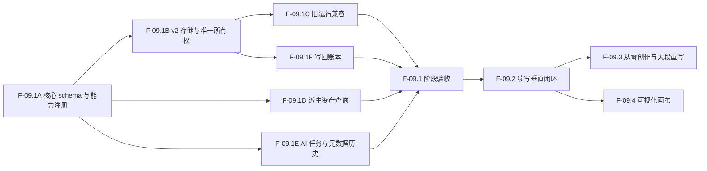

# F-09 半自动小说工作流开发计划

- 计划版本：0.1
- 日期：2026-07-14
- 状态：已完成；F-09.1 至 F-09.5 的功能、真实 Provider、恢复、压力、视觉与发布验收均已通过
- 产品设计：[半自动小说工作流设计 0.2](SEMI_AUTOMATIC_WORKFLOW_DESIGN.md)
- 权威进度：[功能开发待办与进度](FEATURE_TODO.md) 中的 F-09

## 1. 计划目的

本计划把 F-09 拆成可以独立验证、独立回退的阶段。核心顺序是先冻结数据与恢复能力，再完成续写闭环，随后扩展从零创作和大段重写，最后开放可视化画布。

`docs/FEATURE_TODO.md` 仍是唯一状态记录。本文件负责工作包、依赖、测试和退出条件；每完成一个工作包，必须同步更新 F-09 复选框和完成证据。

## 2. 开发原则

1. 不以现有占位 `runs.json` 直接承载长篇产物。
2. 不让项目整体保存、写作区或资料库界面直接写工作流文件。
3. 不先做画布再补执行模型；引导模式和画布从第一天使用同一份 DAG 定义。
4. 不复制写作区局部生成业务；工作流拥有独立长篇生成和大段重写能力。
5. 不复制资料卡 schema 和保存逻辑；通过资料库 Service 与既有确认流程联动。
6. 每阶段先完成纯函数和存储测试，再接入 API，最后接入界面。
7. 不做破坏性原地迁移；旧运行通过兼容读取器保留。
8. 不提交真实项目、API Key、模型完整响应样本和发布产物。

## 3. 依赖关系



F-09.3 与 F-09.4 都依赖经过真实项目验证的 F-09.2；二者可以在 F-09.2 验收后分别规划，但不应在同一提交或同一开发阶段混做。

## 4. F-09.1 数据契约与迁移基础

目标：完成不会因长篇内容、版本分支和画布扩展而被推翻的底层骨架。此阶段不交付完整长篇生成功能。

### F-09.1A 核心 schema 与能力注册（5 点）

交付内容：

- 定义版本化工作流模板、节点实例、端口、连线和模板快照。
- 定义产物家族、不可变 Revision、`variantId`、`inputDigest` 和输入 Revision 引用。
- 分离节点执行状态、产物审阅状态、新鲜度、应用状态和归档状态。
- 定义按目标范围划分的 `slotKey` 当前绑定。
- 建立能力注册表，能力自行声明输入、输出、配置和产物 schema。
- 定义方向锁、排除锁、事实等级和锁快照协议。

建议代码边界：

- `src/core/workflow/workflow-definition-schema.js`
- `src/core/workflow/workflow-artifact-schema.js`
- `src/core/workflow/workflow-capability-registry.js`
- `src/core/workflow/workflow-constraint-schema.js`

测试：

- 未知能力和版本被拒绝。
- 不兼容端口不能连接。
- 已确认 Revision 不可原地修改。
- 同一槽位不能同时绑定多个当前 Revision。
- 正交状态可以表达“已确认 + 已过期 + 已写回”。

退出条件：核心 schema 不依赖 DOM、Provider 或文件系统，纯函数测试通过。

完成证据（2026-07-14）：

- 已新增四个纯核心模块，覆盖版本化模板/DAG、能力和端口类型注册、产物 Revision/绑定/正交状态、方向锁/排除锁/事实等级与快照。
- 已新增四组单元测试并接入 `core-test`；未知能力和版本、端口不兼容、批准 Revision 不可原地修改、重复槽位绑定、事实强弱等级等边界均有断言。
- ESLint、新增单测、`npm run core-test` 与完整 `npm test` 均通过。
- 未修改旧工作流 Store、API、界面和 0.1 运行格式。

### F-09.1B v2 存储与唯一写入所有权（8 点）

交付内容：

- 实现 `runs.json` 摘要与每次运行目录分离的 v2 Store。
- 分离运行状态、产物元数据、长文本、区块检查点、事件和写回账本。
- 所有 JSON 和正文文件使用原子写入。
- 工作流 Store 成为工作流数据唯一写入所有者。
- 调整项目整体保存，确保不会用旧快照覆盖工作流数据。
- 明确资料库继续由资料库 Store/Service 唯一写入。
- 增加孤立临时文件恢复或清理测试。

建议代码边界：

- `desktop/storage/workflow-run-store-v2.js`
- `desktop/storage/workflow-artifact-store.js`
- `desktop/storage/workflow-chunk-store.js`
- `desktop/storage/workflow-application-store.js`
- `desktop/storage/library-paths.js`
- `desktop/storage/project-file-store.js`

测试：

- 保存项目正文不会改变工作流文件摘要。
- 更新一个区块不会重写其他长文本 Revision。
- 大文本和多个版本不会进入 `runs.json`。
- 写入中断不会留下被当成正式内容读取的临时文件。
- 并发版本摘要不一致时拒绝覆盖。

退出条件：至少使用一个包含多运行、多 Revision 和大文本的临时项目完成保存、重新打开和并发保护测试。

完成证据（2026-07-14）：

- 已新增 v2 运行 Store，并按运行摘要、`definition.json`、`state.json`、产物家族/Revision 元数据、正文内容、区块检查点、事件和应用记录分别存储；旧 `workflows/runs.json` 与事件日志未修改。
- v2 摘要使用独立版本号进行乐观并发校验；Revision 元数据与正文分离，已存在的 Revision 不允许原地覆盖。
- 项目整体保存不再写入 `workflows/runs.json`，工作流数据由专用 Store 负责写入；资料库继续使用既有资料库 Store/Service 入口，本阶段未改变其运行格式。
- 原子写入会清理失败临时文件，并提供 v2 目录的遗留 UUID 临时文件清理入口。
- 临时项目测试覆盖旧运行保留、两个 v2 运行、多个 Revision、大正文隔离、区块更新隔离、重新打开、并发拒绝与临时文件恢复；`npm run core-test` 和完整 `npm test` 均通过。

### F-09.1C 旧运行兼容（3 点）

交付内容：

- 为当前 `0.1-placeholder` 运行提供只读适配器。
- 列表中同时展示旧运行和 v2 运行。
- 旧运行不允许通过新版接口原地更新。
- 提供“复制为新版运行”的转换入口，生成新 ID、模板快照和产物 Revision。
- 保留旧事件日志读取。

测试：

- 当前占位测试项目可以继续列出和打开。
- 读取旧运行不会修改磁盘。
- 转换失败不会影响旧文件。
- 转换成功后旧、新运行同时存在。

退出条件：`tests/workflow-store.js` 和 `tests/workflow-engine-service.js` 的既有行为保持通过，并增加 v2 兼容覆盖。

完成证据（2026-07-14）：

- 工作流列表现在合并旧 0.1 运行和 v2 摘要；旧运行保留既有步骤、产物和事件读取，v2 条目明确标记为只读，不能调用旧执行、审批、写回或事件写入接口。
- 已新增“复制为新版运行”接口与界面入口。复制会生成新 ID、版本化 DAG 快照、节点状态、独立产物家族与 Revision；不会修改旧 `runs.json` 或旧事件日志。
- 复制失败时旧文件保持不变；成功后旧、新运行同时存在。v2 执行器尚未接入，因此 v2 条目只展示兼容说明，不误用旧操作按钮。
- 新增兼容测试覆盖直接服务与 HTTP 接口，并与既有 `workflow-store`、`workflow-engine-service`、完整 `npm test` 一同通过。

### F-09.1D 派生项目资产查询（3 点）

交付内容：

- 定义统一资产摘要接口。
- 为正文、资料卡和工作流产物实现只读摘要适配器。
- 支持按标题、摘要、类型、状态和来源检索。
- 结果包含可定位目标，不复制原始正文。
- 暂不持久化权威索引；如实现缓存，必须可以删除后自动重建。

测试：

- 同一来源只出现一次。
- 删除或归档原始产物后结果正确更新。
- 搜索不会触发资料库、正文或工作流写入。
- 未确认正文草稿不会被标记为正式事实。

退出条件：服务级查询可以返回三模块混合结果，并定位到正确模块。

完成证据（2026-07-14）：

- 已新增只读派生资产查询服务和 `/api/project-assets` 入口；查询实时合并写作场景、资料卡、旧工作流产物和 v2 Revision 元数据，不创建索引文件或写入任何来源 Store。
- 统一结果包含资产类别、状态、来源引用、Revision 谱系、模块来源和可定位目标；不返回场景正文、资料卡正文或工作流正文。未确认工作流草稿明确为非正式事实。
- 默认排除归档 Revision，支持关键词、资产类型、来源模块、审阅/新鲜度/写回状态筛选；删除源资料卡后派生结果立即消失。
- 专门测试覆盖来源去重、跨模块混合、定位字段、正文隔离、无写入、归档筛选、源删除与 HTTP 接口；`npm run core-test` 和完整 `npm test` 均通过。

### F-09.1E AI 任务、Provider 和元数据历史（4 点）

交付内容：

- 扩展共享 AI 任务基础契约，增加 `workflow` 域。
- 将具体工作流产物解析交给能力注册表，不持续扩大中心输出枚举。
- Provider 解析顺序为节点、工作流、当前写作配置。
- 保存 Provider ID、模型和非敏感参数快照，不保存 API Key。
- 长篇历史只保存元数据、摘要和产物引用。
- 提供集中 `generationPolicy`，数值参数不进入 schema 常量。

测试：

- Provider 覆盖顺序正确。
- API Key 不进入任务、事件、历史和产物。
- 未注册输出 schema 不能执行。
- 长篇结果不会重复进入项目 `promptHistory`。

退出条件：用模型桩完成工作流任务，产物引用和历史元数据可重新读取，完整正文只保存一份。

完成证据（2026-07-14）：

- 共享 `AITask` 契约已增加 `workflow` 域及能力/产物类型引用；实际输出类型继续由能力注册表验证，未注册产物不能执行，不新增工作流专用中心输出枚举。
- 已新增工作流任务编排层，沿用共享 `AITaskRunner`，但不引入写作模块的逐段生成业务。Provider 覆盖顺序固定为节点、工作流、当前写作配置，集中 `generationPolicy` 不引入数值常量默认值。
- 已按运行保存不可变生成历史元数据与产物 Revision 引用；Provider 快照强制过滤 API Key 等敏感字段，完整正文只落在产物内容文件，不写入项目 `promptHistory`、运行摘要或生成历史。
- `tests/workflow-task-service.js` 用模型桩覆盖 Provider 优先级、密钥隔离、未注册输出拒绝、可重读产物/历史、项目历史不变与正文单份持久化；`npm run core-test`、完整 `npm test` 均通过。

### F-09.1F 写回账本与幂等接口（6 点）

交付内容：

- 定义 `applicationId`、来源 Revision、目标、备份和逐项结果协议。
- 批量写回先整批校验，再预分配章节和场景 ID。
- 正式写入前创建备份。
- 场景保存轻量来源引用，完整关系进入账本。
- 同一 `applicationId` 重试时返回已有结果。
- 部分成功时支持从未完成目标继续或从备份恢复。
- 为资料卡新建和受限字段更新建立同样的写回记录。

测试：

- 同一产物重复提交不会重复创建正文。
- 目标版本变化时拒绝覆盖。
- 整批校验失败时磁盘不变。
- 模拟中途失败后可以恢复或继续。
- 来源字段经过项目 normalize 和重新打开后仍保留。

退出条件：正文批量写回和资料写回都有服务级幂等测试，且恢复测试通过。

完成证据（2026-07-14）：

- 新增版本化应用账本：每条记录包含 `applicationId`、来源 Revision、预分配的操作与目标、备份引用、逐项结果、错误和恢复信息；状态可表达准备、写入中、部分完成、已完成、失败和已恢复。
- 正文写回在整批校验后才创建备份和写入；支持新建章节/场景以及版本受保护的场景更新。场景 schema 已显式保存 `sourceRunId`、`sourceArtifactId`、`sourceRevisionId` 三个轻量来源字段。
- 资料库写回复用既有资料服务，支持新资料创建及 `summary`、`tags`、`aliases`、`characterProfile` 白名单更新；禁止工作流直接改写资料正文。
- 同一 `applicationId` 默认返回既有结果；部分失败可从未完成操作继续，或按应用备份恢复。恢复会清理由本次应用新建、且不属于备份的场景和章节文件，避免项目文件存储的追加式保存遗留孤儿文件。
- `tests/workflow-application-service.js` 覆盖重复提交、目标版本冲突、整批校验无写入、来源字段重新打开后保留、资料白名单、部分写回恢复与继续；`npm run core-test`、完整 `npm test` 均通过。

### F-09.1G 阶段验收与文档（3 点）

- 更新架构说明、项目目录说明、迁移说明和 F-09 完成证据。
- 运行核心、存储、备份、协议和桌面回归。
- 使用隔离临时项目验证旧运行读取、v2 大文本保存、正文保存不覆盖工作流、重复写回和备份恢复。
- 确认没有开发长篇生成 UI 或可视化画布。

完成证据（2026-07-14）：

- [架构说明](ARCHITECTURE.md) 已补充 v2 工作流目录、唯一写入所有权、旧运行只读迁移策略、元数据历史隔离、应用账本和恢复边界。
- 隔离临时项目测试覆盖旧运行读取/复制、v2 大文本内容与摘要分离、项目整体保存不覆盖工作流、Provider 密钥隔离、重复写回、部分写回的继续/恢复，以及项目快照迁移后场景来源字段保留。
- 已执行 `npm run core-test`、完整 `npm test`、`npm run backup-test`、`git diff --check`；其中完整测试包含 protocol handler、项目迁移和桌面主线回归。此阶段没有新增长篇生成 UI 或可视化画布。

阶段完成标准：F-09.1 的所有数据契约和恢复路径稳定，后续节点增加不需要修改存储布局和核心状态模型。

## 5. F-09.2 续写垂直闭环

目标：完成第一条真实可用的“写作 → 工作流 → 写作/资料库”路径，并通过真实项目验收。

### F-09.2A 写作转交与来源快照（4 点）

- 写作区提供选区、场景、章节和项目范围转交。
- 支持续写、替代版本、大段重写、提取大纲/人物和风格参考意图。
- 保存正文内容摘要和来源引用；来源变化后标记输入过期。
- 用户可以继续使用旧快照或创建新输入 Revision。

完成证据（2026-07-14）：

- 新增工作流输入快照服务，将选区、场景、章节或整个项目的正文写为 v2 `writer-source` 不可变 Revision；完整正文只在产物内容文件保存，元数据保留范围、来源场景、内容摘要和哈希。
- 请求支持续写、替代版本、大段重写、提取大纲、提取人物和风格参考意图。来源正文变化后可查询为 `stale`；作者可继续使用旧 Revision，或在同一产物家族创建带父 Revision 的新快照。
- `tests/workflow-input-service.js` 覆盖四种范围、意图、内容重新读取、过期检测、旧快照不可变和新 Revision 谱系；完整 `npm test` 与 `git diff --check` 通过。界面转交入口保留到 F-09.2G。

### F-09.2B 分层总结、大纲与批量资料提取（6 点）

- 按场景、章节和项目分层总结，避免一次传入全部正文。
- 提取可编辑的原文大纲。
- 批量生成资料卡候选。
- 与已有资料卡本地去重，区分新建与更新建议。
- 未确认内容不进入正式资料库。

### F-09.2C 续写方向、锁与场景计划（6 点）

- 生成 2 至 4 个续写方向，支持选择、合并和重新生成。
- 实现方向锁、排除锁、事实等级和冲突检查。
- 生成续写大纲和统一场景计划。
- 细纲默认开启，支持直接编辑、排序、拆分、合并和关闭。
- 已有已确认场景计划时不重复生成。

完成证据（2026-07-14）：

- 新增方向集和选定方向契约，强制每次生成 2 至 4 个方向，并支持选择多个方向合并为统一续写方向。
- 方向锁、排除锁与分级事实会按作用域、事实等级、软硬约束和 1 至 5 权重编译为提示词；方向与排除内容相撞时返回明确冲突。
- 统一场景计划包含视角、地点、目标、冲突、结果、情绪节拍和可选细纲。细纲默认开启，关闭后不会保留隐式细纲；调用方可直接提交编辑、排序、拆分或合并后的场景数组作为新 Revision。
- 模型输出必须先通过方向集或场景计划 schema 才能写成 JSON 产物；已有已确认场景计划时默认直接返回该 Revision，除非显式强制重建。
- `tests/workflow-planning-service.js` 覆盖方向数量、选择合并、约束权重与冲突、细纲关闭、模型桩生成及已确认计划复用；完整 `npm test` 和 `git diff --check` 通过。

### F-09.2D 长篇分批生成与滚动状态（8 点）

- 根据场景计划创建区块计划。
- 每个区块独立构建上下文并持久化检查点。
- 生成后更新滚动状态并传给下一块。
- 支持取消、失败、关闭应用后继续。
- 输入摘要未变化的完成区块不重复计费或生成。
- 使用真实 Provider 基准确定首版 `generationPolicy` 默认值与安全上限。

实现证据（2026-07-14 代码完成；2026-07-15 真实 Provider 基准完成）：

- 场景计划会稳定转换为按顺序执行的区块计划；每个区块拥有输入摘要、原子检查点和独立正文文件。
- 每个区块完成后写入不可变滚动状态 Revision，覆盖已完成场景、上一场摘要以及人物、地点、物品和知情状态扩展位；下一块生成时接收该状态。
- 失败、取消和运行/节点状态均会持久化。重新运行时按顺序读取已完成检查点和滚动状态，输入摘要未变化的区块直接复用，不再次调用模型。
- 滚动状态 Revision ID 包含输入摘要片段；上游场景计划或约束变化时会生成新 Revision，不覆盖旧状态。
- `tests/workflow-longform-service.js` 覆盖第二块失败后恢复、滚动状态恢复、完成区块零重复调用、全部完成后重开和取消检查点；完整 `npm test` 与 `git diff --check` 通过。
- 真实基准确认长结构化输出可能在 6K Token 左右截断，且长请求可能挂起；引导界面现按阶段设置 3K–6K 最低输出预算。统一 Provider 流采用 10 分钟首包等待和 2 分钟流空闲窗口，reasoning、正文、usage 或有效流数据均会续期；活跃流默认没有总墙钟上限。策略仍保留为运行时配置，不写入 schema 常量。

### F-09.2E 审查、版本与返工（5 点）

- 已实现独立的 `draft-review@1` 审查报告：检查重复句段、硬排除锁、硬方向锁和空正文/大纲基础不匹配；报告本身是不可变产物，不会修改正文。
- 同一草稿 Artifact 可从任一 Revision 创建带 `variantId` 和父 Revision 的替代版本；当前用于返工分支，而非覆盖原版。
- 提供正文级比较（长度、共同句段和是否变更）；采用写回仍沿用 F-09.1F 的应用账本，首版不自动合并任意正文片段。
- 过期状态按输入 Revision 集合双向比较：新增、替换或删除任一上游输入都会标记为 `stale`。
- `tests/workflow-review-service.js` 覆盖锁/重复审查、替代版本父子关系、比较与输入新增/删除两种过期情况；完整 `npm test` 和 `git diff --check` 通过。

### F-09.2F 转到写作与资料回流（6 点）

- 已实现转写预览：返回章节、场景顺序、标题、摘要、正文、创建/覆盖模式和目标位置；预览是只读操作。
- 批量创建场景或覆盖指定场景统一经过 F-09.1F 应用账本，保留工作流来源 Revision，并具备备份、幂等、失败恢复与目标版本并发保护。
- 支持单场景转写；选定正文范围会先固化为可追踪的 `draft-excerpt@1` 不可变产物，再转到写作区精修，不丢失原产物来源链。
- 策划稿和草稿沿用项目资产查询，可从资料库视图按关键词、类型和状态检索并定位到工作流 Run、Artifact 和 Revision。
- 已实现资料卡创建建议与已有资料更新建议的只读预览；调用方必须提交明确的 `confirmedSuggestionIds` 才会写入，空确认不会产生资料变更。
- 已有资料更新仍只允许 `summary`、`tags`、`aliases`、`characterProfile`；过期或未批准的来源产物不可写回。`tests/workflow-transfer-service.js` 覆盖服务与 HTTP 预览、批量/单场景/片段转写、资料建议确认门、字段限制、来源定位和过期拒绝。

### F-09.2G 引导式界面与验收（6 点）

- 已提供续写作品的七阶段引导模式，不开放自由连线；启动时可选择当前场景、当前章节或整个项目，并冻结不可变来源快照。
- 界面显示阶段/节点状态、产物 Revision、审批状态、上游上下文数量、当前模型、单批输出预算和事件日志；方向可多选，细纲可开关；深度思考可按需开启，Provider 返回的 reasoning 会在浮动气泡中实时显示。
- 分析、方向、场景计划和正文产物均可查看；等待确认的结构化产物与正文可编辑，保存时创建子 Revision，不覆盖已生成版本。
- 已接入现有 Provider 流：分析、方向和计划各自生成，正文按场景顺序逐批生成；自动审查完成后可预览并确认转到写作区或资料库。
- `tests/workflow-guided-service.js` 覆盖完整状态机、编辑 Revision、逐场正文、审查和完成状态；`tests/workflow-guided-ui.js` 使用 Provider 桩完成真实桌面点击链，并验证写作区来源和资料卡回流。
- 真实 Provider 验收已于 2026-07-15 完成：隔离项目以 16,038 字符原文生成 2 个场景、11,879 字符正文并成功回流写作区；Flash 负责分析和对照，Pro 负责方向、计划、正式稿与盲评。成功调用费用 `$0.037547388`，Pro 正式稿在盲评中胜出。
- 验收暴露并修复了长结构化输出截断、请求长时间挂起和本地规则无法发现语义连续性问题：现已加入阶段最低输出预算、流活动续期超时、usage 事件和 AI 语义审查。详见 [真实 Provider 长篇验收](REAL_PROVIDER_ACCEPTANCE_2026-07-15.md)。

阶段完成标准：功能闭环、自动化验收与真实 Provider 长篇质量验收均已完成；F-09.2 正式关闭。

## 6. F-09.3 从零创作与大段重写

只有 F-09.2 真实验收通过后启动。

### F-09.3A 从零创作模板（8 点）

- 结构化 Brief、创意方向、总纲和冲突结构。
- 人物与世界观资料草稿。
- 节奏和场景计划。
- 分批生成、审查、写回和资料回流。

复用边界（2026-07-15）：

- 直接复用：`CompendiumSchema` 的资料卡类型与人物八字段、`PlanningSchema` 的方向集和场景计划、约束编译、统一 Provider 流、AI Task、Artifact Revision、分场生成、审查、转写作区和资料库确认写回。
- 薄适配：从零创作阶段只负责把 Brief、已选方向和故事蓝图组装为上述能力所需的输入，不复制资料卡保存、正文生成或审查逻辑。
- 必须新增：结构化创作 Brief、故事蓝图/中央冲突契约，以及“Brief → 方向 → 蓝图 → 人物与世界观草稿 → 节奏场景计划”的模板编排。

首个实现切片（2026-07-15）：

- 已新增从零创作核心契约：创作 Brief、故事蓝图、资料卡草稿包和聚合创作包。资料草稿通过现有 `CompendiumSchema.createCompendiumEntry` 归一化，人物八字段和资料类型没有复制。
- 已扩展共用场景计划，使续写和从零创作共同支持参与人物、转折、揭示、结尾钩子、情绪起止、快慢节奏、冲突强度、信息密度、目标字数、必须包含/排除和衔接要求。
- 已新增分阶段 Prompt/输出归一化服务，方向与场景计划继续调用 `PlanningSchema`，人物和世界观继续调用资料库 schema，正文阶段输出每场一个流式 Prompt。
- 已抽出续写与从零创作共用的引导运行内核；阶段推进、Artifact/Revision 写入、用户编辑子 Revision、批准、取消和完成回流不再由模板重复实现。原续写服务已迁移到该内核并保持回归通过。
- 从零创作现已接入完整 v2 Run/Artifact 状态链和产品 API：Brief 作为初始已批准 Revision，随后依次执行方向、蓝图、资料草稿、计划、分场正文、规则+AI 语义审查和回流阶段。
- `tests/workflow-creation-schema.js`、`tests/workflow-creation-service.js` 与 `tests/workflow-creation-guided-service.js` 已进入默认测试链，覆盖直接服务和 HTTP 启动/读取/准备。

桌面闭环切片（2026-07-15）：

- 原工作流侧栏改为“续写现有作品 / 从零构建新作”双模式入口；从零模式提供书名、故事前提、题材、目标字数、主题、基调、视角和世界设定的结构化 Brief。
- 从零模板复用现有阶段看板、方向多选、产物编辑与不可变 Revision、Provider 流、思考气泡、自动审查和取消机制；只按 `templateId` 分派模板专属 API，没有复制一套生成界面。
- 已批准的方向 ID 写入方向产物的新批准 Revision，刷新或重开运行后可恢复选择，后续蓝图、资料、计划和正文不会丢失方向上下文。
- 人物与世界观草稿直接进入已有资料建议预览/确认链，分场正文直接进入已有写作区转移链，二者均保留 Run、Artifact 与 Revision 来源。
- `tests/workflow-creation-guided-ui.js` 已加入桌面主线，覆盖结构化启动、流式 reasoning、方向选择、资料卡版本编辑、全阶段生成、资料库回流和写作区回流；完整 `npm test` 通过。F-09.3A 自动化功能闭环完成，下一工作包为 F-09.3B 大段重写模板。

### F-09.3B 大段重写模板（8 点）

- 选择多场景或整章原文。
- 生成可编辑的重写计划。
- 定义保留、删除、压缩、扩写和换序规则。
- 按语义区块重写并进行可选衔接修复。
- 展示分段差异并转到写作区。

首个实现切片（2026-07-15）：

- 已冻结 `rewrite-brief@1`、`rewrite-plan@1`、逐单元结果和 `rewrite-diff@1` 契约。计划以原场景 ID 作为稳定回流目标，规则支持保留、删除、压缩、扩写、换序、风格、视角和基调，后续无需把重写产物改造成新建场景语义。
- 段落差异采用有界 LCS；规模超过阈值时退化为共同前后缀比较，避免真实长篇差异预览出现平方级内存失控。
- 已新增 `rewrite-guided` v2 模板，阶段为来源快照、可编辑计划、分场景重写、衔接修复与差异、语义审查、选择回流。运行、Artifact Revision、编辑/批准/取消和事件继续复用共用引导内核。
- 衔接修复输出完整场景正文，随后确定性生成逐场景差异；审查报告记录差异摘要。回流直接复用现有 Writer Transfer 的 `update` 模式和幂等应用账本，已验证两个原场景被原位更新且来源 Revision 完整保留。
- 新增 schema、Prompt/归一化服务及完整引导服务/API 自动化测试。下一切片接入桌面重写入口、差异预览、场景勾选和确认更新。

桌面闭环切片（2026-07-15）：

- 工作流侧栏新增“大段重写现有正文”模式，支持当前场景、当前章节和整个项目，并可设置目标风格、基调、视角与长度比例。
- 重写继续复用现有阶段看板、可编辑 Revision、Provider 流和思考气泡。差异产物使用逐场景卡片呈现：删除段、新增段和未改段分别显示，默认全选且可逐场景取消。
- 回流按钮只构建已勾选场景的 Writer Transfer `update` 操作。桌面自动化以两个场景验证只采用第一个：第一个原位更新并写入 Run/Artifact/Revision 来源，第二个逐字保持原文。
- `tests/workflow-rewrite-guided-ui.js` 已加入桌面主线。至此 F-09.3B 的重写计划、分块重写、衔接修复、差异预览和按场景确认回流闭环完成；下一阶段为 F-09.3C 多版本比较与模板验收。

### F-09.3C 模板与版本验收（4 点）

- 验证两种模板与续写模板共用同一能力和产物协议。
- 验证不会因增加模板修改 v2 存储布局。
- 完成自动化和真实项目回归。

版本基础切片（2026-07-15）：

- 复用 Artifact Revision 已有的 `variantId`，新增 `workflow-variant@1` 成组清单；一个版本明确列出每个稳定场景键对应的 Artifact/Revision，避免把若干“最新 Revision”误当成同一个整体版本。
- 支持版本间按场景键对齐，区分相同、已变化、仅左侧和仅右侧，并复用有界段落差异生成正文比较。
- 支持从不同已批准版本逐场景选择，直接编译为现有 Writer Transfer 来源；例如第一场采用强化版、第二场保留初版，不需要新的写回协议。
- 文本替代版本以原 Revision 为父节点创建 `waiting_review` Revision，批准时再生成不可变 approved 子 Revision和批准版清单。测试确认没有修改 v2 Store 的状态、目录或索引 schema。
- 下一切片接入替代版本重新生成 API、桌面整版比较和按场景采用交互，并完成三模板协议验收。

替代版本 API 切片（2026-07-15）：

- 产品 API 可为已完成的三种引导运行自动捕获主版本，按每个稳定场景返回独立替代版本 Prompt，并完成替代版保存、批准、列表和两版本比较。
- 主版本捕获严格选择 `variantId=main` 的已批准 Revision；后续替代版即使更新更晚，也不会反向覆盖主版定义。
- API 自动化覆盖“捕获主版 → 准备两场景 Prompt → 保存替代版 → 批准 → 与主版比较”，继续使用原 v2 Artifact 文件布局。
- 下一切片仅剩桌面整版比较、逐场景版本选择和混合采用交互，以及三模板协议验收。

桌面版本工作台切片（2026-07-15）：

- 运行到回流阶段后可输入新版本要求；每个场景继续使用统一 Provider 流和 reasoning 气泡生成替代正文，生成结果先保持待审状态。
- 桌面版本面板逐场景显示主版与替代版的段落增删差异，并允许每个场景独立选择来源。替代版未批准前禁止采用，批准后才开放混合写回。
- Writer Transfer 根据场景是否已有正式目标自动选择 create/update：续写和从零创作可创建稳定目标场景，重写版本继续原位更新原场景。
- 桌面自动化已验证第一场采用替代版、第二场采用主版，两个场景的来源 Revision 均按所选版本写入。多版本比较与按场景采用闭环完成，F-09.3C 仅剩三模板统一协议和存储布局验收。

三模板协议验收（2026-07-15）：

- 同一隔离项目内同时创建续写、从零创作和大段重写运行，三者 Definition 均通过同一 DAG 校验与拓扑排序，节点和边使用同一协议。
- 三者读取结果暴露完全相同的 Guided Run 字段集，统一标记为 `storageVersion=v2`、`compatibilityMode=v2_guided`、可执行且非只读。
- 三个运行的 Definition Snapshot、Run State、Artifact Family/Revision 均通过同一 schema 校验；兼容层全部走同一个 v2 executable adapter。
- 三个运行目录逐项相同，均只有 `definition.json`、`state.json`、`artifacts/`、`events/`；Runs Index、State 和 Definition schema 版本保持 2，没有新增模板专属 Store 或权威索引。
- `tests/workflow-template-protocol.js` 已进入默认存储测试链。自动化协议与布局验收完成，F-09.3 最后关卡为从零创作和大段重写的真实 Provider 质量、耗时与费用回归。

真实 Provider 验收（2026-07-15）：

- 独立项目使用 DeepSeek V4 Flash/Pro 跑通从零创作、写作区回流、大段重写、衔接修复、差异、语义审查和两个原场景更新。两个运行最终均为 `completed`。
- 14 次成功调用墙钟约 5.8 分钟，合计 68,055 输入 Token、22,962 输出 Token，费用 `$0.033394805`。
- 从零创作生成两场共 6,031 字符；重写后 4,047 字符。Pro 盲评对原创的设定兑现/人物动机/悬念/文风/可读性给出 9/9/10/9/8，对重写的事实保留/节奏改善/衔接/语言质量给出 9/10/8/10，并判定整体提升。
- 审查同时发现两项关键事实遗漏和一项场景跳切，证明重写后的审查与用户确认门禁不可取消。验收后过滤 Provider 返回的 `severity=pass` 条目，避免通过项虚增问题数。
- 详见 `docs/F093_REAL_PROVIDER_ACCEPTANCE_2026-07-15.md`。至此 F-09.3 功能、协议、自动化和真实 Provider 验收全部完成。

## 7. F-09.4 可视化画布

恢复条件：F-09.2 引导模式有真实使用反馈，确认节点、端口和产物模型已经覆盖常见需求。

### F-09.4A 只读图视图（4 点）

- [x] 将续写、从零创作和大段重写三种引导运行以图形式展示，Definition 从 v2 运行快照原样读取。
- [x] 显示节点位置、能力、状态、活动节点、产物数量和有向连线；产物与事件仍复用步骤模式下方的同一套面板。
- [x] 步骤/图视图可以即时切换，图节点可定位已有产物，但不允许编辑节点或连线。
- [x] 新增 `tests/workflow-graph-ui.js`，验证三模板分别为 7/8/6 节点、6/7/5 连线，活动状态、只读门禁和切换行为一致。

### F-09.4B 编辑与类型校验（8 点）

- [x] B1：运行 Definition 保持不可变，从快照创建可随时丢弃的独立编辑草稿；草稿不会静默修改正在执行的运行。
- [x] B1：支持节点拖动、坐标和标题配置、复制、禁用、删除，以及通过节点选择器新增/删除连线。
- [x] B1：复用核心 Definition DAG 校验，拒绝循环、自连接和缺失端点；校验失败时不能退出编辑态。
- [x] B2：注册覆盖三模板的 15 个真实能力与 14 种版本化产物类型，节点库、端口展示和校验读取同一核心目录。
- [x] B2：支持从节点库新增节点、画布内输出端口到输入端口连线，以及下拉式精确端口连线。
- [x] B2：接入未知能力、未知端口和产物类型不兼容校验；错误草稿不能完成编辑或保存模板。
- [x] 右侧节点配置、可视端口和产物来源连线选择已接入。
- [x] 自定义模板使用全局模板 Store 持久化，支持版本递增、列表、载入草稿和删除 API；运行仍使用启动时快照。

### F-09.4C 运行与双模式一致性（6 点）

- [x] C1：保存模板时记录基础执行器；只有节点集合、能力和拓扑顺序与标准执行器兼容且不存在禁用节点的模板，才能启动真实运行。
- [x] C1：模板启动前创建项目备份，新 Run 保存自定义模板 ID/版本，但运行 Definition 的执行模板 ID 保持为续写、从零创作或重写之一。
- [x] C1：步骤模式与图模式读取新 Run 的同一份 Definition；自定义标题和布局不会形成第二份执行配置。
- [x] C2：只有当前 `ready` 节点可从画布运行；单节点和运行到确认点复用既有 Provider 流、活动超时、结果审阅和人工批准门禁。
- [x] C2：节点重跑持久化重置目标及全部下游，旧产物显示为过期；重新生成形成带父 Revision 的新版本，来源/Brief/转交节点不能重跑。
- [x] C3：模板最新副本继续保存在原路径；每次保存同时归档不可变版本，旧数据会在首次更新时补入历史目录。列表返回可用版本，读取和启动 API 可指定版本，删除模板同时删除全部历史版本。
- [x] C3：画布模板选择器可载入任一旧版本为独立草稿，并按该版本创建真实运行；后续保存总是基于最新版本递增，不覆盖历史。
- [x] C3：完成真实桌面视觉审计；编辑配置区改为全宽下置，端口点击高度提升到 22px，类型不兼容错误中文化并增加 `role="alert"`。证据见 `docs/audits/F094_WORKFLOW_GRAPH_VISUAL_AUDIT_2026-07-15/`。

第一版画布仍不支持任意循环、脚本节点、插件节点和无人确认的自动写回。

## 8. 提交与回退策略

- 每个 `F-09.xY` 工作包至少一个独立提交，不把 schema、存储、API 和完整 UI 混成一个大提交。
- schema 与 Store 先合并纯函数和存储测试，再接入产品入口。
- 新 v2 Store 上线时保留旧读取器；回退代码不会破坏旧运行。
- 不执行原地批量迁移，因此回退不需要恢复用户旧数据。
- 新增写回能力前先有自动备份和幂等测试。
- 每阶段完成后更新 `docs/FEATURE_TODO.md`，记录命令、人工验收和后续恢复条件。

## 9. 测试计划

### 9.1 新增测试组

建议增加：

- `tests/workflow-v2-schema.js`
- `tests/workflow-capability-registry.js`
- `tests/workflow-v2-store.js`
- `tests/workflow-legacy-adapter.js`
- `tests/workflow-asset-query.js`
- `tests/workflow-application-service.js`
- `tests/workflow-longform-runner.js`
- `tests/workflow-compendium-transfer.js`
- `tests/workflow-writer-transfer.js`
- `tests/desktop-workflow-v2.js`

### 9.2 必须保留的回归

```powershell
npm test
npm run backup-test
npm run writer-audit
npm run writer-layout-audit
npm run writer-realistic-visual-audit
git diff --check
```

发布前继续执行：

```powershell
npm run workflow-release-acceptance
npm run workflow-provider-canary
npm run dist
npm run packaged-smoke
```

### 9.3 关键故障场景

- 生成中断、应用关闭和重新打开。
- Provider 返回空内容、无效 JSON、限流和网络断开。
- 输入正文、资料卡或上游 Revision 在运行期间变化。
- 同一应用请求重复提交。
- 批量写回中途失败。
- 项目正文保存与工作流更新交错发生。
- 旧运行、v2 运行和已归档运行同时存在。
- 大文本、多版本和大量事件下的打开与保存性能。

## 10. 真实 Provider 验收

F-09.2 的长篇生成默认值不能只依赖模型桩确定。2026-07-15 已使用隔离项目完成下列验证，详细数据见 [真实 Provider 长篇验收](REAL_PROVIDER_ACCEPTANCE_2026-07-15.md)：

- 场景分块是否自然，是否出现重复开头和断裂衔接。
- 滚动状态是否降低人物位置、知情范围和物品状态错误。
- 细纲开启与关闭的质量、耗时和 Token 差异。
- 方向锁、排除锁和事实约束的遵守程度。
- 整章生成失败后恢复是否避免重复计费。
- 资料更新建议是否把工作流虚构内容误当成正式事实。

真实响应不得提交到仓库。只记录模型、参数、输入规模、输出规模、耗时、Token、通过项和失败摘要。

## 11. Definition of Done

某个工作包只有同时满足以下条件才可勾选完成：

1. 代码边界符合 `docs/ARCHITECTURE.md`，可复用业务位于 `src/core`，路由不进入 `desktop/local-server.js`。
2. 正常、失败、取消、并发和恢复路径均有自动化覆盖。
3. 未确认不写入正式正文或资料。
4. API Key、完整长篇 Prompt 和重复正文不进入历史、日志和普通备份。
5. 既有写作、资料库、备份、导入导出和旧工作流回归通过。
6. `docs/FEATURE_TODO.md` 记录完成证据和下一步。

最终验收（2026-07-15）：

- 两轮真实长篇验收继续作为质量、耗时和费用基线；最终在线冒烟确认 Flash/Pro 当前可用，Pro reasoning 流与正文分离正常。
- 新增 Provider 空响应与 HTTP 429 稳定错误契约。
- `tests/workflow-release-acceptance.js` 以 1,008,279 字符、500 事件、50 Revision 和 8 个模板版本完成综合压力验收。
- 完整结论见 `docs/F09_FINAL_ACCEPTANCE_2026-07-15.md`；F-09 后续进入作者人工测试与 Prompt/默认值打磨，不再阻塞下一功能模块。

## 12. 第一开发切片

设计和计划评审通过后，只启动 F-09.1A：核心 schema 与能力注册。该切片不改界面、不调用真实模型、不迁移项目数据，也不改变现有工作流运行格式。

F-09.1A 通过后再进入 v2 Store，避免在数据模型未稳定时同时修改持久化和 UI。
