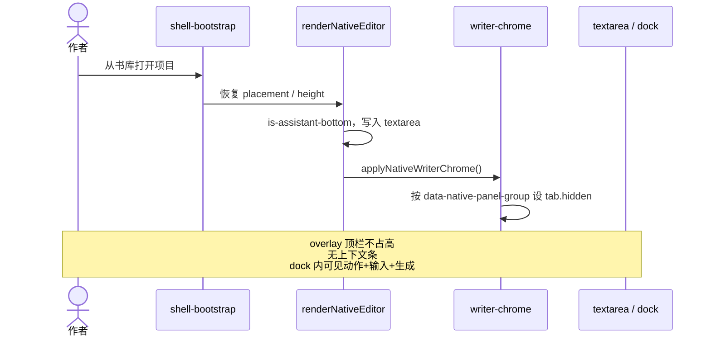

# DraftHarbor 写作工作区 UI 设计（v10：稿纸优先）

| 字段 | 值 |
| --- | --- |
| 文档标题 | 写作模块 UI 设计：把稿纸变高，而不是再挪一次控件 |
| 作者 | TBD |
| 日期 | 2026-08-19 |
| 状态 | Ready（Open Questions 已于 2026-08-19 由作者拍板关闭） |
| 产品 | DraftHarbor（稿湾）写作工作区 |
| 范围代号 | W-02 |
| 前序 | `docs/writer-ui-audit.md` v1–v9 |
| 修订 | 2026-08-19 r4：Q2 拍板 — PR-1 layout-audit 纳入 2560×1440（dock 360±2、textarea ≥700）；Q4 拍板 — 右侧藏问候与建议、保留上下文卡 |

本文是 **UI 目标态 + 可实施技术规格**。工程师按 Proposed Design 施工即可。不改数据结构、不改 AI 协议、不重做 v8/v9 确认条、不改 `writer-core.js`。

默认主题是 `morandi-ink`（`shell-foundation.js` 406–423）。三套产品主题（morandi-ink / mist-library / ash-rose）下的写作页才是用户看见的界面。未主题化的 `desktop-workspaces.css` 路径只存在于无 `data-desktop-theme` 的理论级联，**不得再当预算底稿**。

---

## Overview

写作功能已经能用：目录、稿纸、续写/按拍/总结/改写、资料引用、摘要、查找替换、不透明确认条和镜像待确认标记都已接通。前九轮 UI 改造把栏位、分组、高度和确认卡反复贴片，**交互中心没有变**——进入写作页仍同时看见目录操作、约 16 个工具按钮、Copilot 大标题、3 个组 tab、8 个始终可见的二级 tab、问候卡、任务卡、上下文、建议和输入框。v4 在主题写作页上实测：1280×720 正文 `textarea` 约 209px；1920×1080 约 391px。作者的最终决策是：Copilot **保持常驻底部 dock**，本轮唯一主目标是 **把稿纸变高**。

v10 做三件能改变使用方式的事：

1. **先收 Copilot 首屏，再（或同时）把 dock 收到 `clamp(208px, 25vh, 360px)`。** 禁止单独把 208px 默认合进仍铺着问候/任务卡/上下文/建议的栈。JS 拖拽下限 300→208。
2. 组 tab **过滤** 二级入口（消费 `data-native-panel-group`）；首屏只留创作动作 + 方向输入 + 生成。问候 / 建议 / 上下文摘要退出默认首屏（节点保留）。
3. 编辑器顶栏收成单行（场景名、字数/保存、专注、保存、更多）；底部 dock 下用 CSS 隐藏稿纸内重复标题。

打开已有场景后，用户应立刻能写、立刻能生成，且 dock 内无需滚动。

主题写作页的顶栏已经是 **绝对定位浮层**（不占文档流）。本设计 **保留这套 overlay**，不把 52px 标题栏重新插入流内。写作页唯一还在流里的壳是 44px 上下文条——藏掉它，并同时把 `desktop-main` 改成单行 `minmax(0, 1fr)`。

---

## Background & Motivation

### 当前状态（代码事实，不是观感）

写作工作区根节点是 `[data-native-writer]`（`desktop/fragments/writer.html`）。默认放置来自 `nativeEditorState.assistantPlacement = 'bottom'`（`src/desktop/shell/shell-foundation.js` 第 192–196 行），`shell-bootstrap.js` 只在本地已有 `draftharbor:nativeAssistantPlacement` 时覆盖。

底部 dock 高度在 `src/styles/desktop/desktop-finishing.css` 里写了多次，**改的是整段 `grid-template-rows`（含 `minmax` 地板），不是只改 clamp**：

| 选择器 / 条件 | 行号 | 整段 `grid-template-rows` |
| --- | --- | --- |
| `.is-assistant-bottom` 基础 | 1773–1775 | `minmax(220px, 1fr) minmax(300px, var(--native-assistant-height, clamp(400px, 48vh, 560px)))` |
| `max-width: 1360px` 底部/非折叠 | **294–297**（前稿未列） | `minmax(0, 1fr) minmax(220px, 34vh)`（1280×720 会打到这条，34vh≈245） |
| `981–1100px` 宽 | 2040–2043 | `minmax(0, 1fr) minmax(300px, … clamp(320px, 48vh, 480px))` |
| `min-width: 1361px`（含 1920 / 2560） | 2116–2119 | `minmax(220px, 1fr) minmax(300px, … clamp(420px, 30vh, 440px))` |
| `max-width: 980px` | 2123–2125 | `auto minmax(420px, 1fr) minmax(300px, … clamp(300px, 42vh, 460px))` |
| `981px+` 且 `max-height: 820px`（含 1280×720） | 2175–2177 | `minmax(180px, 1fr) minmax(280px, … clamp(280px, 42vh, 420px))` |

更早的层：`desktop-workspaces.css` 159–161 `minmax(220px, 32vh)`，808–809 `minmax(230px, 30vh)`。新层 `desktop-writer-chrome.css` 必须用 **同等或更高特异性** 压过 1775 与 294–297。只改 clamp、留下 `minmax(300px, …)`，208 永远不会出现。

JS 把用户拖不下去的地板钉死在 300：

```6:7:src/desktop/shell/writer-sidebar-resize.js
    const NATIVE_ASSISTANT_MIN_HEIGHT = 300;
    const NATIVE_ASSISTANT_MAX_HEIGHT = 760;
```

`applyNativeAssistantHeight()` 在未保存偏好时 **清除** `--native-assistant-height`（第 54–59 行）。已保存值被 `Math.max(300, …)` 夹住。

### 主题写作页的真实壳（预算必须用这套）

默认主题 `morandi-ink`。三套主题已经把写作顶栏拿出文档流，并把视图 padding 清零：

```651:662:src/styles/desktop/desktop-polish.css
[data-desktop-theme="mist-library"] .desktop-app[data-view="writer"] .desktop-topbar {
    position: absolute;
    top: 5px;
    right: 172px;
    ...
    min-height: 32px;
    padding: 0;
}
```

`desktop-release.css` 569–580 对 `morandi-ink` / `ash-rose` 写了同一套 overlay。三者都设置：

- `.desktop-view-writer { padding: 0 }`（polish 692–695，release 620–623）
- `.desktop-main { grid-template-rows: auto minmax(0, 1fr) }`（polish 687–688，release 608–610）
- 写作页上下文条 `min-height: 44px; padding: 6px 24px`（polish 707–709，release 614–618）
- `.desktop-native-writer { height: 100%; min-height: 520px }`（polish 697–699，release 625–628）

`renderContextStrip()`（`shell-foundation.js` 503–515）对 `writer` **会显示** 该条。overlay 顶栏不是 grid item。因此 **当前主题写作页纵向壳 ≈ 上下文条 44px**，不是未主题化路径的 128px（顶栏 64 + 条 40 + padding 24）。

1280 宽的左轨也不是 92px：`desktop-workspaces.css` 835–837，`max-width: 1440px` 时 `.desktop-app { grid-template-columns: 78px minmax(0, 1fr) }`。

v4 在这套主题壳上实测（底部 dock、无保存高度）：1280×720 textarea ≈ 209px；1920×1080 ≈ 391px。短窗 finishing 2177 把 720p dock 钉在 `minmax(280px, clamp(280px, 42vh, 420px))` ≈ 302px；1080p 被 2119 的 `clamp(420px, 30vh, 440px)` 钉在 420px。

### 藏条而不修 grid 会塌工作区

主题 `desktop-main` 是 `auto minmax(0, 1fr)`。流内子项是：上下文条（auto）+ 当前 `.desktop-view.is-active`（1fr）。overlay 顶栏不占行。把条 `hidden` / `display: none` 之后，只剩一个流内子项落在 `auto` 行，`1fr` 变成空行。`.desktop-native-writer` 的 `height: 100%` 在不定高的 auto 行里是循环百分比，可能缩到 `min-height: 520px`，textarea 被钉在编辑列 `minmax(280px, 1fr)` 地板附近，底下留一条死空白。

**藏条的同时必须** 把三套主题的写作 `desktop-main` 改成 `grid-template-rows: minmax(0, 1fr)`（或留一个 0 高的 auto 占位）。选择器特异性必须 ≥ 现有主题规则。

### 为什么 v1–v9 失败

HTML 里已有钩子：

```208:215:desktop/fragments/writer.html
<button type="button" data-native-panel-tab="generate" data-native-panel-group="writing" class="is-active">AI</button>
<button type="button" data-native-panel-tab="rewrite" data-native-panel-group="writing">改写</button>
...
```

`nativeAssistantPanelGroup()`（`writer-core.js` 1–12）和组 tab 的 `is-active`（567–575）都在。**没有任何 JS/CSS 读取 `data-native-panel-group` 去隐藏非当前组 tab。** 8 个二级入口始终全显示。

Copilot 首屏：问候（英文 kicker `Assistant`）→ 三张任务卡 → 上下文 `dl` → 三颗建议 → beat `textarea`（底部 finishing 1998–2000 `min-height: 58px`；非底部 workspaces 76–77 / components 2153 为 150px）→ 篇幅 / **预览** / 生成（`writer.html` 266–279，`.desktop-native-generation-actions` 是 `flex-wrap` 列，`desktop-components.css` 1662–1667）→ 高级选项 `min-height: 34px`（finishing 1882–1887）。底部 dock 里生成按钮已经在折线下方。

工具条把 header 撑成两行。`desktop-polish.css` 409–414：`flex-wrap` + `min-height: 52px`。`sendToWorkshop` / `saveToCompendium` 由 `renderNativeEditor()` 834–837 按 **是否有场景** 设 `hidden`，与选区无关。

### 工程门禁（施工红线）

以 `tests/release-config.js` 99 / 111 / 144 为准：

- `src/desktop/shell/*.js` 每文件 ≤ **1400** 行。`writer-core.js` **1398 行**，不能再塞逻辑。
- `src/styles/desktop/*.css` 每层 ≤ **2200** 行。`desktop-finishing.css` **2199 行**，是最后一层现有级联。
- `desktop.html` ≤ **120** 行（当前 **119**）。style 文件数已 ≥ 6，允许再加 `desktop-writer-chrome.css`。
- 保留全部 `data-native-*` 与 AI 请求协议。不改 prompt 装配，不改 v8/v9 确认语义。
- 测试契约节点不可删：`data-native-paper-heading`、`data-native-copilot-greeting`、`data-native-copilot-context-note`、`data-native-model-settings`（`release-config.js` 117–121）。CSS / `hidden` 隐藏即可。
- 已保存的 `draftharbor:nativeAssistantHeight` 必须继续生效；只改未保存时的默认。
- **禁止** 在 JS 里写 `paperHeading.hidden = true` 来藏底部标题：`writer-button-audit.js` 213–223 断言的是 HTML `hidden` 属性，不是 computed style。底部用 CSS `display: none`。

---

## Goals & Non-Goals

### Goals

- 无保存高度偏好、三套主题下，三个目标视口的正文 `textarea` 达到下表下限。
- Copilot 常驻底部；默认首屏可见创作动作、方向输入、生成按钮，**dock 内无需滚动**。
- 二级 tab 只显示当前组；切组时 dock 高度不变，正文高度不变。
- 编辑器顶栏单行；原工具全部可从「更多」触达；`data-native-*` 绑定不丢。
- 已保存 dock 高度用户不被重置。
- `npm test`（含 `desktop-library.js`、`summary-workflow.js`）+ 三个 writer audit 通过。layout-audit **新增 textarea 地板、computed dock 高度，以及 2560×1440 视口**。

### Non-Goals

- 不重做生成协议、确认条语义、镜像层。不要复活 `desktop-release.css` 815–838 的 v6「确认卡占稿纸 grid 第 3 行」；真理是 **884–899 的 `position: absolute` 浮条**。
- 不默认收起 Copilot，不把右侧 IDE 抽屉改成默认。
- 不把写作页改成聊天 UI；不引入新图标字体 / 设计系统。
- 不为「更好看」加装饰、大标题、空状态插画、英文 kicker。
- **不把主题 overlay 顶栏改回流内 52px 标题行。**
- 不在本设计扩张 F-11、工作流、阅读器；不改项目/场景数据。
- 目录右键只做配套，不挡主路径。

---

## Key Decisions

1. **Copilot 继续默认底部 dock，收干净而不是收起。** 右侧仅作手动切换。
2. **一条默认高度公式，改的是整段 `grid-template-rows`：** `minmax(280px, 1fr) minmax(208px, var(--native-assistant-height, clamp(208px, 25vh, 360px)))`。1080p 不再被 `min-width: 1361px` + `minmax(300px, clamp(420px, …))` 按成 420。
3. **`NATIVE_ASSISTANT_MIN_HEIGHT`：300 → 208。** 上限仍 760。已保存像素值原样生效。
4. **写作页隐藏上下文条。** 这是主题壳上唯一还在流里的 44px。模块跳转走左轨。Q1 关闭：不压成 28px 跳转条。藏条必须同时把三套主题的 `.desktop-main` 改成 `minmax(0, 1fr)`，并改 `tests/desktop-library.js` 661–666。
5. **保留主题 overlay 顶栏（Alternative F）。** 不插入流内 52px 标题栏。
6. **底部 dock 用 CSS 隐藏 `.desktop-native-paper-heading`。** 不改 `hidden` 属性。右侧模式仍可显示。
7. **组 tab 真正过滤二级 tab。** 切组记住该组上次面板。所有会点 `data-native-panel-tab` 的 `npm test` 文件在同一 PR 改完。
8. **写作首屏不因选区自动跳到改写。** 芯片挂在 `renderNativeRewrite` / 编辑器 `select|mouseup|keyup` 上，不只挂在 `renderNativeEditor` 之后。
9. **问候与建议在底部和右侧都藏；上下文卡仅底部藏、右侧保留。** 节点不删。右侧手动切换时仍显示当前场景 / 章节 / 字数卡。Q4 已关闭。
10. **新逻辑进 `writer-chrome.js`，新样式进 `desktop-writer-chrome.css`。** 不碰 `writer-core.js`（1398 行）。finishing 只替换整段高度公式，净行数不增。
11. **打开高级选项或切组不自动拉高 dock。** 面板必须占 assistant 的 `minmax(0, 1fr)` 行并 `overflow-y: auto`。藏 header 后要把 4 行网格收成 3 行，否则 panel 落在 `auto` 行、高级内容被 `overflow: hidden` 的 dock 裁切。
12. **208px dock 不得在问候/卡片栈仍占流时合入。** 首屏收纳与高度公式同船，或收纳先于高度（Alternative E）。推荐同船（见 PR-1）。
13. **聊/料保持「有场景即显示」。** 与 `writer-core.js` 834–837 一致，不改成选区门闩。
14. **`[data-native-preview-prompt]` 搬进 `<details data-native-generation-advanced>`。** 首屏输入行只留 篇幅 + 生成。点预览的测试必须先 `open` details。
15. **PR-1 `writer-layout-audit.js` 必须含 2560×1440。** 无保存高度、morandi-ink：dock **360±2**，textarea **≥ 700**。Q2 已关闭。

---

## Proposed Design

### 1. 信息架构（目标态）

```text
写作工作区
├─ 应用壳
│  ├─ 左轨 .desktop-rail（1280 宽 = 78px；≥1441 才是 92px）
│  ├─ 顶栏 .desktop-topbar（三套主题：position:absolute overlay，不占流；
│  │     标题簇已 display:none；只留「隐藏导航 / 全屏」）
│  └─ 上下文条 .desktop-context-strip
│        ├─ 写作页：hidden + display:none（本轮）
│        └─ 资料 / 讨论 / 工作流：仍显示
│
└─ [data-native-writer]     ← 藏条后占满 desktop-main 的唯一 1fr
   ├─ 左栏目录（常驻，可藏）
   │  ├─ 项目名 + 新建/书库（空项目时）
   │  ├─ [新场景] [新章节]
   │  ├─ 章节/场景树（拖拽排序保留）
   │  └─ 右键菜单（配套，PR-3）
   │
   ├─ 中央稿纸（唯一主视觉）
   │  ├─ header（PR-1 仍约 52–54px 且可能换行；PR-2 收成 ≤40 单行）
   │  │  ├─ 章节 + 场景名（可就地改名）
   │  │  ├─ 保存状态 + 字数
   │  │  ├─ 专注 / 保存
   │  │  └─ 更多 ▾（PR-2）
   │  │       ├─ 朗读 / 停止 / 符号 / 排版 / 避用
   │  │       ├─ 显示|隐藏结构 / 辅助 / 辅助在下|在右
   │  │       └─ 发送到讨论 / 保存为资料（有场景时，与今日相同）
   │  ├─ .desktop-native-editor-body
   │  │  ├─ 排版/符号弹出层（已有）
   │  │  ├─ .desktop-native-paper-heading（DOM 保留；底部 CSS display:none）
   │  │  ├─ textarea[data-native-scene-editor]
   │  │  ├─ 镜像层 / 确认条（v8：release.css 884–899 absolute，不占 grid 行）
   │  │  └─ .desktop-native-paper-footer
   │  └─ 正文右键菜单（已有）
   │
   └─ Copilot 常驻底部 dock
      ├─ 拖拽条
      ├─ .desktop-native-assistant-header（底部 display:none）
      ├─ 组 tab：写作 | 上下文 | 文档
      │  ├─ 写作 → 续写(generate) | 改写(rewrite)
      │  ├─ 上下文 → 人物 | 资料
      │  └─ 文档 → 元数据 | 结构 | 查找 | 历史
      └─ 写作/续写首屏（必须无滚动）
         ├─ [续写] [节拍] [总结] （有选区时 + [改写选区]）
         ├─ 方向输入 + 篇幅 + [生成]
         ├─ 问候 / 建议：底部与右侧都 display:none
         ├─ 上下文卡：底部 display:none；右侧可见
         └─ 高级选项（折叠）：模板、预览、写入位置、模型
```

**常驻 / 按需 / 更多**

| 层级 | 常驻 | 按需 | 进「更多」或折叠 |
| --- | --- | --- | --- |
| 应用壳 | 左轨、overlay 顶栏按钮 | 全屏 | 写作页上下文条 |
| 目录 | 树、新场景/新章节 | 空项目的新建/书库 | 重命名删除（右键；结构面板仍保留） |
| 稿纸 | 场景名、字数/保存、专注、保存、textarea、页脚 | 排版/符号层、确认条 | 朗读、符号、排版、避用、结构/辅助显隐、位置、跨模块发送 |
| Copilot | 组 tab、当前组二级 tab、动作+输入+生成 | 高级选项、**右侧**上下文卡（场景/章节/字数） | 问候、建议（底+右都藏）、底部的上下文卡、Copilot 大标题、预览 |

### 2. 垂直空间预算（核心交付）

所有数字默认 **morandi-ink 主题写作页**（mist-library / ash-rose 同构）。无保存 `draftharbor:nativeAssistantHeight`。默认底部 dock、非专注、目录展开、无确认条。

#### 2.1 应用壳：现状 vs 目标

| 层 | 未主题化路径（不要再用） | 主题现状 | 目标 |
| --- | --- | --- | --- |
| 顶栏 | 流内 64px | **overlay，流内 0** | **保持 overlay，不改回流内** |
| 上下文条 | 40 | **44**（主题 `min-height: 44px`） | **0**（hidden + `display: none`） |
| 视图 padding | 24 | **0** | **0** |
| `desktop-main` 行 | `auto auto 1fr` | `auto 1fr`（条 + 视图） | **`minmax(0, 1fr)`**（只有视图） |
| **纵向壳合计** | 128 | **44** | **0** |
| 左轨（1280 宽） | 92 | **78** | 78（不改） |

实施时，chrome 选择器必须带主题或与主题等权，否则 polish/release 会赢：

```css
[data-desktop-theme="morandi-ink"] .desktop-app[data-view="writer"] .desktop-context-strip,
[data-desktop-theme="mist-library"] .desktop-app[data-view="writer"] .desktop-context-strip,
[data-desktop-theme="ash-rose"] .desktop-app[data-view="writer"] .desktop-context-strip {
  display: none;
}

[data-desktop-theme="morandi-ink"] .desktop-app[data-view="writer"] .desktop-main,
[data-desktop-theme="mist-library"] .desktop-app[data-view="writer"] .desktop-main,
[data-desktop-theme="ash-rose"] .desktop-app[data-view="writer"] .desktop-main {
  grid-template-rows: minmax(0, 1fr);
}
```

`renderContextStrip()`：`elements.strip.hidden = !coreViews.has(view) || view === 'writer'`。资料/讨论/工作流仍显示。

合入前用 `getBoundingClientRect()` 在 1280×720 + `morandi-ink` 上量 `[data-native-writer]`：藏条且 grid 修对后，高度应 ≈ **720**（100vh，无 OS 框的 Playwright 视口），而不是 520 或中间某个塌缩值。

#### 2.2 两列表：PR-1 可交付 vs PR-2 终态

`textarea` 恒等式必须用真实 padding，不是 8px：

- `editor-body` 底部模式：finishing 2132 `padding-block: 10px 14px` = **24px**。短窗 `max-height: 820px`（2175–2182）压成 `4px 8px` = **12px**。1080 / 1440 **没有** 这条，保持 24。
- 页脚：finishing 2156 `min-height: 34px`；短窗 2195–2197 **28px**。PR-1 不改页脚，预算用 28 / 34。
- header：PR-1 仍是 polish 409–414 的 **52–54px**（可能 wrap 更高）。PR-2 才收到 ≤40。
- heading：PR-1 起底部 `display: none` = **0**。

**PR-1 后（首屏已收 + dock 208 + 藏条 + heading 藏，header 仍 ~54）：**

| 视口 | 壳 | 工作区 | header | heading | body pad | footer | dock | textarea 推算 | 验收地板 |
| --- | --- | --- | --- | --- | --- | --- | --- | --- | --- |
| 1280×720 | 0 | 720 | 54 | 0 | 12 | 28 | **208** | 720−208−54−12−28 = **418** | ≥ 280（争取 320） |
| 1920×1080 | 0 | 1080 | 54 | 0 | 24 | 34 | **270** | 1080−270−54−24−34 = **698** | ≥ 520 |
| 2560×1440 | 0 | 1440 | 54 | 0 | 24 | 34 | **360** | 1440−360−54−24−34 = **968** | ≥ 700 |

**PR-2 后（header ≤40 单行；footer 可压到 26，非必须）：**

| 视口 | header | footer | body pad | dock | textarea 推算 |
| --- | --- | --- | --- | --- | --- |
| 1280×720 | 40 | 28 | 12 | 208 | **432** |
| 1920×1080 | 40 | 34 | 24 | 270 | **712** |
| 2560×1440 | 40 | 34 | 24 | 360 | **982** |

PR-1 的 418 / 698 / 968 已过 A1–A3 地板。实现时以 `morandi-ink` 下 `[data-native-scene-editor].getBoundingClientRect().height` 为准；上表是可手算的上限（未计 header wrap、边框 1px）。

若 header 在 PR-1 仍 wrap 成 ~70px，720p textarea ≈ 402，地板仍成立。

#### 2.3 一条公式，改整段 `grid-template-rows`

```css
/* desktop-writer-chrome.css，特异性至少含 :not(.is-focus-mode):not(.is-assistant-collapsed) */
.desktop-native-writer.is-assistant-bottom:not(.is-focus-mode):not(.is-assistant-collapsed) {
  grid-template-rows:
    minmax(280px, 1fr)
    minmax(208px, var(--native-assistant-height, clamp(208px, 25vh, 360px)));
}
```

`clamp(208px, 25vh, 360px)`：720→208，1080→270，1440→360。

JS：

```js
const NATIVE_ASSISTANT_MIN_HEIGHT = 208; // was 300
const NATIVE_ASSISTANT_MAX_HEIGHT = 760;

function nativeAssistantHeightBounds(root) {
  const rootHeight = root.getBoundingClientRect().height;
  const availableHeight = rootHeight > 0 ? rootHeight - 280 : NATIVE_ASSISTANT_MAX_HEIGHT;
  const maxHeight = Math.max(
    NATIVE_ASSISTANT_MIN_HEIGHT,
    Math.min(NATIVE_ASSISTANT_MAX_HEIGHT, availableHeight)
  );
  return { min: NATIVE_ASSISTANT_MIN_HEIGHT, max: maxHeight };
}
```

`applyNativeAssistantHeight()` 保持：`height <= 0` 时 `removeProperty`。历史已保存值都 ≥ 300。

**必须整段替换（含 `minmax` 地板）的规则：**

- finishing **294–297**（`max-width: 1360px` 的 `minmax(220px, 34vh)`——漏改则 1280 仍约 245）
- finishing 1775
- finishing 2043
- finishing 2119
- finishing 2125
- finishing 2177（只删/改 **行高**；保留短窗 heading/页脚/body padding 压缩）
- workspaces 161、809：可留，chrome 层压过即可

PR-1 layout-audit 除 textarea 地板外，还要断言无保存偏好、**morandi-ink** 时：

- 1280×720 dock 高 **208±2**
- 1920×1080 dock 高 **270±2**
- **2560×1440 dock 高 360±2，textarea ≥ 700**（视口必须加入 `tests/writer-layout-audit.js` 的 `viewports` 数组）

#### 2.4 dock 首屏：必须先改 CSS min-height，208 才放得下

现状（底部，border-box，合起来远超 208）：

| 件 | 现行 | 约高 |
| --- | --- | --- |
| 组 tab | 按钮 `min-height: 30` + padding `5px 10px 3px`（finishing 1837–1839） | **38** |
| 二级 tab | polish `min-height: 26` + finishing padding `4px 10px 5px` | **35** |
| panel | finishing 1849 `padding: 9px 12px 12px` | 21 垂直 |
| 任务钮 | finishing 1947–1949 `min-height: 40` | **40** |
| beat | finishing 1998–2000 `min-height: 58` | **58** |
| 高级 summary | finishing 1882–1887 `min-height: 34` | **34** |
| 篇幅+预览+生成 | components 1662–1667 wrap 列 | 输入「行」变成 **90–110** |

PR-1 在 `desktop-writer-chrome.css` 写死这些覆盖（选择器带 `.is-assistant-bottom`，特异性压过 finishing）。

藏 header 必须同时改网格。现行 `.desktop-native-assistant` 是 4 行 `auto auto auto minmax(0, 1fr)`（`desktop-finishing.css` 177–179），对应 DOM：header → 组 tab → 二级 tab → panel（`writer.html` 196–217）。`display: none` 拿掉 header 盒之后，auto-placement 会把组 tab、二级 tab、panel 填进前三个 `auto` 行，`1fr` 空着。`auto` 行随内容长高，panel 的 `overflow-y: auto` 永不触发；外层 `.desktop-native-assistant` 又是 `overflow: hidden`（finishing 1784）。默认 190px 首屏仍能塞进 208，但高级一开（模板 + 预览 + 写入位置 + 模型 ≫ 余下 ~146px）会被裁切，Playwright 也点不到 details 里的预览。

```css
.desktop-native-writer.is-assistant-bottom .desktop-native-assistant-header,
.desktop-native-writer.is-assistant-bottom .desktop-native-copilot-brief,
.desktop-native-writer.is-assistant-bottom .desktop-native-copilot-context,
.desktop-native-writer.is-assistant-bottom .desktop-native-copilot-suggestions,
.desktop-native-writer.is-assistant-bottom .desktop-native-copilot-tasks button span {
  display: none;
}

/* 右侧：藏问候（kicker + brief）和建议；上下文卡保持可见 */
.desktop-native-writer:not(.is-assistant-bottom) .desktop-native-copilot-brief,
.desktop-native-writer:not(.is-assistant-bottom) .desktop-native-copilot-kicker,
.desktop-native-writer:not(.is-assistant-bottom) .desktop-native-copilot-suggestions {
  display: none;
}

/* header 已不占盒：三行 = 组 tab + 二级 tab + 可滚动 panel */
.desktop-native-writer.is-assistant-bottom .desktop-native-assistant {
  grid-template-rows: auto auto minmax(0, 1fr);
  overflow: hidden;
}
.desktop-native-writer.is-assistant-bottom .desktop-native-assistant-panel {
  min-height: 0;
  overflow-x: hidden;
  overflow-y: auto;
}

.desktop-native-writer.is-assistant-bottom .desktop-native-assistant-group-tabs {
  padding: 2px 8px;
}
.desktop-native-writer.is-assistant-bottom .desktop-native-assistant-group-tabs button {
  min-height: 24px;
  padding: 2px 8px;
}
.desktop-native-writer.is-assistant-bottom .desktop-native-assistant-tabs {
  flex-wrap: nowrap;
  padding: 2px 8px;
  overflow: hidden;
}
.desktop-native-writer.is-assistant-bottom .desktop-native-assistant-tabs button {
  min-height: 24px;
  padding: 2px 8px;
}
.desktop-native-writer.is-assistant-bottom .desktop-native-assistant-panel {
  padding: 8px 10px;
}
/* 3 或 4 枚芯片都挤在一行 32px；不要沿用 finishing 1942 的 repeat(3, …) */
.desktop-native-writer.is-assistant-bottom .desktop-native-copilot-tasks {
  display: flex;
  flex-wrap: nowrap;
  gap: 6px;
}
.desktop-native-writer.is-assistant-bottom .desktop-native-copilot-tasks button {
  flex: 1 1 0;
  min-width: 0;
  min-height: 32px;
  padding: 4px 8px;
}
.desktop-native-writer.is-assistant-bottom .desktop-native-copilot-tasks:has([data-native-open-rewrite]:not([hidden])) {
  /* 显式 4 列，避免某层又把 flex 盖回 3 列 grid */
  display: grid;
  grid-template-columns: repeat(4, minmax(0, 1fr));
}
.desktop-native-writer.is-assistant-bottom .desktop-native-generation-input {
  grid-template-columns: minmax(0, 1fr) auto;
  gap: 6px;
}
.desktop-native-writer.is-assistant-bottom .desktop-native-generation-input textarea {
  min-height: 52px;
  max-height: 52px;
}
.desktop-native-writer.is-assistant-bottom .desktop-native-generation-actions {
  flex-wrap: nowrap;
  align-items: center;
  gap: 6px;
}
.desktop-native-writer.is-assistant-bottom .desktop-native-generation-advanced summary {
  min-height: 24px;
  padding: 4px 8px;
}
```

HTML：把 `[data-native-preview-prompt]` **从** `.desktop-native-generation-actions` **搬进** `<details data-native-generation-advanced>` 的 body（与模板/写入位置并列）。首屏动作行只剩 篇幅 + 生成，高度由 beat 52 决定。

重算（折叠高级、无改写芯片）：

```
28  组 tab（24 + pad 2+2）
26  二级 tab（24 + pad 2）
 8  panel padding-top
32  动作条
 6  gap
52  输入行（beat 52，篇幅+生成 nowrap 同行）
 6  gap
24  高级折叠条
 8  panel padding-bottom
──
190  < 208，余量 18
```

有选区时改写芯片进同一动作条：默认 flex nowrap，芯片可见时 `:has(...)` 切到 `repeat(4, minmax(0, 1fr))`，行高仍 32。**禁止**沿用 finishing 1942–1945 的 3 列 grid，否则第四枚换行把栈抬到 ~70px，首屏 ≈228 > 208。

高级展开后 dock **高度不变**。panel 在 `minmax(0, 1fr)` 里 `overflow-y: auto` 滚动；组 tab 与二级 tab 钉在上沿。layout-audit 须在 `<details>` 打开后断言：panel 是滚动容器（`scrollHeight > clientHeight`，或 advanced 块底边 ≤ dock 底边 + panel.scrollTop 可及）。

若实现后 190 被边框吃到 ≥208：先减 panel padding，而不是把默认抬回 220+。只有重算仍 >208 才把公式地板改成 220，并同步改 JS min 与 audit。

### 3. 布局与视觉层级

原则：**稿纸是唯一主视觉；dock 是次级工作条。** 禁止再画 Copilot 大标题 + 英文 kicker。宽画布与三主题纸色沿用 v4。

#### 3.1 1280×720 底部 dock 默认态（主题，PR-1 后）

顶栏是浮在右上的「隐藏导航 / 全屏」，**没有** 52px 标题行。

```
┌─78─┬──────────────────────── 1202 ─────────────────────────┐
│轨  │ ┌─220─┬────────────────  982  ─────────────────────┐  │
│书库│ │项目  │ 第3章 · 雨夜码头         1,204字 已保存      │  │ ≈54 header
│写作│ │      │                          [专注][保存][更多*]│  │ *更多=PR-2
│阅读│ │新场景│ ┌────────────────────────────────────────┐ │  │
│资料│ │新章节│ │                                        │ │  │
│讨论│ │      │ │   textarea ≈ 418px                     │ │  │
│工作│ │ 卷一 │ │                                        │ │  │
│设置│ │  ▸雨 │ │   打开场景后可以直接写。                 │ │  │
│    │ │  ▸码头│ │                                        │ │  │
│    │ │      │ └────────────────────────────────────────┘ │  │
│    │ │      │  1,204 字    第3章 / 雨夜码头    已保存     │  │ 28
│    │ │      ├────────────────────────────────────────────┤  │
│    │ │      │ ▄▄                                         │  │
│    │ │      │ [ 写作 ] [上下文] [ 文档 ]                  │  │ 28
│    │ │      │ [续写] [改写]                               │  │ 26
│    │ │      │ [续写] [节拍] [总结]                        │  │ 32
│    │ │      │ ┌方向……………………┐ 篇幅▾ [生成]               │  │ 52
│    │ │      │ 高级选项 ▸                                  │  │ 24
│    │ └──────┴────────────────────────────────────────────┘  │
└────┴───────────────────────────────────────────────────────┘
  [data-native-writer] ≈ 720 = 编辑 512 + dock 208
  overlay 顶栏浮在右上，不占这 720
```

#### 3.2 打开「高级选项」

dock 仍 208。组 tab + 二级 tab 钉住；**只有** `.desktop-native-assistant-panel` 滚动（它必须占 assistant 的第三行 `minmax(0, 1fr)`，且 `min-height: 0`）。预览、模板、写入位置、模型都在 details 里。若 panel 落在 `auto` 行，高级会被 dock 的 `overflow: hidden` 裁掉，预览测试也会红。

#### 3.3 右侧助手（手动，非默认）

稿纸 heading 可重新显示。输入框可用 88px。窄于 1101px 仍回底部（finishing 1731–1746、2040–2059）。

右侧 Copilot 与底部的差异只在「上下文卡」：

| 块 | 底部 dock | 右侧 |
| --- | --- | --- |
| Copilot header / 英文 kicker `Assistant` | 藏 | 藏问候（kicker + brief） |
| `.desktop-native-copilot-brief` | 藏 | 藏 |
| `.desktop-native-copilot-suggestions` | 藏 | 藏 |
| `.desktop-native-copilot-context`（场景 / 章节 / 字数） | 藏 | **可见，保留** |
| 动作 + 输入 + 生成 | 首屏 | 首屏 |

**不要**在右侧藏上下文卡。

#### 3.4 专注模式

`.is-focus-mode` 已藏目录和助手。藏条后 720p textarea ≈ 720 − 54 − 12 − 28 ≈ **626**。退出后 dock 高度与面板不变。

#### 3.5 编辑器 header 单行（PR-2）

```
第3章 · 雨夜码头          1,204字 · 已保存     [专注] [保存] [更多]
```

```css
.desktop-native-editor-header {
  flex-wrap: nowrap;
  min-height: 36px;
  max-height: 40px;
  padding: 4px 12px;
  overflow: hidden;
}
.desktop-native-editor-header > div:first-child .desktop-section-kicker {
  display: none; /* 章节名前缀进 h2 或 title */
}
```

按钮留在 DOM，父节点改到 `[data-native-more-menu]`。`querySelector` 绑定不受影响。

聊/料：**有场景即出现在更多里**（今日逻辑），不要写「有选区时」。

#### 3.6 Copilot 视觉

底部与右侧必须按下表施工，不要靠「右侧纵向不稀缺」再发明一套：

| 块 | 底部 dock | 右侧 |
| --- | --- | --- |
| 问候（`.desktop-native-copilot-brief` / kicker `Assistant`） | 藏 | 藏 |
| 建议芯片（`.desktop-native-copilot-suggestions`） | 藏 | 藏 |
| 上下文卡（`.desktop-native-copilot-context`：场景 / 章节 / 字数） | 藏 | **可见** |
| Copilot 大标题 header | 藏 | 可保留（不占底部预算） |
| 动作 + 输入 + 生成 | 首屏无滚动 | 首屏 |

二级 tab 文案 `AI` → `续写`。任务 `<strong>` 改短；`<span>` 底部 `display: none`。

### 4. 关键交互流

#### 4.1 打开已有场景



#### 4.2 续写

1. 默认「写作 / 续写」，`data-native-gen-task="continue"` 已 active。
2. 可选填 `[data-native-beat-input]`；可选改篇幅。
3. 点 `[data-native-generate]`。协议与确认条沿用 `writer-generation.js` / v8/v9。
4. 确认条是编辑器内深色不透明浮条。源码以 `desktop-release.css` **884–899**（`position: absolute`）为准。**不要**把 815–838 的 v6 grid-row 确认卡救回来。不进 dock，不占稿纸网格行。

#### 4.3 有选区时的改写

不自动切面板。

芯片显隐 **必须** 跟选区走。`renderNativeEditor` 在划词时不会重跑。现成路径是 `writer-bindings.js` 178–179 的 `select` / `mouseup` / `keyup` → `renderNativeRewrite()`（`writer-prompts.js` 234–268，已算 `hasSelection`）。

`writer-chrome.js`（必须在 `writer-prompts.js` **求值之后** 才跑这段，见加载顺序）：

```js
const renderNativeRewriteUnwrapped = renderNativeRewrite;
renderNativeRewrite = function () {
  renderNativeRewriteUnwrapped();
  syncRewriteChip();
};

function syncRewriteChip() {
  const chip = document.querySelector('[data-native-open-rewrite]');
  const editor = document.querySelector('[data-native-scene-editor]');
  if (!chip || !editor) return;
  chip.hidden = editor.selectionStart === editor.selectionEnd;
}
```

`applyNativeWriterChrome()` 也可调 `syncRewriteChip()`，但不能只靠它。点击芯片：`nativeEditorState.assistantPanel = 'rewrite'; renderNativeEditor();`。右键「润色选区」（bindings 470–472）保持。

#### 4.4 切组

dock 行高不变 → textarea 高度不变。`assistantPanelByGroup` 只活在内存。组 tab 跨组才切换；二级 tab 写回该组上次面板。改 `writer-bindings.js` 145–158，不改 core。

#### 4.5 更多菜单（PR-2）

包装 `closeNativeWriterPopovers`（core 294–306 不改函数体）：

```js
const closeNativeWriterPopoversUnwrapped = closeNativeWriterPopovers;
closeNativeWriterPopovers = function (options = {}) {
  closeNativeWriterPopoversUnwrapped(options);
  if (options.keep !== 'more') hideNativeMoreMenu();
};

function hideNativeMoreMenu() {
  const menu = document.querySelector('[data-native-more-menu]');
  const btn = document.querySelector('[data-native-more-tools]');
  if (menu) menu.hidden = true;
  if (btn) {
    btn.setAttribute('aria-expanded', 'false');
    btn.focus({ preventScroll: true });
  }
}

function showNativeMoreMenu() {
  const menu = document.querySelector('[data-native-more-menu]');
  const btn = document.querySelector('[data-native-more-tools]');
  closeNativeWriterPopovers({ keep: 'more' });
  if (menu) menu.hidden = false;
  if (btn) btn.setAttribute('aria-expanded', 'true');
  const first = menu && menu.querySelector('button:not([hidden])');
  if (first) first.focus({ preventScroll: true });
}
```

- 点更多：切换开合。
- **点菜单项**：先 `hideNativeMoreMenu()`（焦点回到更多按钮），再让原 click 处理器跑。从更多里开排版/符号时，包装后的 closer `keep !== 'more'` 会关掉更多——这是预期：同时只开一层。
- Escape：bindings 59–66 的 `hasOpenPopover` **必须** 把更多算进去，然后调包装后的 closer。
- 外点：bindings 53–58 排除 `[data-native-more-menu], [data-native-more-tools]`。
- `setNativeToolbarButton` 仍改搬进菜单的按钮文案（显示|隐藏结构 等）；菜单直接显示这些节点，标签会更新。
- `role="menu"`：ArrowUp/Down 在可见 `button` 间循环；Home/End 跳首尾。不做完整 WAI-ARIA menu 键盘表以外的事。

#### 4.6 目录右键（PR-3）

`contextmenu` 在场景/章节上：重命名、删除、上移、下移，调用现有函数与确认框。不拦拖拽。结构面板按钮保留。

---

## API / Interface Changes

无网络 API、无 prompt 协议变更。

### HTML（`desktop/fragments/writer.html`）

PR-1：

- `data-native-panel-tab="generate"` 文案：`AI` → `续写`
- 任务卡 `<strong>`：`续写` / `节拍` / `总结`
- 动作条加 `<button type="button" data-native-open-rewrite hidden>改写选区</button>`
- **把 `[data-native-preview-prompt]` 挪进** `<details data-native-generation-advanced>`

PR-2：

```html
<button class="desktop-secondary-action desktop-native-toolbar-button"
        type="button" data-native-more-tools
        aria-haspopup="true" aria-expanded="false" title="更多写作工具">
  <span class="desktop-native-tool-mark" aria-hidden="true">⋯</span>
  <span class="desktop-native-tool-label">更多</span>
</button>
<div class="desktop-native-more-menu" data-native-more-menu hidden role="menu" aria-label="更多写作工具">
  <!-- 整块搬入 .desktop-native-tool-actions 与 .desktop-native-layout-actions -->
</div>
```

禁止删除契约节点与任一 `data-native-panel-tab`。

### JS 全局包装（`writer-chrome.js`）

| 符号 | 变化 |
| --- | --- |
| `renderNativeEditor` | 之后 `applyNativeWriterChrome()`（tab.hidden + 可选 syncRewriteChip） |
| `renderNativeRewrite` | 之后 `syncRewriteChip()` —— **选区钩子在这里，不在 core** |
| `closeNativeWriterPopovers` | 额外关更多（PR-2） |
| `NATIVE_ASSISTANT_MIN_HEIGHT` | 300 → 208 |

```js
function applyNativeWriterChrome() {
  const group = nativeAssistantPanelGroup(nativeEditorState.assistantPanel);
  document.querySelectorAll('[data-native-panel-tab]').forEach((tab) => {
    tab.hidden = tab.dataset.nativePanelGroup !== group;
  });
  syncRewriteChip();
}
```

不要改 `writer-core.js` 567–575。

### 加载顺序（`desktop.html`，保持 119 行）

接到已有行。**不要**把 chrome 接到第 69 行 `writer-overlays.js` 后面：`renderNativeRewrite` 在第 93 行 `writer-prompts.js` 才定义。defer 按文档顺序执行，overlays 时刻包装会读到 `undefined`；若再「缺失则 skip」，芯片钩子永远装不上。

```html
<link rel="stylesheet" href="src/styles/desktop/desktop-finishing.css"><link rel="stylesheet" href="src/styles/desktop/desktop-writer-chrome.css">
```

```html
<script defer src="src/desktop/shell/writer-prompts.js"></script><script defer src="src/desktop/shell/writer-chrome.js"></script>
```

允许的更后位置：同一手法接到第 94 行 `writer-generation.js` 或第 99 行 `writer-bindings.js`。禁止接到 overlays（69）或更早。

`writer-chrome.js` 顶层 **eager** 包装，三个名字此时必须都在：

- `renderNativeEditor`（core，第 68 行，已先于 93）
- `renderNativeRewrite`（prompts，刚执行完的第 93 行）
- `closeNativeWriterPopovers`（core，第 68 行；PR-2 才包装，缺了就先别包）

缺任何一个就 `throw`（开发期立刻红），**不要** `typeof === 'function'` 后 skip。正确的 load 顺序下它们一定存在。

---

## Data Model Changes

无持久化 schema 变更。

| 键 | 行为 |
| --- | --- |
| `draftharbor:nativeAssistantPlacement` | 不变。无键 = bottom |
| `draftharbor:nativeAssistantHeight` | 有键：写入变量并按 208–760 夹紧。无键：走 CSS clamp |
| `draftharbor:nativeSidebarWidths` | 不变 |
| `draftharbor:desktop:nativeEditorPrefs` | 不变 |

`assistantPanelByGroup` 只在内存。

稿纸标题：

```css
.desktop-native-writer.is-assistant-bottom .desktop-native-paper-heading {
  display: none;
}
```

`renderNativeEditor()` 800 行 `hidden = !activeScene` **保持原样**。

---

## Alternatives Considered

### A. 默认右侧 IDE 抽屉

作者否决。只保留手动切换。

### B. 默认折叠 dock

作者否决。用 208px 常驻矮条。

### C. 保留多套 media query，只调低 clamp

v3/v4/v7 的失败模式。`minmax` 地板仍会吃掉 208。否决。

### D. 选区自动切到改写

会抢走续写输入。否决。用芯片 + `renderNativeRewrite` 钩子。

### E. 先收 Copilot 首屏，再把 dock 收到 208（推荐的拆分序）

单独合入 208、而问候/卡片仍占流，会让生成更难找，并打红 A4。正确顺序是 **收纳 → 高度**，或 **同船**。本设计 PR-1 同船；若 diff 过大，拆成 PR-1a（收纳 + tab 过滤，dock 公式不动）再 PR-1b（208 + 藏条），且 **1b 不得先于 1a 合入**。

### F. 保留主题 overlay 顶栏，只藏上下文条（推荐）

把顶栏改回流内 52px 是在主题已经省掉的地方加 chrome，720p 倒退。否决回流内标题栏。

**采用 E+F：** overlay 不动；高度变化要么跟收纳同船，要么严格后于收纳。

---

## Security & Privacy Considerations

| 风险 | 严重度 | 缓解 |
| --- | --- | --- |
| 更多菜单加深跨模块发送 | 低 | 仍按「有场景」显示；右键近路保留 |
| 目录右键删除 | 中 | 必须走现有 `deleteNativeScene` / `deleteNativeChapter` 确认框 |
| 包装全局函数失败 | 低 | chrome 接到 `writer-prompts.js` 之后并 eager wrap；缺函数则 throw。禁止在 overlays 时刻 skip，那会把芯片钩子永久卸掉 |
| 无新存储键 | — | 不扩大本地指纹面 |

不得从 DOM 拿掉 `data-native-model-settings`。

---

## Observability

开发期可在 `applyNativeWriterChrome()` 打一条 debug（勿进生产）：`assistantPanel`、组、可见二级 tab 数、textarea 高、dock 高、是否有 `--native-assistant-height`。

`writer-layout-audit.js` 是哨兵。截图仍在 `.ai_state/test_reports/writer_layout_audit/`。三主题各留 1280×720 与 1920×1080，对比 v4 的 209 / 391。PR-1 另留一张 **2560×1440 / morandi-ink**（dock ≈360、textarea ≥700）。

---

## Rollout Plan

1. 无 feature flag。
2. PR-1 必须同时包含收纳与 208（或 1a→1b 且禁止反向合入）。
3. 不迁移已保存高度。发布说明：「若 dock 仍偏高，双击分隔条恢复新默认。」
4. 回滚：逆序 revert。回滚高度、留下 tab.hidden 是安全的；回滚收纳、留下更多菜单仍可用。回滚 HTML 以免顶栏再变两行。

---

## 实现落点

### `desktop/fragments/writer.html`

PR-1：文案、改写芯片、**预览搬进 advanced**。PR-2：更多容器并搬按钮。PR-3：outline 菜单。禁止删契约节点。

### `src/desktop/shell/writer-core.js`

**不改**（1398 / 1400）。

### `src/desktop/shell/writer-chrome.js`（新，< 250 行）

- 包装 `renderNativeEditor`、**`renderNativeRewrite`**、（PR-2）`closeNativeWriterPopovers`。脚本必须接在 `desktop.html` 第 93 行 `writer-prompts.js` 之后（或 94/99），禁止接 overlays。
- `applyNativeWriterChrome`、`syncRewriteChip`
- 改写芯片 click
- PR-2 更多菜单；PR-3 目录右键

### `src/desktop/shell/writer-bindings.js`（538 行，有余量）

- 组记忆
- PR-2：Escape / 外点 / `hasOpenPopover` 含更多

### `src/desktop/shell/writer-prompts.js`

不改函数体。chrome 包装 `renderNativeRewrite`。

### `src/desktop/shell/writer-sidebar-resize.js`

PR-1：`MIN_HEIGHT = 208`；bounds 预留 280；双击仍 `removeItem`。

### `src/desktop/shell/shell-foundation.js`

PR-1：`renderContextStrip()` 对 writer 保持 `hidden`。

### `src/styles/desktop/desktop-finishing.css`（2199 行，净行数 ≤ 0）

整段替换 294–297 / 1775 / 2043 / 2119 / 2125 / 2177 的 **`grid-template-rows`**。不在 finishing 写首屏隐藏或更多菜单。

### `src/styles/desktop/desktop-writer-chrome.css`（新，< 400 行）

挂在 finishing 之后：

- 三主题藏条 + `desktop-main: minmax(0, 1fr)`（等权选择器）
- **不要** 写流内顶栏 52px
- 整段 dock `grid-template-rows`（压 294–297 / 1775 等）
- 底部 heading / Copilot header / 问候 / **底部**上下文 / 建议 / 任务 span
- 右侧：藏问候 + 建议；**不要**藏 `.desktop-native-copilot-context`
- **藏 header 后** `.desktop-native-assistant { grid-template-rows: auto auto minmax(0, 1fr); }`，panel `min-height: 0; overflow-y: auto`
- 动作条 flex nowrap；芯片可见时 4 列 grid（覆盖 finishing 1942 的 3 列）
- §2.4 其余 min-height / padding / 输入行 nowrap 覆盖
- PR-2：header nowrap + 更多菜单皮肤

### `desktop.html`

接到现有行，保持 119 行。

### 测试（按 PR，缺一不可）

共享 helper（建议放在各文件顶部或小的 `tests/helpers/native-panel.js`，不要为它新开门禁）：

```js
const PANEL_GROUP = {
  generate: 'writing', rewrite: 'writing',
  characters: 'context', context: 'context',
  metadata: 'document', structure: 'document',
  search: 'document', history: 'document'
};
async function openNativePanel(page, tab) {
  await page.click(`[data-native-assistant-group="${PANEL_GROUP[tab]}"]`);
  await page.click(`[data-native-panel-tab="${tab}"]`);
}
async function openGenerationAdvanced(page) {
  await page.locator('[data-native-generation-advanced]').evaluate((el) => { el.open = true; });
}
```

**PR-1 必须改：**

| 文件 | 改什么 |
| --- | --- |
| `tests/writer-layout-audit.js` | `viewports` **必须含 `{ width: 2560, height: 1440 }`**。textarea 地板：720≥280、1080≥520、1366≥300、1493≥420、**2560≥700**；dock **208±2 / 270±2 / 360±2**（2560，morandi-ink，无保存高度）；生成按钮在 dock 矩形内；可见 tab 同组；打开 advanced 后面板是滚动容器，dock 高度不变 |
| `tests/writer-button-audit.js` | 全部 `data-native-panel-tab` 点击改 `openNativePanel`（约 258、270、329、391、521、826、928、936、939、959、979、1026、1062、1101、1249、1335）；预览点击（约 612、961）先 `openGenerationAdvanced`。heading 断言保持 `!paperHeading.hidden`（属性） |
| `tests/writer-realistic-visual-audit.js` 195–201 | `requiredVisible` 的 paper 改为 `[data-native-scene-title]` |
| `tests/desktop-library.js` | **661–666**：写作页不再要求 `:not([hidden])`；改为 `strip.hidden === true` 或不可见。资料/讨论仍可见。结构/元数据/查找/生成点击（185、189、194、197、205、218、233、239、266、458）改 `openNativePanel`。预览（416）先打开 advanced |
| `tests/summary-workflow.js` | 48、69、91 的 `metadata` 点击改 `openNativePanel` |
| `tests/release-config.js` | 可选：断言挂上了 chrome CSS/JS 与 `MIN_HEIGHT = 208`。不放宽 1400/2200/120 |

**PR-2 必须改（不是「若失败」）：** `writer-button-audit.js` 在点这些控件前先 `openMoreMenu(page)`：`[data-native-toggle-outline]`（152）、`[data-native-assistant-placement]`（158、190–192）、`[data-native-toggle-assistant]`（181）、`[data-native-toggle-typography]`（194、251）、`[data-native-read-aloud]`（407、450）。layout-audit 加 header ≤42。

### 文档

- `docs/FEATURE_TODO.md` 增 W-02
- `docs/writer-ui-audit.md` 增 v10 目标与实测

---

## 验收

无保存高度、默认底部、非专注、三主题。

| # | 断言 | 数字 / 方法 |
| --- | --- | --- |
| A1 | 1280×720 textarea | ≥ 280，争取 ≥ 320。PR-1 推算 ≈418 |
| A2 | 1920×1080 textarea | ≥ 520。PR-1 推算 ≈698 |
| A3 | 2560×1440 textarea | ≥ 700。PR-1 推算 ≈968。**layout-audit 必测** |
| A4 | 续写首屏 | beat 与生成完全在 assistant 矩形内；`scrollTop === 0` 可点生成 |
| A4b | computed dock | 无偏好、morandi-ink：720→208±2，1080→270±2，**2560→360±2** |
| A5 | 二级 tab | 每组只看见该组；layout-audit 检查可见 tab 的 `data-native-panel-group` |
| A6 | header | PR-2：高度 ≤42；更多能点到全部原按钮 |
| A7 | 已保存 420 | 刷新后 dock ≈420 |
| A8 | 双击分隔条 | 回到 clamp 默认 |
| A9 | 三主题 | A1–A6；overlay 顶栏仍不占流 |
| A10 | 专注 | 目录与 dock 消失；退出后高度不变 |
| A11 | 右侧 | heading 可现；回底部再藏。问候与建议仍藏；**上下文卡可见** |
| A12 | 契约节点 | release-config 仍能读到四件套；`paperHeading.hidden` 仅随有无场景变 |
| A13 | 命令 | `npm test`（**含 desktop-library、summary-workflow**）+ 三个 writer audit |
| A14 | 手测 | 写一段、生成、切组、开更多、拖 dock、双击复位；确认条仍是 v8 浮条 |
| A15 | 工作区高度 | 1280×720 + morandi-ink，`[data-native-writer]` ≈720，不是 520 |
| A16 | 高级滚动 | details 打开后 dock 仍 208±2；panel `min-height` 已是 0 且 `scrollHeight > clientHeight`（或预览按钮 `scrollIntoView` 后完全落在 panel 可视矩形内） |
| A17 | 改写芯片一行 | 有选区时四枚动作钮同一行，该行高 ≤34；不得把高级条挤出 208 |

---

## Open Questions

1. ~~写作页上下文条藏还是压~~ **已关闭（2026-08-19）：藏。** 见 Key Decision 4、Alternative F。
2. ~~2560×1440 是否纳入 layout-audit~~ **已关闭（2026-08-19）：纳入 PR-1。** `viewports` 增加 2560×1440；无保存高度、morandi-ink：dock **360±2**，textarea **≥ 700**。见 Key Decision 15。
3. **目录右键是否进第一批。** 否，进 PR-3，不挡 A1–A5。
4. ~~右侧是否也藏问候卡~~ **已关闭（2026-08-19）：问候 + 建议在右侧也藏；上下文卡在右侧保留。** 见 Key Decision 9、§3.3 / §3.6。

---

## References

- `docs/writer-ui-audit.md` v1–v9（v4 209/391，v7 432/964，v8/v9 确认条）
- `desktop/fragments/writer.html` 147–151、208–215、219–223、266–279
- `src/desktop/shell/writer-core.js` 1–12、294–306、541–578、800、834–837（**1398 行**）
- `src/desktop/shell/writer-bindings.js` 53–66、136–158、178–179、465–472
- `src/desktop/shell/writer-prompts.js` 234–268（`renderNativeRewrite` / `hasSelection`）
- `src/desktop/shell/writer-sidebar-resize.js` 1–7、44–65
- `src/desktop/shell/shell-foundation.js` 185–196、406–423、503–515
- `src/styles/desktop/desktop-polish.css` 409–414、651–695、707–709
- `src/styles/desktop/desktop-release.css` 569–628、809–811、815–838（v6 遗迹）、**884–899（v8 真理）**
- `src/styles/desktop/desktop-finishing.css` **177–179**（assistant 4 行）、**294–297**、1773–1775、1784、1837–1849、1882–1887、**1942–1945**（3 列任务）、1947–2000、2040–2043、2116–2126、2130–2132、2156、2174–2199（**2199 行**）
- `src/styles/desktop/desktop-workspaces.css` 159–161、425–448、808–809、835–837
- `src/styles/desktop/desktop-components.css` 1662–1667
- `desktop.html` **119** 行
- `tests/release-config.js` 95–144
- `tests/desktop-library.js` 185–266、416、458、661–666
- `tests/summary-workflow.js` 48、69、91
- `tests/writer-button-audit.js` 152–194、213–223、258+、407、450、612、961
- `tests/writer-layout-audit.js`、`tests/writer-realistic-visual-audit.js` 195–211

---

## PR Plan

每一 PR 独立可审。PR-1 是最小可发布切片：**禁止**只把 208 合进去。

### PR-1 — 首屏收纳 + 208 dock + 藏条（同船）

- **标题：** `fix(writer): collapse Copilot first screen and reclaim manuscript height`
- **文件：**
  - `desktop/fragments/writer.html`（文案、芯片、预览进 advanced）
  - `src/desktop/shell/writer-chrome.js`（新建：包装 `renderNativeEditor` + `renderNativeRewrite`，tab.hidden，芯片）。**接到 `writer-prompts.js` 那一行后面**
  - `desktop.html`（CSS 接 finishing；JS 接 **第 93 行** prompts，不要接第 69 行 overlays）
  - `src/desktop/shell/writer-bindings.js`（组记忆）
  - `src/desktop/shell/writer-sidebar-resize.js`（min 208）
  - `src/desktop/shell/shell-foundation.js`（writer 藏条）
  - `src/styles/desktop/desktop-finishing.css`（整段 `grid-template-rows`，净 ≤0）
  - `src/styles/desktop/desktop-writer-chrome.css`（新建：§2.3–2.4、assistant 3 行网格、4 列芯片、三主题藏条 + `desktop-main` 单行 1fr、heading CSS hide）
  - `tests/writer-layout-audit.js`（**加入 2560×1440**；textarea 地板含 2560≥700；dock 208±2 / 270±2 / **360±2**；生成在矩形内；可见 tab 同组；advanced 打开后面板是滚动容器）
  - `tests/writer-button-audit.js`（`openNativePanel`、预览先开 details）
  - `tests/writer-realistic-visual-audit.js`（heading → scene title）
  - `tests/desktop-library.js`（写作页条 hidden；`openNativePanel`；预览先开 details）
  - `tests/summary-workflow.js`（`openNativePanel`）
  - `tests/release-config.js`（可选挂载断言）
- **依赖：** 无
- **内容：** Alternative E+F 的可发布形态。合入后 720p 正文应明显高于 209px，且生成无需滚动。若 diff 过大，拆 1a（收纳+tab+测试，高度公式不动）/ 1b（208+藏条+grid），**1b 不得先合**。
- **回滚：** revert 本 PR。tab 不再 hidden，dock 回 300 地板。

### PR-2 — 顶栏单行与更多菜单

- **标题：** `fix(writer): single-line editor header with a More menu`
- **文件：** `writer.html`（更多容器）；`writer-chrome.js`（菜单、焦点、aria-expanded）；`writer-bindings.js`（Escape/外点）；`desktop-writer-chrome.css`（header nowrap）；`tests/writer-button-audit.js`（**必须** `openMoreMenu` 后再点纲/助/下/Aa/读）；`tests/writer-layout-audit.js`（header ≤42）
- **依赖：** PR-1（共享 chrome 包装器）
- **回滚：** 留下 PR-1 的 hidden tab 是安全的。

### PR-3 — 目录右键 + W-02 文档

- **标题：** `feat(writer): outline context menu and W-02 acceptance notes`
- **文件：** `writer.html`；`writer-chrome.js` 或 `writer-overlays.js`；`docs/FEATURE_TODO.md`；`docs/writer-ui-audit.md`
- **依赖：** 不挡 PR-1/2。文档等 PR-1 合入后写实测。
- **内容：** Open Question 3。结构面板测试仍走 `openNativePanel('structure')`。
